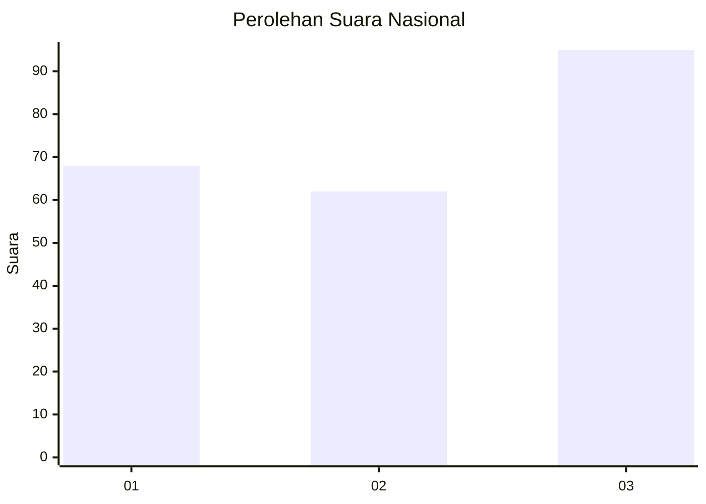
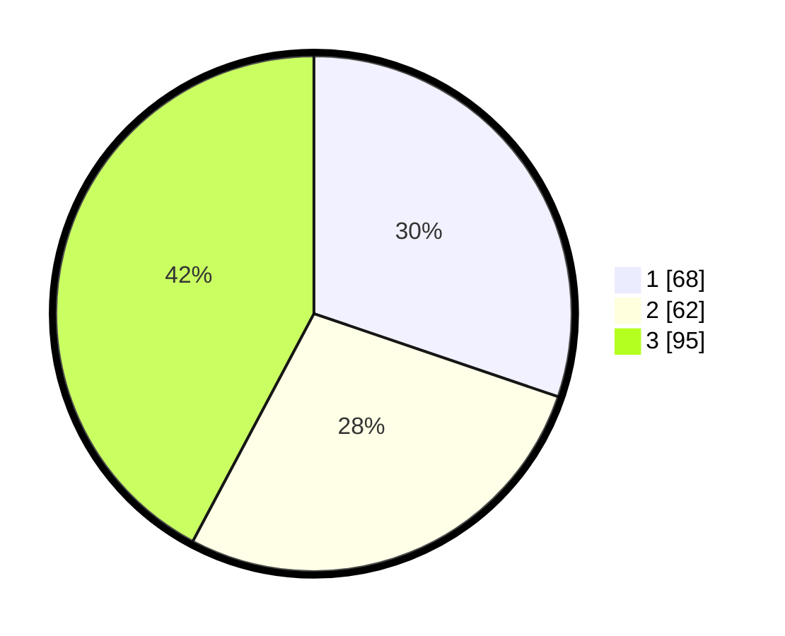

# Hasil

## Grafik

## Tabel

| No. | Nama Paslon    | Suara | Suara (raw) | Persentase |
|:--- |:-------------- | -----:| -----------:| ----------:|
| 1   | ANIES MUHAIMIN | 68    | [68][p-1]   | 30,22      |
| 2   | PRABOWO GIBRAN | 62    | [62][p-2]   | 27,56      |
| 3   | GANJAR MAHFUD  | 95    | [95][p-3]   | 42,22      |

[p-1]: https://github.com/gigit-pemilu/pemilu-2024/blob/main/pilpres/hitung-suara/sub/34-di-yogyakarta/sub/04-sleman/sub/07-depok/sub/2001-caturtunggal/sub/003-tps/sub/paslon-1.txt
[p-2]: https://github.com/gigit-pemilu/pemilu-2024/blob/main/pilpres/hitung-suara/sub/34-di-yogyakarta/sub/04-sleman/sub/07-depok/sub/2001-caturtunggal/sub/003-tps/sub/paslon-2.txt
[p-3]: https://github.com/gigit-pemilu/pemilu-2024/blob/main/pilpres/hitung-suara/sub/34-di-yogyakarta/sub/04-sleman/sub/07-depok/sub/2001-caturtunggal/sub/003-tps/sub/paslon-3.txt

## Foto C Plano

https://sirekap-obj-formc.kpu.go.id/ca31/pemilu/ppwp/34/04/07/20/01/3404072001003-20240214-231519--501c6285-04b1-4787-b56a-d6f61c835f8f.jpg

https://sirekap-obj-formc.kpu.go.id/ca31/pemilu/ppwp/34/04/07/20/01/3404072001003-20240214-231600--3907214b-be0a-44e7-8356-e1347cbe9723.jpg

https://sirekap-obj-formc.kpu.go.id/ca31/pemilu/ppwp/34/04/07/20/01/3404072001003-20240214-231629--d76d7b4f-3701-4b78-b93e-410eeabc7fb2.jpg

## Metadata

| Key        | Value               |
| ---------- | ------------------- |
| Time Stamp | 2024-02-15 16:00:26 |

