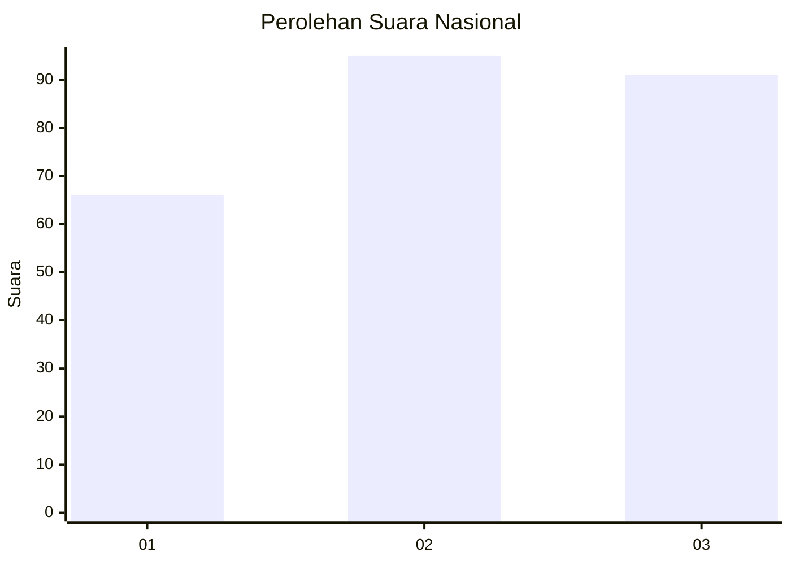
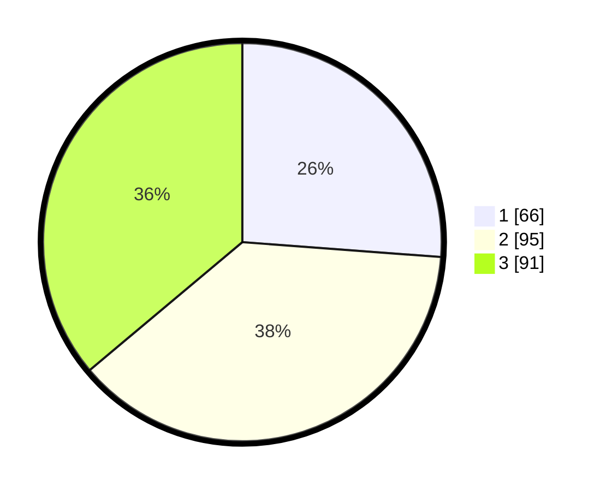

# Hasil

## Grafik

## Tabel

| No. | Nama Paslon    | Suara | Suara (raw) | Persentase |
|:--- |:-------------- | -----:| -----------:| ----------:|
| 1   | ANIES MUHAIMIN | 66    | [66][p-1]   | 26,19      |
| 2   | PRABOWO GIBRAN | 95    | [95][p-2]   | 37,70      |
| 3   | GANJAR MAHFUD  | 91    | [91][p-3]   | 36,11      |

[p-1]: https://github.com/gigit-pemilu/pemilu-2024/blob/main/pilpres/hitung-suara/sub/34-di-yogyakarta/sub/04-sleman/sub/07-depok/sub/2001-caturtunggal/sub/004-tps/sub/paslon-1.txt
[p-2]: https://github.com/gigit-pemilu/pemilu-2024/blob/main/pilpres/hitung-suara/sub/34-di-yogyakarta/sub/04-sleman/sub/07-depok/sub/2001-caturtunggal/sub/004-tps/sub/paslon-2.txt
[p-3]: https://github.com/gigit-pemilu/pemilu-2024/blob/main/pilpres/hitung-suara/sub/34-di-yogyakarta/sub/04-sleman/sub/07-depok/sub/2001-caturtunggal/sub/004-tps/sub/paslon-3.txt

## Foto C Plano

https://sirekap-obj-formc.kpu.go.id/0f1a/pemilu/ppwp/34/04/07/20/01/3404072001004-20240215-232328--11befbe2-9c6f-4b0f-aa06-d7e4b8c72f77.jpg

https://sirekap-obj-formc.kpu.go.id/0f1a/pemilu/ppwp/34/04/07/20/01/3404072001004-20240215-232332--8446f3a6-2b2e-44f8-b9bc-441df9797d38.jpg

https://sirekap-obj-formc.kpu.go.id/0f1a/pemilu/ppwp/34/04/07/20/01/3404072001004-20240215-232330--0b5ba868-3ce5-4a2b-9a1e-e298387d4b6b.jpg

## Metadata

| Key        | Value               |
| ---------- | ------------------- |
| Time Stamp | 2024-02-16 14:00:34 |

## DATA PEMILIH TETAP

Jumlah pemilih dalam DPT: **285**.
 * L: **142**.
 * P: **143**.

## DATA PENGGUNA HAK PILIH

Jumlah pengguna hak pilih dalam DPT: **244**.
 * L: **118**.
 * P: **126**.

Jumlah pengguna hak pilih dalam DPTb: **16**.
 * L: **4**.
 * P: **12**.

Jumlah pengguna hak pilih dalam DPK: **2**.
 * L: **1**.
 * P: **1**.

Jumlah pengguna hak pilih: **262**.
 * L: **123**.
 * P: **139**.

## JUMLAH SUARA SAH DAN TIDAK SAH

JUMLAH SELURUH SUARA SAH: **252**.

JUMLAH SUARA TIDAK SAH: **10**.

JUMLAH SELURUH SUARA SAH DAN SUARA TIDAK SAH: **262**.

