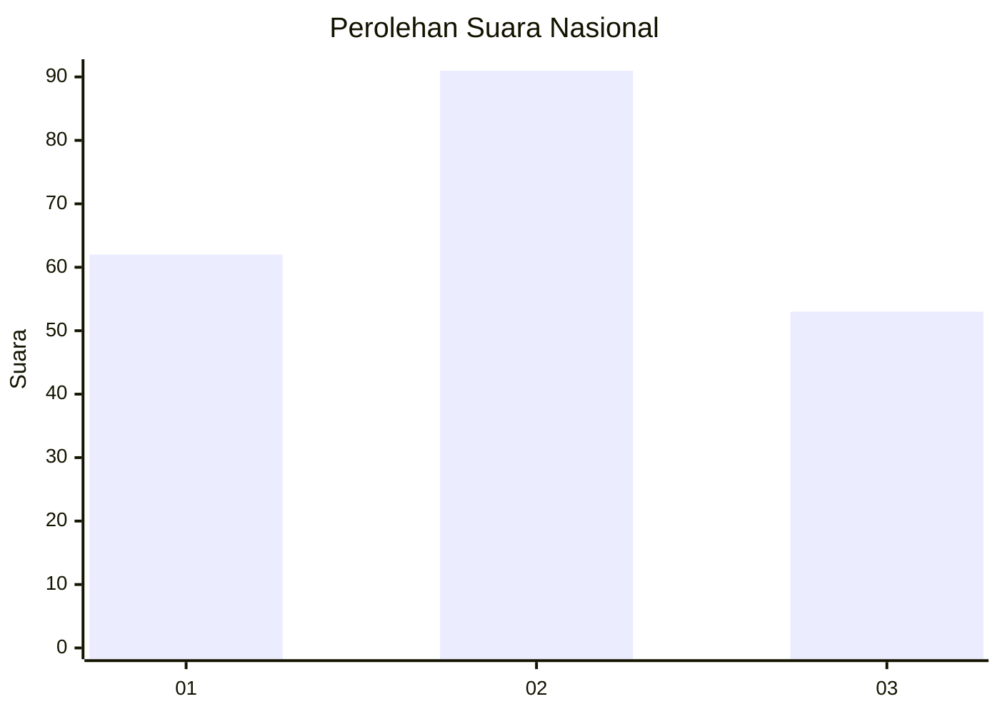
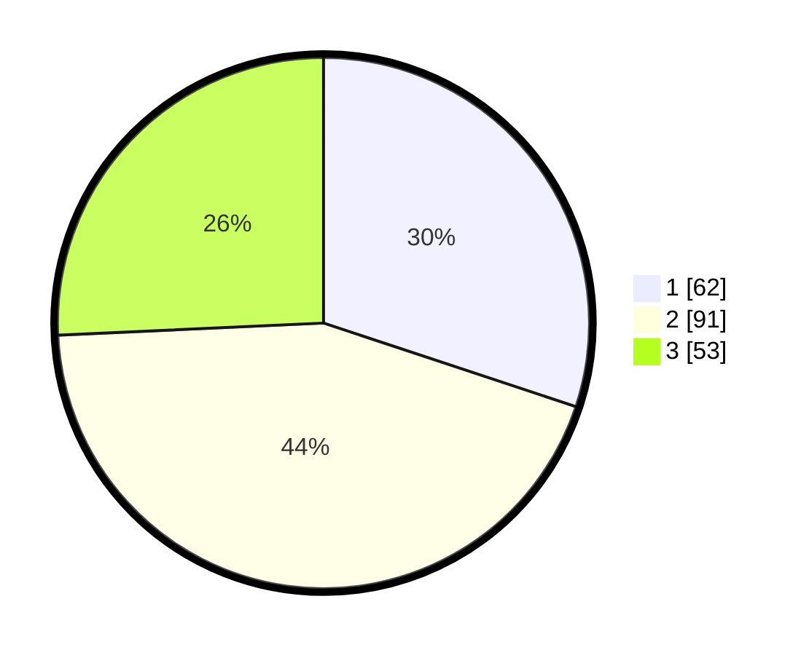

# Hasil

## Grafik

## Tabel

| No. | Nama Paslon    | Suara | Suara (raw) | Persentase |
|:--- |:-------------- | -----:| -----------:| ----------:|
| 1   | ANIES MUHAIMIN | 62    | [62][p-1]   | 30,10      |
| 2   | PRABOWO GIBRAN | 91    | [91][p-2]   | 44,17      |
| 3   | GANJAR MAHFUD  | 53    | [53][p-3]   | 25,73      |

[p-1]: https://github.com/gigit-pemilu/pemilu-2024/blob/main/pilpres/hitung-suara/sub/34-di-yogyakarta/sub/04-sleman/sub/07-depok/sub/2001-caturtunggal/sub/007-tps/sub/paslon-1.txt
[p-2]: https://github.com/gigit-pemilu/pemilu-2024/blob/main/pilpres/hitung-suara/sub/34-di-yogyakarta/sub/04-sleman/sub/07-depok/sub/2001-caturtunggal/sub/007-tps/sub/paslon-2.txt
[p-3]: https://github.com/gigit-pemilu/pemilu-2024/blob/main/pilpres/hitung-suara/sub/34-di-yogyakarta/sub/04-sleman/sub/07-depok/sub/2001-caturtunggal/sub/007-tps/sub/paslon-3.txt

## Foto C Plano

https://sirekap-obj-formc.kpu.go.id/1242/pemilu/ppwp/34/04/07/20/01/3404072001007-20240216-151241--34d619a3-64bb-4379-a281-67e9d4e34f45.jpg

https://sirekap-obj-formc.kpu.go.id/1242/pemilu/ppwp/34/04/07/20/01/3404072001007-20240216-151243--df6c7285-90c7-48a6-9bc9-d4287d2bae6e.jpg

https://sirekap-obj-formc.kpu.go.id/1242/pemilu/ppwp/34/04/07/20/01/3404072001007-20240216-151242--a96e0cec-445e-4855-9fd7-cc43a683040b.jpg

## Metadata

| Key        | Value               |
| ---------- | ------------------- |
| Time Stamp | 2024-02-16 21:01:00 |

## DATA PEMILIH TETAP

Jumlah pemilih dalam DPT: **233**.
 * L: **109**.
 * P: **124**.

## DATA PENGGUNA HAK PILIH

Jumlah pengguna hak pilih dalam DPT: **190**.
 * L: **87**.
 * P: **103**.

Jumlah pengguna hak pilih dalam DPTb: **16**.
 * L: **4**.
 * P: **12**.

Jumlah pengguna hak pilih dalam DPK: **6**.
 * L: **2**.
 * P: **4**.

Jumlah pengguna hak pilih: **212**.
 * L: **93**.
 * P: **119**.

## JUMLAH SUARA SAH DAN TIDAK SAH

JUMLAH SELURUH SUARA SAH: **206**.

JUMLAH SUARA TIDAK SAH: **5**.

JUMLAH SELURUH SUARA SAH DAN SUARA TIDAK SAH: **211**.

