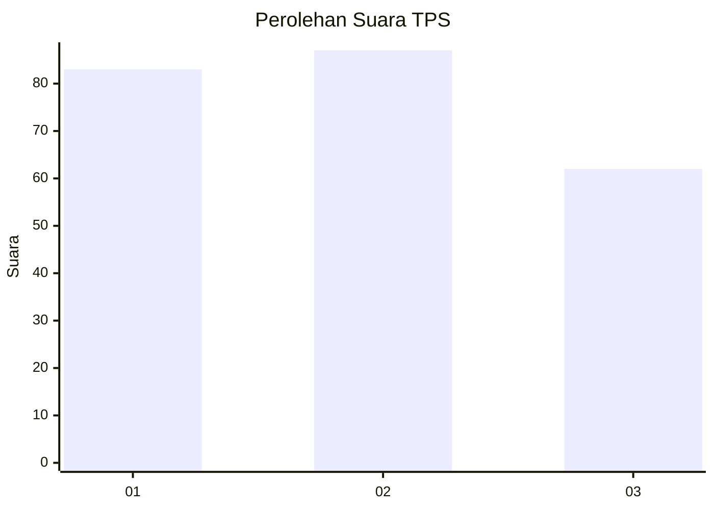
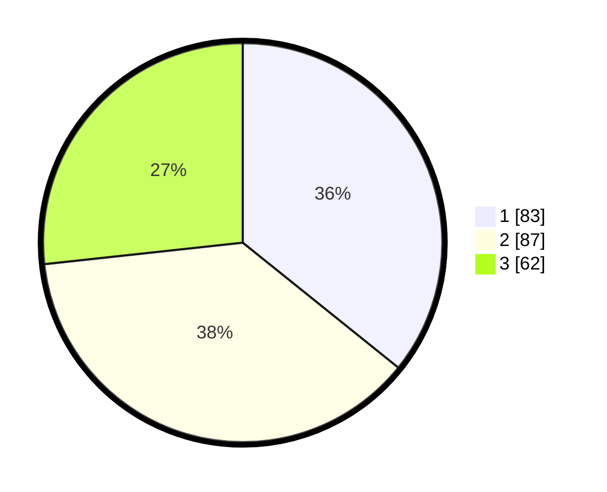

# Hasil

## Grafik

## Tabel

| No. | Nama Paslon    | Suara | Suara (raw) | Persentase |
|:--- |:-------------- | -----:| -----------:| ----------:|
| 1   | ANIES MUHAIMIN | 83    | [83][p-1]   | 35,78      |
| 2   | PRABOWO GIBRAN | 87    | [87][p-2]   | 37,50      |
| 3   | GANJAR MAHFUD  | 62    | [62][p-3]   | 26,72      |

[p-1]: https://github.com/gigit-pemilu/pemilu-2024-34-di-yogyakarta/blob/main/pilpres/hitung-suara/sub/34-di-yogyakarta/sub/04-sleman/sub/07-depok/sub/2001-caturtunggal/sub/008-tps/sub/paslon-1.txt
[p-2]: https://github.com/gigit-pemilu/pemilu-2024-34-di-yogyakarta/blob/main/pilpres/hitung-suara/sub/34-di-yogyakarta/sub/04-sleman/sub/07-depok/sub/2001-caturtunggal/sub/008-tps/sub/paslon-2.txt
[p-3]: https://github.com/gigit-pemilu/pemilu-2024-34-di-yogyakarta/blob/main/pilpres/hitung-suara/sub/34-di-yogyakarta/sub/04-sleman/sub/07-depok/sub/2001-caturtunggal/sub/008-tps/sub/paslon-3.txt

## Foto C Plano

https://sirekap-obj-formc.kpu.go.id/8522/pemilu/ppwp/34/04/07/20/01/3404072001008-20240214-155017--14531a84-2392-4bd5-87ea-3ed321a1af2a.jpg

https://sirekap-obj-formc.kpu.go.id/8522/pemilu/ppwp/34/04/07/20/01/3404072001008-20240214-155057--4af68344-35ae-4259-9db7-c9984c9fc2dc.jpg

https://sirekap-obj-formc.kpu.go.id/8522/pemilu/ppwp/34/04/07/20/01/3404072001008-20240214-155136--46b77523-1536-4de0-8837-28c9190b9f6d.jpg

## Metadata

| Key        | Value               |
| ---------- | ------------------- |
| Time Stamp | 2024-02-14 21:46:01 |

## DATA PEMILIH TETAP

Jumlah pemilih dalam DPT: **284**.
 * L: **141**.
 * P: **143**.

## DATA PENGGUNA HAK PILIH

Jumlah pengguna hak pilih dalam DPT: **222**.
 * L: **105**.
 * P: **117**.

Jumlah pengguna hak pilih dalam DPTb: **10**.
 * L: **0**.
 * P: **10**.

Jumlah pengguna hak pilih dalam DPK: **3**.
 * L: **3**.
 * P: **0**.

Jumlah pengguna hak pilih: **235**.
 * L: **108**.
 * P: **127**.

## JUMLAH SUARA SAH DAN TIDAK SAH

JUMLAH SELURUH SUARA SAH: **232**.

JUMLAH SUARA TIDAK SAH: **3**.

JUMLAH SELURUH SUARA SAH DAN SUARA TIDAK SAH: **235**.

