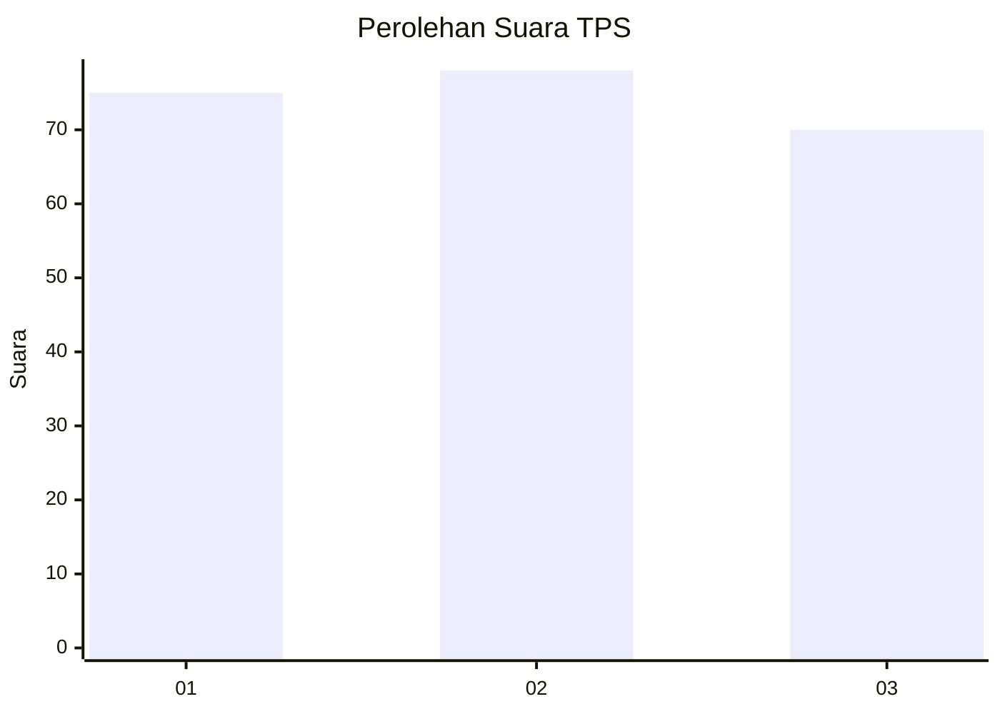
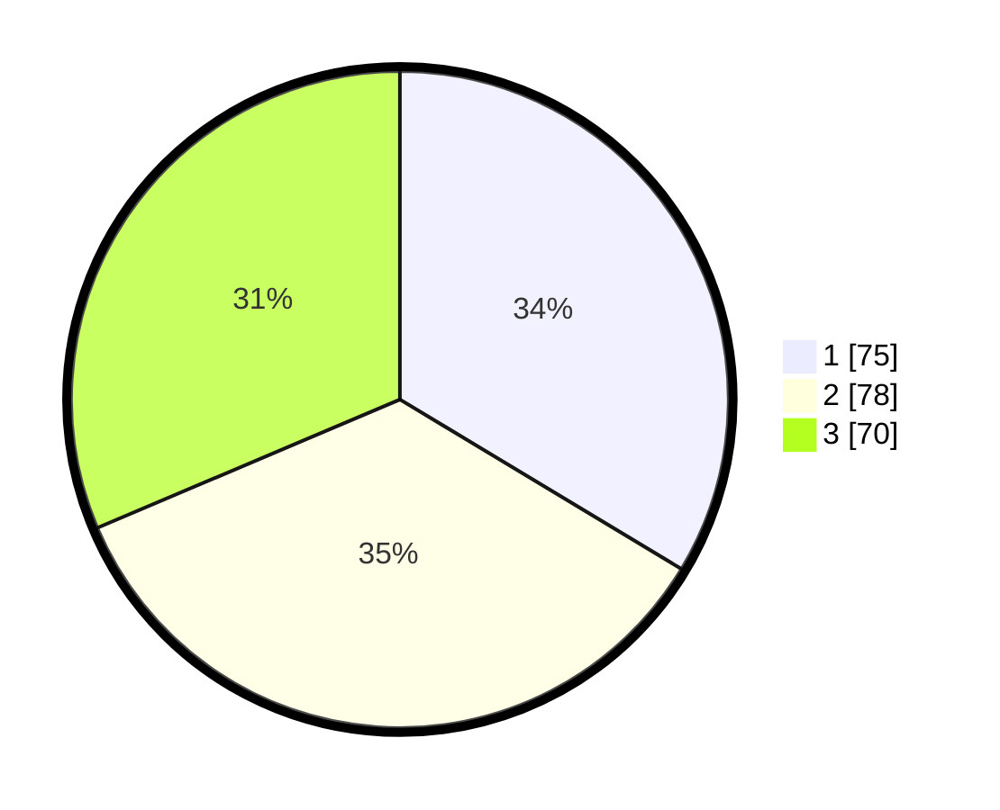

# Hasil

## Grafik

## Tabel

| No. | Nama Paslon    | Suara | Suara (raw) | Persentase |
|:--- |:-------------- | -----:| -----------:| ----------:|
| 1   | ANIES MUHAIMIN | 75    | [75][p-1]   | 33,63      |
| 2   | PRABOWO GIBRAN | 78    | [78][p-2]   | 34,98      |
| 3   | GANJAR MAHFUD  | 70    | [70][p-3]   | 31,39      |

[p-1]: https://github.com/gigit-pemilu/pemilu-2024-34-di-yogyakarta/blob/main/pilpres/hitung-suara/sub/34-di-yogyakarta/sub/04-sleman/sub/07-depok/sub/2001-caturtunggal/sub/009-tps/sub/paslon-1.txt
[p-2]: https://github.com/gigit-pemilu/pemilu-2024-34-di-yogyakarta/blob/main/pilpres/hitung-suara/sub/34-di-yogyakarta/sub/04-sleman/sub/07-depok/sub/2001-caturtunggal/sub/009-tps/sub/paslon-2.txt
[p-3]: https://github.com/gigit-pemilu/pemilu-2024-34-di-yogyakarta/blob/main/pilpres/hitung-suara/sub/34-di-yogyakarta/sub/04-sleman/sub/07-depok/sub/2001-caturtunggal/sub/009-tps/sub/paslon-3.txt

## Foto C Plano

https://sirekap-obj-formc.kpu.go.id/c2e0/pemilu/ppwp/34/04/07/20/01/3404072001009-20240214-230603--c6232a89-eecf-4fb4-9d98-54b0a4157630.jpg

https://sirekap-obj-formc.kpu.go.id/c2e0/pemilu/ppwp/34/04/07/20/01/3404072001009-20240214-230829--0df9f076-612f-436f-a86d-c9b627bf2075.jpg

https://sirekap-obj-formc.kpu.go.id/c2e0/pemilu/ppwp/34/04/07/20/01/3404072001009-20240214-231010--e8433de7-9780-4527-848a-1d74fc133987.jpg

## Metadata

| Key        | Value               |
| ---------- | ------------------- |
| Time Stamp | 2024-02-15 15:00:29 |

