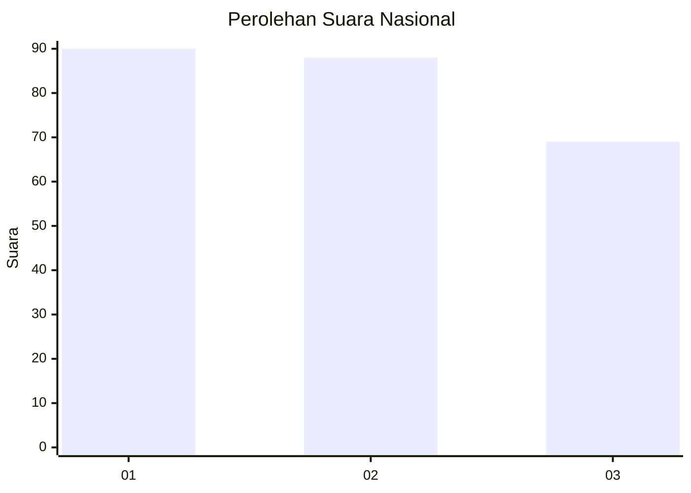
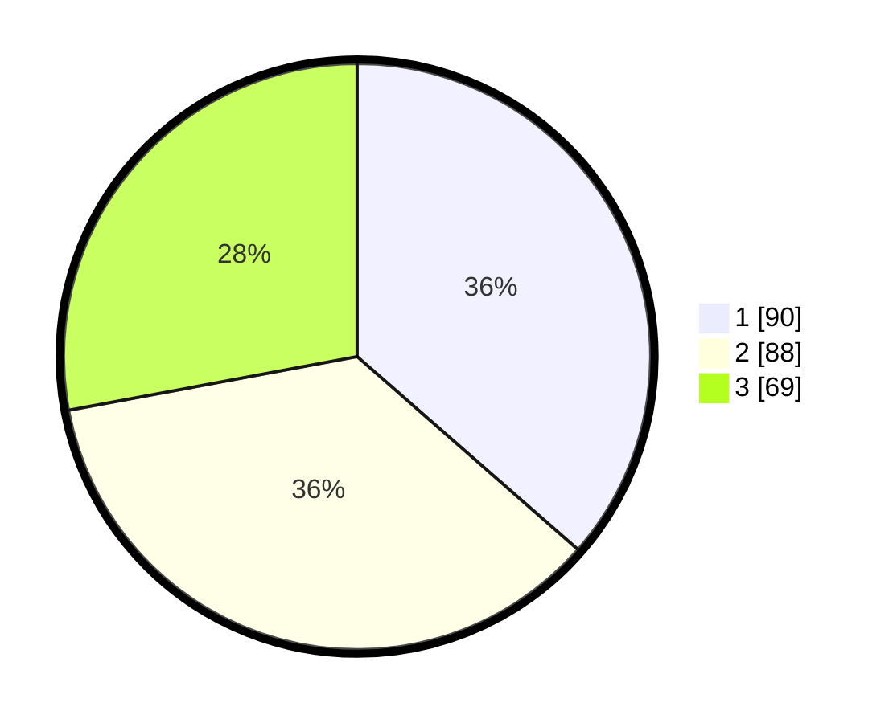

# Hasil

## Grafik

## Tabel

| No. | Nama Paslon    | Suara | Suara (raw) | Persentase |
|:--- |:-------------- | -----:| -----------:| ----------:|
| 1   | ANIES MUHAIMIN | 90    | [90][p-1]   | 36,44      |
| 2   | PRABOWO GIBRAN | 88    | [88][p-2]   | 35,63      |
| 3   | GANJAR MAHFUD  | 69    | [69][p-3]   | 27,94      |

[p-1]: https://github.com/gigit-pemilu/pemilu-2024/blob/main/pilpres/hitung-suara/sub/34-di-yogyakarta/sub/04-sleman/sub/07-depok/sub/2001-caturtunggal/sub/010-tps/sub/paslon-1.txt
[p-2]: https://github.com/gigit-pemilu/pemilu-2024/blob/main/pilpres/hitung-suara/sub/34-di-yogyakarta/sub/04-sleman/sub/07-depok/sub/2001-caturtunggal/sub/010-tps/sub/paslon-2.txt
[p-3]: https://github.com/gigit-pemilu/pemilu-2024/blob/main/pilpres/hitung-suara/sub/34-di-yogyakarta/sub/04-sleman/sub/07-depok/sub/2001-caturtunggal/sub/010-tps/sub/paslon-3.txt

## Foto C Plano

https://sirekap-obj-formc.kpu.go.id/6181/pemilu/ppwp/34/04/07/20/01/3404072001010-20240215-002942--aa5f3987-12dc-4219-a582-00322e0d134f.jpg

https://sirekap-obj-formc.kpu.go.id/6181/pemilu/ppwp/34/04/07/20/01/3404072001010-20240215-003052--acff7d3d-c070-467a-8584-6d6d4b813642.jpg

https://sirekap-obj-formc.kpu.go.id/6181/pemilu/ppwp/34/04/07/20/01/3404072001010-20240215-003225--3b6cb4c6-25f1-4475-a401-b90f77b9ca73.jpg

## Metadata

| Key        | Value               |
| ---------- | ------------------- |
| Time Stamp | 2024-02-17 07:00:02 |

## DATA PEMILIH TETAP

Jumlah pemilih dalam DPT: **277**.
 * L: **131**.
 * P: **146**.

## DATA PENGGUNA HAK PILIH

Jumlah pengguna hak pilih dalam DPT: **233**.
 * L: **108**.
 * P: **125**.

Jumlah pengguna hak pilih dalam DPTb: **13**.
 * L: **5**.
 * P: **8**.

Jumlah pengguna hak pilih dalam DPK: **3**.
 * L: **1**.
 * P: **2**.

Jumlah pengguna hak pilih: **249**.
 * L: **114**.
 * P: **135**.

## JUMLAH SUARA SAH DAN TIDAK SAH

JUMLAH SELURUH SUARA SAH: **247**.

JUMLAH SUARA TIDAK SAH: **2**.

JUMLAH SELURUH SUARA SAH DAN SUARA TIDAK SAH: **249**.

