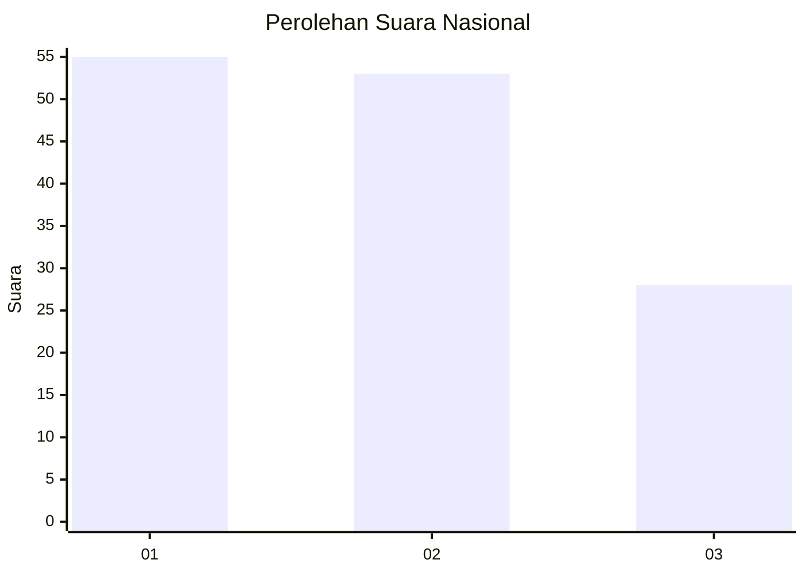
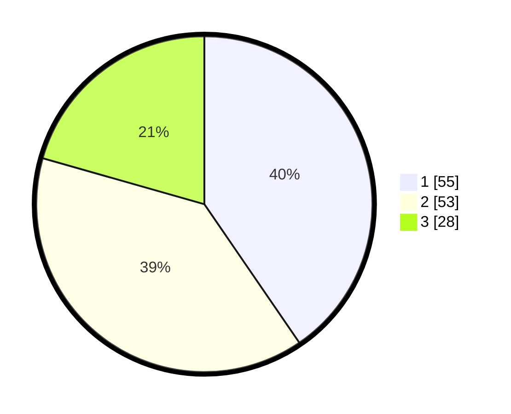

# Hasil

## Grafik

## Tabel

| No. | Nama Paslon    | Suara | Suara (raw) | Persentase |
|:--- |:-------------- | -----:| -----------:| ----------:|
| 1   | ANIES MUHAIMIN | 55    | [55][p-1]   | 40,44      |
| 2   | PRABOWO GIBRAN | 53    | [53][p-2]   | 38,97      |
| 3   | GANJAR MAHFUD  | 28    | [28][p-3]   | 20,59      |

[p-1]: https://github.com/gigit-pemilu/pemilu-2024/blob/main/pilpres/hitung-suara/sub/34-di-yogyakarta/sub/04-sleman/sub/07-depok/sub/2001-caturtunggal/sub/018-tps/sub/paslon-1.txt
[p-2]: https://github.com/gigit-pemilu/pemilu-2024/blob/main/pilpres/hitung-suara/sub/34-di-yogyakarta/sub/04-sleman/sub/07-depok/sub/2001-caturtunggal/sub/018-tps/sub/paslon-2.txt
[p-3]: https://github.com/gigit-pemilu/pemilu-2024/blob/main/pilpres/hitung-suara/sub/34-di-yogyakarta/sub/04-sleman/sub/07-depok/sub/2001-caturtunggal/sub/018-tps/sub/paslon-3.txt

## Foto C Plano

https://sirekap-obj-formc.kpu.go.id/5b7c/pemilu/ppwp/34/04/07/20/01/3404072001018-20240214-200247--a69c7486-7691-4835-abe2-a9528abfc4a9.jpg

https://sirekap-obj-formc.kpu.go.id/5b7c/pemilu/ppwp/34/04/07/20/01/3404072001018-20240214-200251--3f32494f-866e-4ff5-88e9-d5fde686ba1a.jpg

https://sirekap-obj-formc.kpu.go.id/5b7c/pemilu/ppwp/34/04/07/20/01/3404072001018-20240214-200253--8f88455a-eadc-474e-b9c3-49fb985d7066.jpg

## Metadata

| Key        | Value               |
| ---------- | ------------------- |
| Time Stamp | 2024-02-15 21:30:27 |

