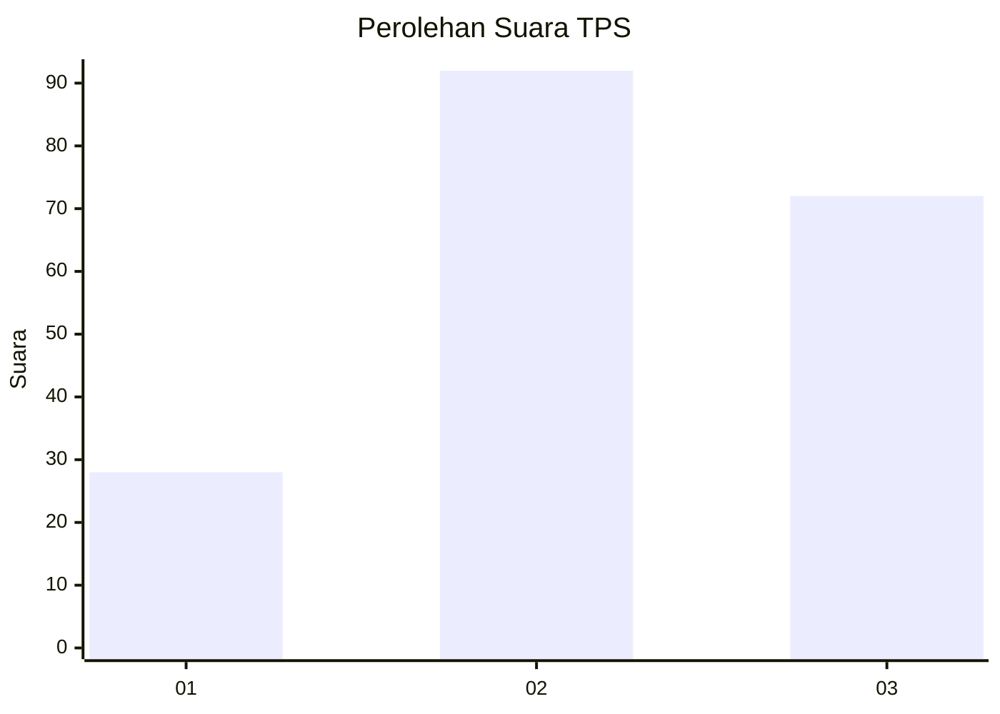
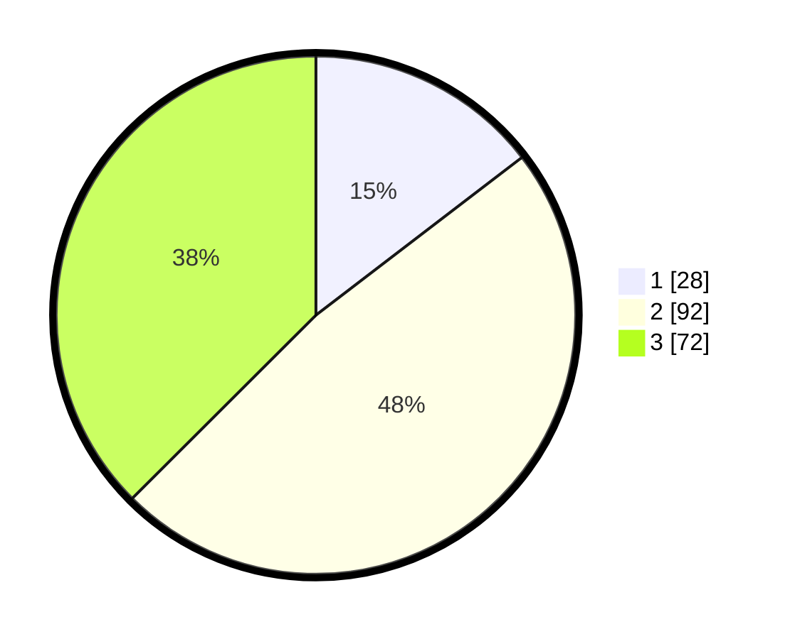

# Hasil

## Grafik

## Tabel

| No. | Nama Paslon    | Suara | Suara (raw) | Persentase |
|:--- |:-------------- | -----:| -----------:| ----------:|
| 1   | ANIES MUHAIMIN | 28    | [28][p-1]   | 14,58      |
| 2   | PRABOWO GIBRAN | 92    | [92][p-2]   | 47,92      |
| 3   | GANJAR MAHFUD  | 72    | [72][p-3]   | 37,50      |

[p-1]: https://github.com/gigit-pemilu/pemilu-2024-34-di-yogyakarta/blob/main/pilpres/hitung-suara/sub/34-di-yogyakarta/sub/04-sleman/sub/07-depok/sub/2001-caturtunggal/sub/024-tps/sub/paslon-1.txt
[p-2]: https://github.com/gigit-pemilu/pemilu-2024-34-di-yogyakarta/blob/main/pilpres/hitung-suara/sub/34-di-yogyakarta/sub/04-sleman/sub/07-depok/sub/2001-caturtunggal/sub/024-tps/sub/paslon-2.txt
[p-3]: https://github.com/gigit-pemilu/pemilu-2024-34-di-yogyakarta/blob/main/pilpres/hitung-suara/sub/34-di-yogyakarta/sub/04-sleman/sub/07-depok/sub/2001-caturtunggal/sub/024-tps/sub/paslon-3.txt

## Foto C Plano

https://sirekap-obj-formc.kpu.go.id/f742/pemilu/ppwp/34/04/07/20/01/3404072001024-20240214-194100--13740b2b-513b-4b3f-8c6a-3f1134a7d12e.jpg

https://sirekap-obj-formc.kpu.go.id/f742/pemilu/ppwp/34/04/07/20/01/3404072001024-20240214-194106--52ba5ca7-1226-44ea-bda4-7bc2b6a837e3.jpg

https://sirekap-obj-formc.kpu.go.id/f742/pemilu/ppwp/34/04/07/20/01/3404072001024-20240214-194111--7898ea1d-6dca-4dd2-bdc9-30ff3223faaa.jpg

## Metadata

| Key        | Value               |
| ---------- | ------------------- |
| Time Stamp | 2024-02-15 21:01:18 |

## DATA PEMILIH TETAP

Jumlah pemilih dalam DPT: **215**.
 * L: **102**.
 * P: **113**.

## DATA PENGGUNA HAK PILIH

Jumlah pengguna hak pilih dalam DPT: **179**.
 * L: **85**.
 * P: **94**.

Jumlah pengguna hak pilih dalam DPTb: **12**.
 * L: **5**.
 * P: **7**.

Jumlah pengguna hak pilih dalam DPK: **4**.
 * L: **2**.
 * P: **2**.

Jumlah pengguna hak pilih: **195**.
 * L: **92**.
 * P: **103**.

## JUMLAH SUARA SAH DAN TIDAK SAH

JUMLAH SELURUH SUARA SAH: **192**.

JUMLAH SUARA TIDAK SAH: **3**.

JUMLAH SELURUH SUARA SAH DAN SUARA TIDAK SAH: **195**.

