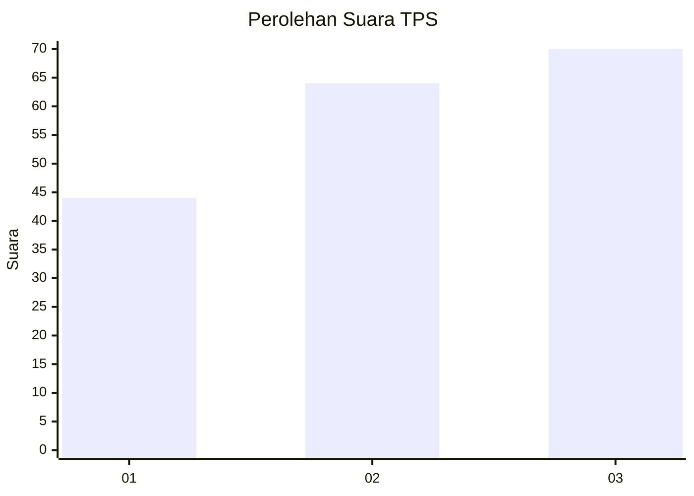
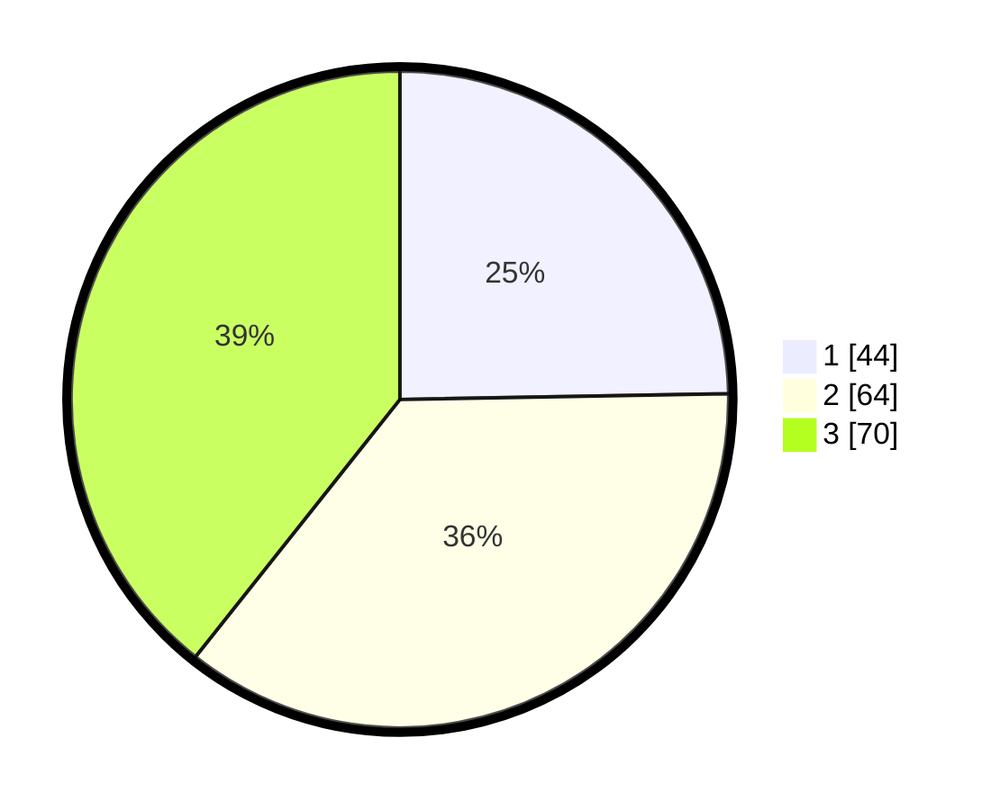

# Hasil

## Grafik

## Tabel

| No. | Nama Paslon    | Suara | Suara (raw) | Persentase |
|:--- |:-------------- | -----:| -----------:| ----------:|
| 1   | ANIES MUHAIMIN | 44    | [44][p-1]   | 24,72      |
| 2   | PRABOWO GIBRAN | 64    | [64][p-2]   | 35,96      |
| 3   | GANJAR MAHFUD  | 70    | [70][p-3]   | 39,33      |

[p-1]: https://github.com/gigit-pemilu/pemilu-2024-34-di-yogyakarta/blob/main/pilpres/hitung-suara/sub/34-di-yogyakarta/sub/04-sleman/sub/07-depok/sub/2001-caturtunggal/sub/027-tps/sub/paslon-1.txt
[p-2]: https://github.com/gigit-pemilu/pemilu-2024-34-di-yogyakarta/blob/main/pilpres/hitung-suara/sub/34-di-yogyakarta/sub/04-sleman/sub/07-depok/sub/2001-caturtunggal/sub/027-tps/sub/paslon-2.txt
[p-3]: https://github.com/gigit-pemilu/pemilu-2024-34-di-yogyakarta/blob/main/pilpres/hitung-suara/sub/34-di-yogyakarta/sub/04-sleman/sub/07-depok/sub/2001-caturtunggal/sub/027-tps/sub/paslon-3.txt

## Foto C Plano

https://sirekap-obj-formc.kpu.go.id/f62b/pemilu/ppwp/34/04/07/20/01/3404072001027-20240215-012445--c93204dc-57f9-4688-b909-e69ba810ce33.jpg

https://sirekap-obj-formc.kpu.go.id/f62b/pemilu/ppwp/34/04/07/20/01/3404072001027-20240214-214837--1a1fc903-2a65-45f4-a1b7-e0f8367d1b7a.jpg

https://sirekap-obj-formc.kpu.go.id/f62b/pemilu/ppwp/34/04/07/20/01/3404072001027-20240215-012614--6fa995ab-846f-472c-ae88-4b5632225386.jpg

## Metadata

| Key        | Value               |
| ---------- | ------------------- |
| Time Stamp | 2024-02-15 21:01:18 |

