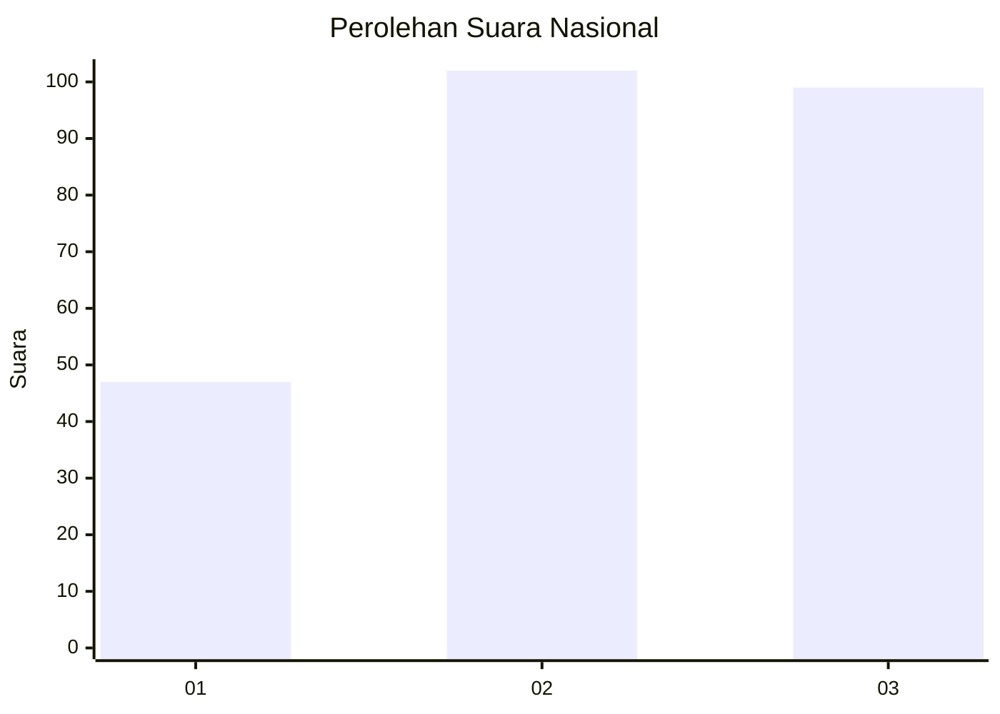
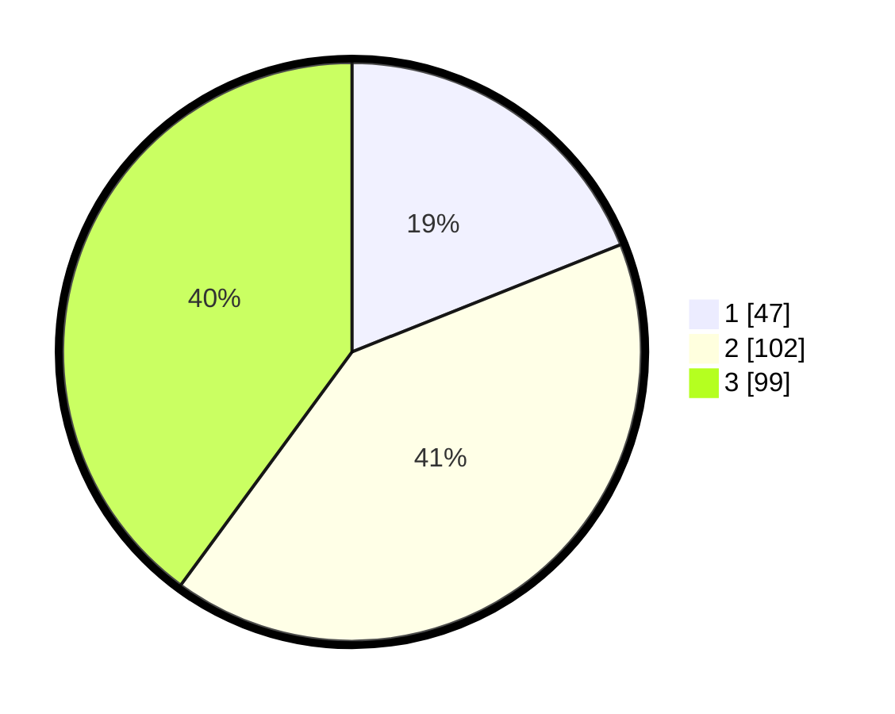

# Hasil

## Grafik

## Tabel

| No. | Nama Paslon    | Suara | Suara (raw) | Persentase |
|:--- |:-------------- | -----:| -----------:| ----------:|
| 1   | ANIES MUHAIMIN | 47    | [47][p-1]   | 18,95      |
| 2   | PRABOWO GIBRAN | 102   | [102][p-2]  | 41,13      |
| 3   | GANJAR MAHFUD  | 99    | [99][p-3]   | 39,92      |

[p-1]: https://github.com/gigit-pemilu/pemilu-2024/blob/main/pilpres/hitung-suara/sub/34-di-yogyakarta/sub/04-sleman/sub/07-depok/sub/2001-caturtunggal/sub/030-tps/sub/paslon-1.txt
[p-2]: https://github.com/gigit-pemilu/pemilu-2024/blob/main/pilpres/hitung-suara/sub/34-di-yogyakarta/sub/04-sleman/sub/07-depok/sub/2001-caturtunggal/sub/030-tps/sub/paslon-2.txt
[p-3]: https://github.com/gigit-pemilu/pemilu-2024/blob/main/pilpres/hitung-suara/sub/34-di-yogyakarta/sub/04-sleman/sub/07-depok/sub/2001-caturtunggal/sub/030-tps/sub/paslon-3.txt

## Foto C Plano

https://sirekap-obj-formc.kpu.go.id/983d/pemilu/ppwp/34/04/07/20/01/3404072001030-20240215-014840--f0026f78-f261-41e8-841f-8121f339abc8.jpg

https://sirekap-obj-formc.kpu.go.id/983d/pemilu/ppwp/34/04/07/20/01/3404072001030-20240215-014510--89720d6e-53bf-4462-bd02-2491ddd49c6c.jpg

https://sirekap-obj-formc.kpu.go.id/983d/pemilu/ppwp/34/04/07/20/01/3404072001030-20240215-014540--dc83eedc-3a62-40e1-8513-7a1d79d0a32d.jpg

## Metadata

| Key        | Value               |
| ---------- | ------------------- |
| Time Stamp | 2024-02-15 15:00:29 |

## DATA PEMILIH TETAP

Jumlah pemilih dalam DPT: **283**.
 * L: **151**.
 * P: **132**.

## DATA PENGGUNA HAK PILIH

Jumlah pengguna hak pilih dalam DPT: **240**.
 * L: **130**.
 * P: **110**.

Jumlah pengguna hak pilih dalam DPTb: **14**.
 * L: **3**.
 * P: **11**.

Jumlah pengguna hak pilih dalam DPK: **2**.
 * L: **1**.
 * P: **1**.

Jumlah pengguna hak pilih: **256**.
 * L: **134**.
 * P: **122**.

## JUMLAH SUARA SAH DAN TIDAK SAH

JUMLAH SELURUH SUARA SAH: **248**.

JUMLAH SUARA TIDAK SAH: **8**.

JUMLAH SELURUH SUARA SAH DAN SUARA TIDAK SAH: **256**.

