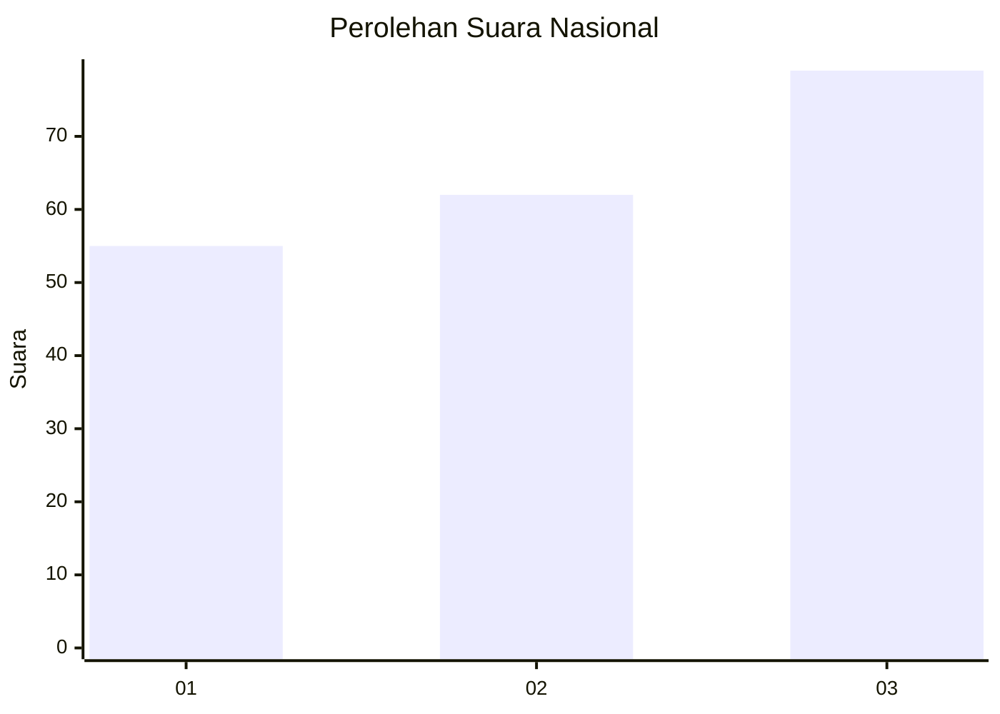
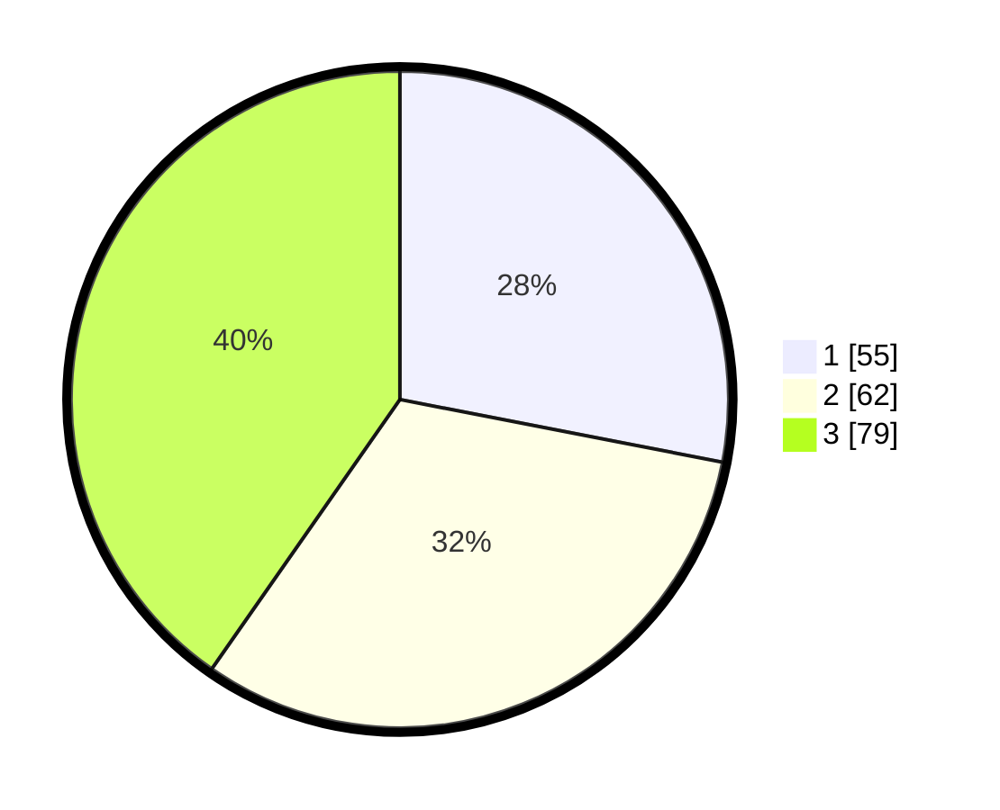

# Hasil

## Grafik

## Tabel

| No. | Nama Paslon    | Suara | Suara (raw) | Persentase |
|:--- |:-------------- | -----:| -----------:| ----------:|
| 1   | ANIES MUHAIMIN | 55    | [55][p-1]   | 28,06      |
| 2   | PRABOWO GIBRAN | 62    | [62][p-2]   | 31,63      |
| 3   | GANJAR MAHFUD  | 79    | [79][p-3]   | 40,31      |

[p-1]: https://github.com/gigit-pemilu/pemilu-2024/blob/main/pilpres/hitung-suara/sub/34-di-yogyakarta/sub/04-sleman/sub/07-depok/sub/2001-caturtunggal/sub/031-tps/sub/paslon-1.txt
[p-2]: https://github.com/gigit-pemilu/pemilu-2024/blob/main/pilpres/hitung-suara/sub/34-di-yogyakarta/sub/04-sleman/sub/07-depok/sub/2001-caturtunggal/sub/031-tps/sub/paslon-2.txt
[p-3]: https://github.com/gigit-pemilu/pemilu-2024/blob/main/pilpres/hitung-suara/sub/34-di-yogyakarta/sub/04-sleman/sub/07-depok/sub/2001-caturtunggal/sub/031-tps/sub/paslon-3.txt

## Foto C Plano

https://sirekap-obj-formc.kpu.go.id/0ded/pemilu/ppwp/34/04/07/20/01/3404072001031-20240214-201027--33a7d693-2a95-4fd2-9b22-5e4b3776c39c.jpg

https://sirekap-obj-formc.kpu.go.id/0ded/pemilu/ppwp/34/04/07/20/01/3404072001031-20240214-200856--0d753052-1721-4946-87db-76a0fe697cde.jpg

https://sirekap-obj-formc.kpu.go.id/0ded/pemilu/ppwp/34/04/07/20/01/3404072001031-20240214-200747--2dc376f6-fb97-4dc9-b174-f21a0f7f12c9.jpg

## Metadata

| Key        | Value               |
| ---------- | ------------------- |
| Time Stamp | 2024-02-15 00:41:44 |

## DATA PEMILIH TETAP

Jumlah pemilih dalam DPT: **240**.
 * L: **108**.
 * P: **132**.

## DATA PENGGUNA HAK PILIH

Jumlah pengguna hak pilih dalam DPT: **188**.
 * L: **73**.
 * P: **115**.

Jumlah pengguna hak pilih dalam DPTb: **11**.
 * L: **3**.
 * P: **8**.

Jumlah pengguna hak pilih dalam DPK: **3**.
 * L: **0**.
 * P: **3**.

Jumlah pengguna hak pilih: **202**.
 * L: **76**.
 * P: **126**.

## JUMLAH SUARA SAH DAN TIDAK SAH

JUMLAH SELURUH SUARA SAH: **196**.

JUMLAH SUARA TIDAK SAH: **6**.

JUMLAH SELURUH SUARA SAH DAN SUARA TIDAK SAH: **202**.

