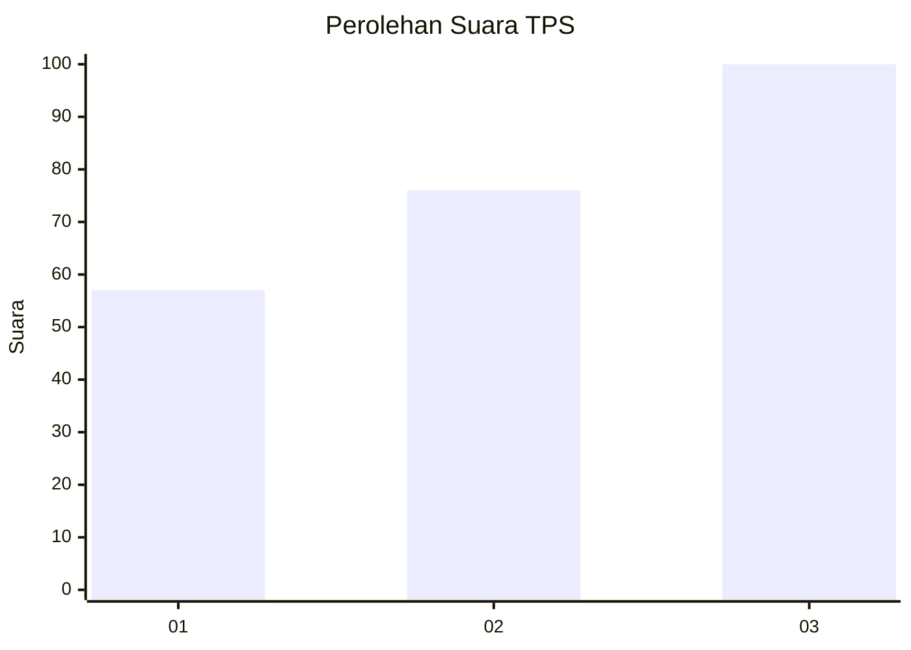
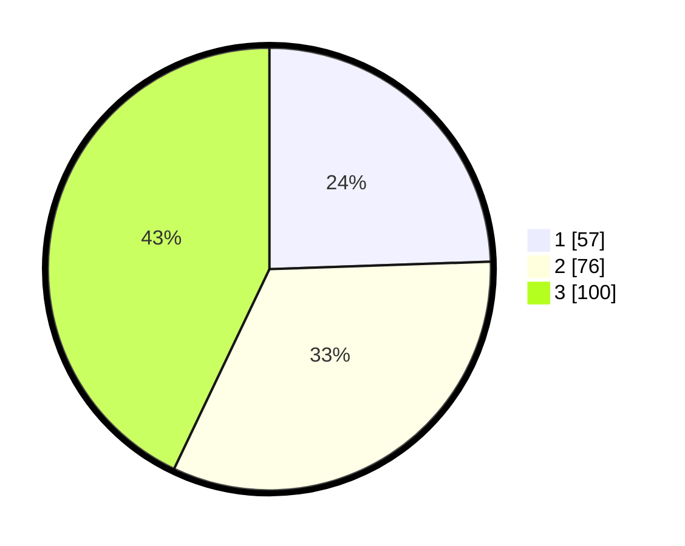

# Hasil

## Grafik

## Tabel

| No. | Nama Paslon    | Suara | Suara (raw) | Persentase |
|:--- |:-------------- | -----:| -----------:| ----------:|
| 1   | ANIES MUHAIMIN | 57    | [57][p-1]   | 24,46      |
| 2   | PRABOWO GIBRAN | 76    | [76][p-2]   | 32,62      |
| 3   | GANJAR MAHFUD  | 100   | [100][p-3]  | 42,92      |

[p-1]: https://github.com/gigit-pemilu/pemilu-2024-34-di-yogyakarta/blob/main/pilpres/hitung-suara/sub/34-di-yogyakarta/sub/04-sleman/sub/07-depok/sub/2001-caturtunggal/sub/035-tps/sub/paslon-1.txt
[p-2]: https://github.com/gigit-pemilu/pemilu-2024-34-di-yogyakarta/blob/main/pilpres/hitung-suara/sub/34-di-yogyakarta/sub/04-sleman/sub/07-depok/sub/2001-caturtunggal/sub/035-tps/sub/paslon-2.txt
[p-3]: https://github.com/gigit-pemilu/pemilu-2024-34-di-yogyakarta/blob/main/pilpres/hitung-suara/sub/34-di-yogyakarta/sub/04-sleman/sub/07-depok/sub/2001-caturtunggal/sub/035-tps/sub/paslon-3.txt

## Foto C Plano

https://sirekap-obj-formc.kpu.go.id/236e/pemilu/ppwp/34/04/07/20/01/3404072001035-20240214-215802--35470096-76fe-4875-9d54-6f54566273dc.jpg

https://sirekap-obj-formc.kpu.go.id/236e/pemilu/ppwp/34/04/07/20/01/3404072001035-20240214-220103--8f53aa9c-cf9b-45be-949c-c09b94fff17d.jpg

https://sirekap-obj-formc.kpu.go.id/236e/pemilu/ppwp/34/04/07/20/01/3404072001035-20240214-220157--3419a15a-4908-4cf1-a0e7-6a8a106149b2.jpg

## Metadata

| Key        | Value               |
| ---------- | ------------------- |
| Time Stamp | 2024-02-15 15:00:29 |

