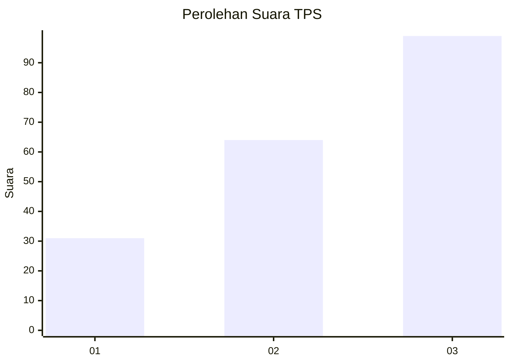
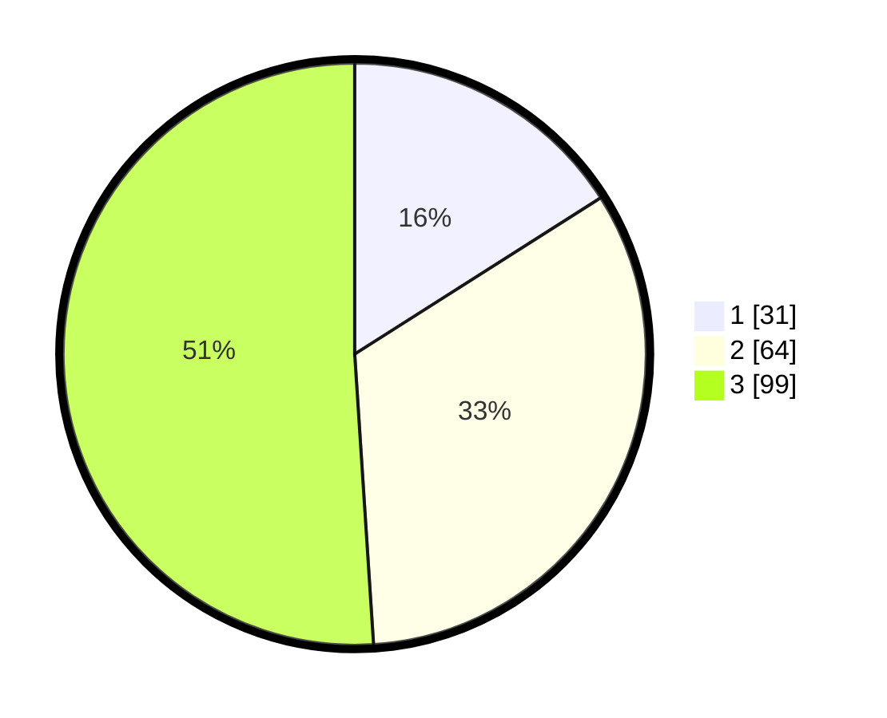

# Hasil

## Grafik

## Tabel

| No. | Nama Paslon    | Suara | Suara (raw) | Persentase |
|:--- |:-------------- | -----:| -----------:| ----------:|
| 1   | ANIES MUHAIMIN | 31    | [31][p-1]   | 15,98      |
| 2   | PRABOWO GIBRAN | 64    | [64][p-2]   | 32,99      |
| 3   | GANJAR MAHFUD  | 99    | [99][p-3]   | 51,03      |

[p-1]: https://github.com/gigit-pemilu/pemilu-2024-34-di-yogyakarta/blob/main/pilpres/hitung-suara/sub/34-di-yogyakarta/sub/04-sleman/sub/07-depok/sub/2001-caturtunggal/sub/036-tps/sub/paslon-1.txt
[p-2]: https://github.com/gigit-pemilu/pemilu-2024-34-di-yogyakarta/blob/main/pilpres/hitung-suara/sub/34-di-yogyakarta/sub/04-sleman/sub/07-depok/sub/2001-caturtunggal/sub/036-tps/sub/paslon-2.txt
[p-3]: https://github.com/gigit-pemilu/pemilu-2024-34-di-yogyakarta/blob/main/pilpres/hitung-suara/sub/34-di-yogyakarta/sub/04-sleman/sub/07-depok/sub/2001-caturtunggal/sub/036-tps/sub/paslon-3.txt

## Foto C Plano

https://sirekap-obj-formc.kpu.go.id/e6f5/pemilu/ppwp/34/04/07/20/01/3404072001036-20240215-045218--13cc3ff6-0252-4a3d-95cd-df5146d36bd3.jpg

https://sirekap-obj-formc.kpu.go.id/e6f5/pemilu/ppwp/34/04/07/20/01/3404072001036-20240215-045248--626868af-0ff0-4109-8033-11475e0dd8c8.jpg

https://sirekap-obj-formc.kpu.go.id/e6f5/pemilu/ppwp/34/04/07/20/01/3404072001036-20240215-045258--395ad0a6-9252-40f1-9de5-d8d6d5b741e5.jpg

## Metadata

| Key        | Value               |
| ---------- | ------------------- |
| Time Stamp | 2024-02-15 17:30:25 |

