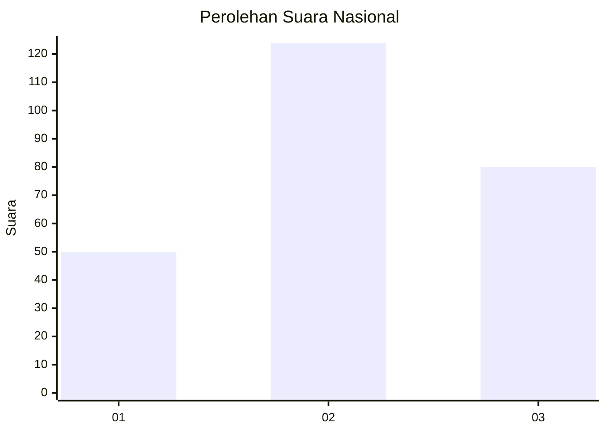
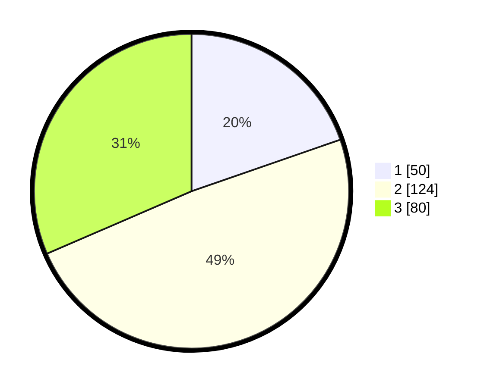

# Hasil

## Grafik

## Tabel

| No. | Nama Paslon    | Suara | Suara (raw) | Persentase |
|:--- |:-------------- | -----:| -----------:| ----------:|
| 1   | ANIES MUHAIMIN | 50    | [50][p-1]   | 19,69      |
| 2   | PRABOWO GIBRAN | 124   | [124][p-2]  | 48,82      |
| 3   | GANJAR MAHFUD  | 80    | [80][p-3]   | 31,50      |

[p-1]: https://github.com/gigit-pemilu/pemilu-2024/blob/main/pilpres/hitung-suara/sub/34-di-yogyakarta/sub/04-sleman/sub/07-depok/sub/2001-caturtunggal/sub/039-tps/sub/paslon-1.txt
[p-2]: https://github.com/gigit-pemilu/pemilu-2024/blob/main/pilpres/hitung-suara/sub/34-di-yogyakarta/sub/04-sleman/sub/07-depok/sub/2001-caturtunggal/sub/039-tps/sub/paslon-2.txt
[p-3]: https://github.com/gigit-pemilu/pemilu-2024/blob/main/pilpres/hitung-suara/sub/34-di-yogyakarta/sub/04-sleman/sub/07-depok/sub/2001-caturtunggal/sub/039-tps/sub/paslon-3.txt

## Foto C Plano

https://sirekap-obj-formc.kpu.go.id/a9dd/pemilu/ppwp/34/04/07/20/01/3404072001039-20240216-151614--08cb9183-7c82-450a-b122-afa897332a49.jpg

https://sirekap-obj-formc.kpu.go.id/a9dd/pemilu/ppwp/34/04/07/20/01/3404072001039-20240214-202901--3ae2722a-a663-44a0-9d77-eb5e45c21fae.jpg

https://sirekap-obj-formc.kpu.go.id/a9dd/pemilu/ppwp/34/04/07/20/01/3404072001039-20240216-151615--54a56f2d-2c83-4c46-87a3-c10f6837b0e7.jpg

## Metadata

| Key        | Value               |
| ---------- | ------------------- |
| Time Stamp | 2024-02-16 21:01:00 |

## DATA PEMILIH TETAP

Jumlah pemilih dalam DPT: **288**.
 * L: **127**.
 * P: **161**.

## DATA PENGGUNA HAK PILIH

Jumlah pengguna hak pilih dalam DPT: **243**.
 * L: **106**.
 * P: **137**.

Jumlah pengguna hak pilih dalam DPTb: **13**.
 * L: **2**.
 * P: **11**.

Jumlah pengguna hak pilih dalam DPK: **2**.
 * L: **0**.
 * P: **2**.

Jumlah pengguna hak pilih: **258**.
 * L: **108**.
 * P: **150**.

## JUMLAH SUARA SAH DAN TIDAK SAH

JUMLAH SELURUH SUARA SAH: **254**.

JUMLAH SUARA TIDAK SAH: **4**.

JUMLAH SELURUH SUARA SAH DAN SUARA TIDAK SAH: **258**.

