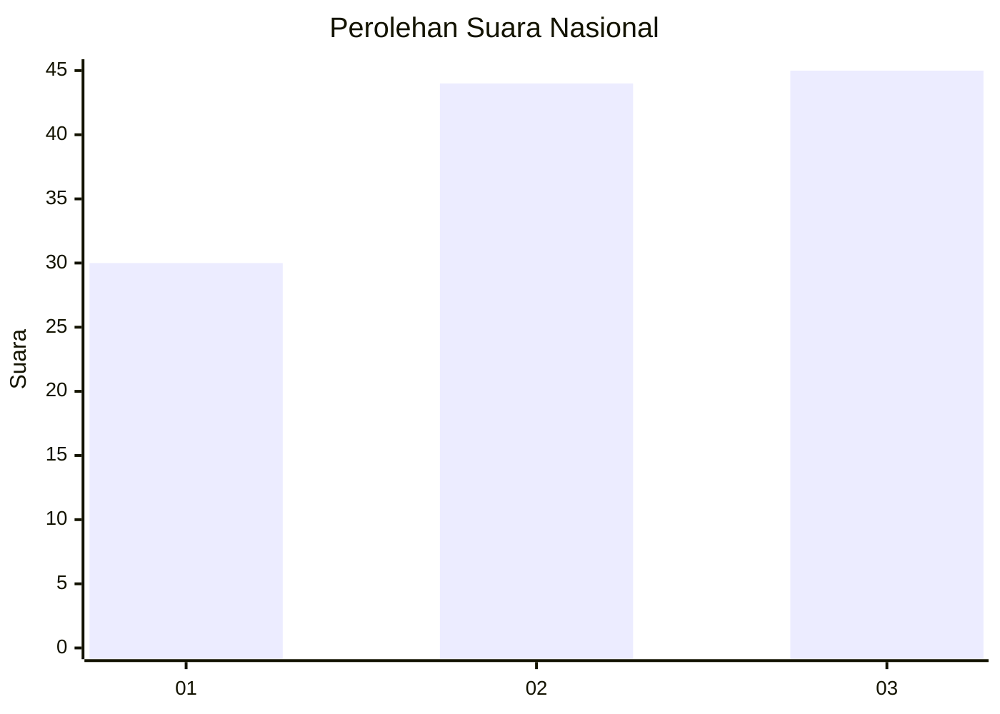
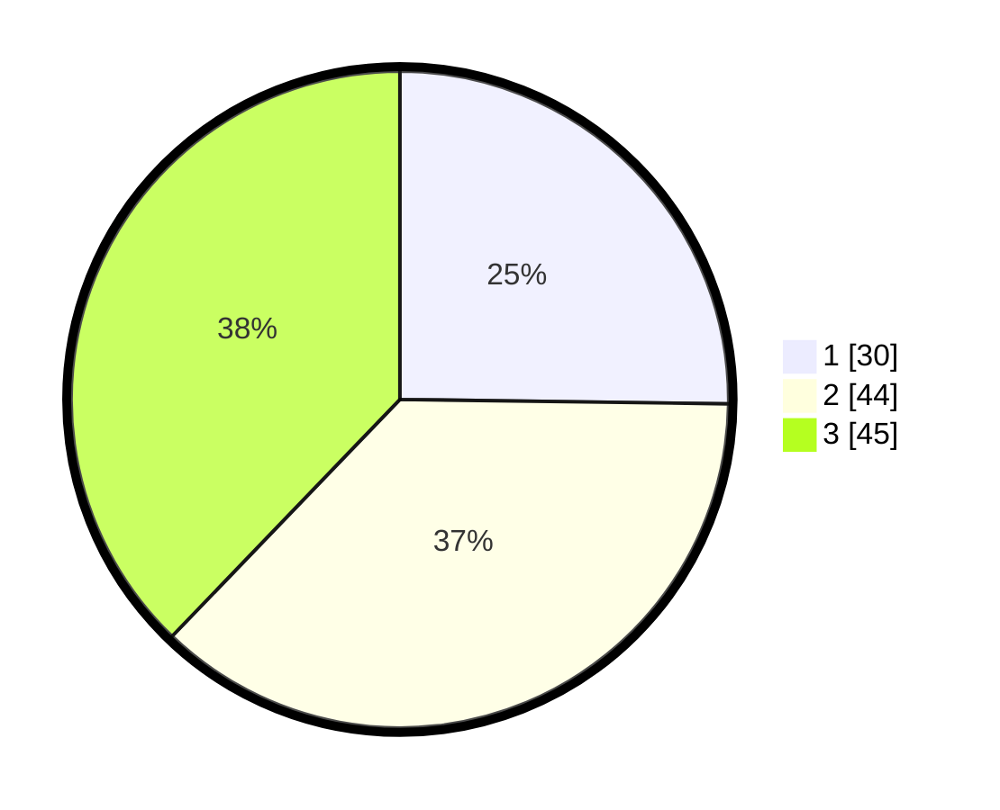

# Hasil

## Grafik

## Tabel

| No. | Nama Paslon    | Suara | Suara (raw) | Persentase |
|:--- |:-------------- | -----:| -----------:| ----------:|
| 1   | ANIES MUHAIMIN | 30    | [30][p-1]   | 25,21      |
| 2   | PRABOWO GIBRAN | 44    | [44][p-2]   | 36,97      |
| 3   | GANJAR MAHFUD  | 45    | [45][p-3]   | 37,82      |

[p-1]: https://github.com/gigit-pemilu/pemilu-2024/blob/main/pilpres/hitung-suara/sub/34-di-yogyakarta/sub/04-sleman/sub/07-depok/sub/2001-caturtunggal/sub/043-tps/sub/paslon-1.txt
[p-2]: https://github.com/gigit-pemilu/pemilu-2024/blob/main/pilpres/hitung-suara/sub/34-di-yogyakarta/sub/04-sleman/sub/07-depok/sub/2001-caturtunggal/sub/043-tps/sub/paslon-2.txt
[p-3]: https://github.com/gigit-pemilu/pemilu-2024/blob/main/pilpres/hitung-suara/sub/34-di-yogyakarta/sub/04-sleman/sub/07-depok/sub/2001-caturtunggal/sub/043-tps/sub/paslon-3.txt

## Foto C Plano

https://sirekap-obj-formc.kpu.go.id/e95a/pemilu/ppwp/34/04/07/20/01/3404072001043-20240214-202932--30614b83-0ac9-4d13-ba0b-66c6fcd05204.jpg

https://sirekap-obj-formc.kpu.go.id/e95a/pemilu/ppwp/34/04/07/20/01/3404072001043-20240214-204007--926cec0f-ef0e-4e13-9bd8-bf53e46e89b1.jpg

https://sirekap-obj-formc.kpu.go.id/e95a/pemilu/ppwp/34/04/07/20/01/3404072001043-20240214-204814--6c708a4f-7578-43bc-821f-3aa055819bb7.jpg

## Metadata

| Key        | Value               |
| ---------- | ------------------- |
| Time Stamp | 2024-02-15 21:01:18 |

