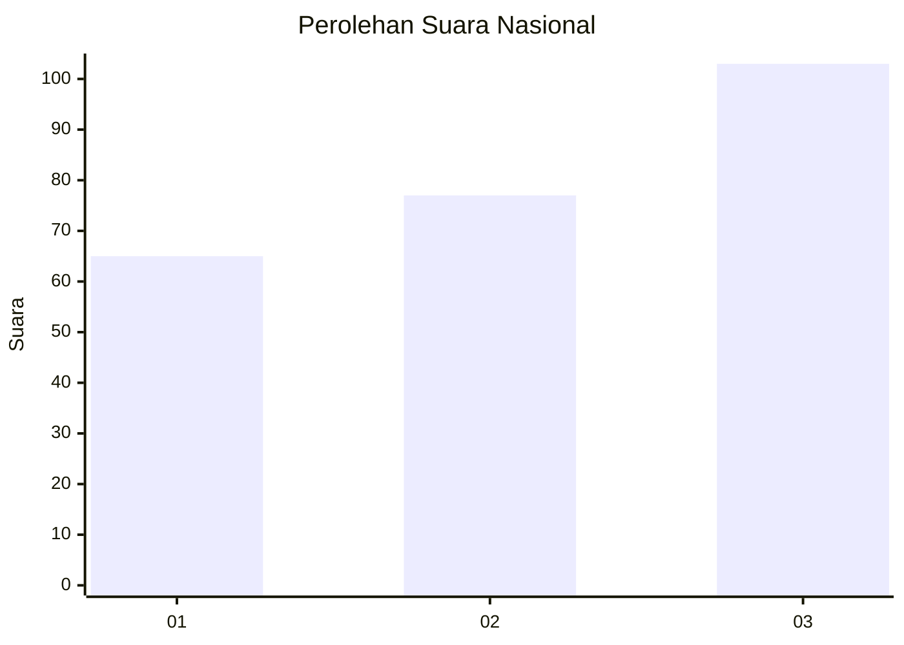
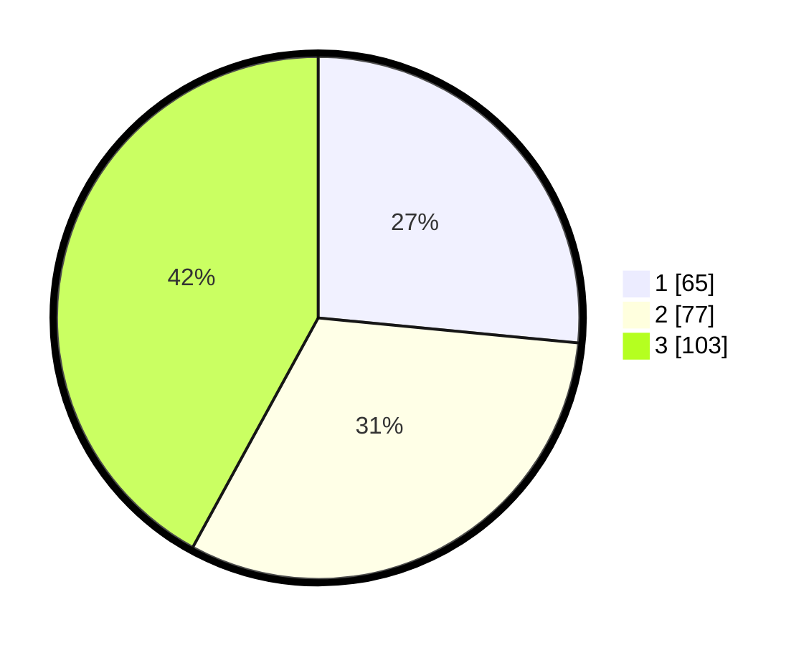

# Hasil

## Grafik

## Tabel

| No. | Nama Paslon    | Suara | Suara (raw) | Persentase |
|:--- |:-------------- | -----:| -----------:| ----------:|
| 1   | ANIES MUHAIMIN | 65    | [65][p-1]   | 26,53      |
| 2   | PRABOWO GIBRAN | 77    | [77][p-2]   | 31,43      |
| 3   | GANJAR MAHFUD  | 103   | [103][p-3]  | 42,04      |

[p-1]: https://github.com/gigit-pemilu/pemilu-2024/blob/main/pilpres/hitung-suara/sub/34-di-yogyakarta/sub/04-sleman/sub/07-depok/sub/2001-caturtunggal/sub/057-tps/sub/paslon-1.txt
[p-2]: https://github.com/gigit-pemilu/pemilu-2024/blob/main/pilpres/hitung-suara/sub/34-di-yogyakarta/sub/04-sleman/sub/07-depok/sub/2001-caturtunggal/sub/057-tps/sub/paslon-2.txt
[p-3]: https://github.com/gigit-pemilu/pemilu-2024/blob/main/pilpres/hitung-suara/sub/34-di-yogyakarta/sub/04-sleman/sub/07-depok/sub/2001-caturtunggal/sub/057-tps/sub/paslon-3.txt

## Foto C Plano

https://sirekap-obj-formc.kpu.go.id/5766/pemilu/ppwp/34/04/07/20/01/3404072001057-20240215-022640--f202278a-da15-46e1-a47f-81a45033ca39.jpg

https://sirekap-obj-formc.kpu.go.id/5766/pemilu/ppwp/34/04/07/20/01/3404072001057-20240215-022023--81959071-7efe-4052-b948-71a1718ab318.jpg

https://sirekap-obj-formc.kpu.go.id/5766/pemilu/ppwp/34/04/07/20/01/3404072001057-20240215-022108--d437aeb9-3f88-4a5f-8dcd-e15d58985195.jpg

## Metadata

| Key        | Value               |
| ---------- | ------------------- |
| Time Stamp | 2024-02-15 04:00:24 |

