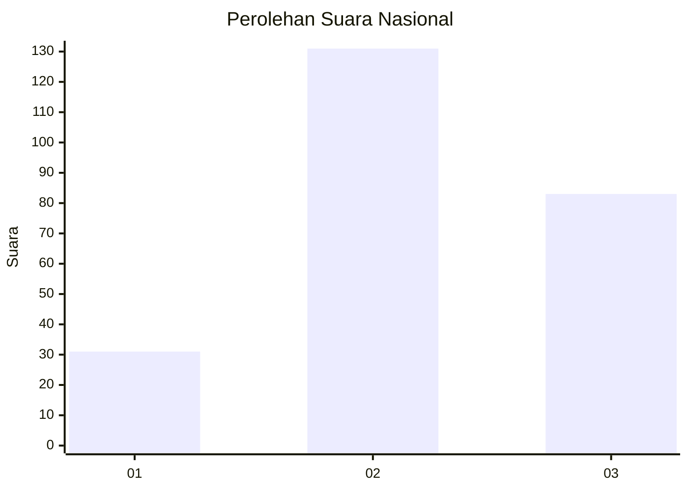
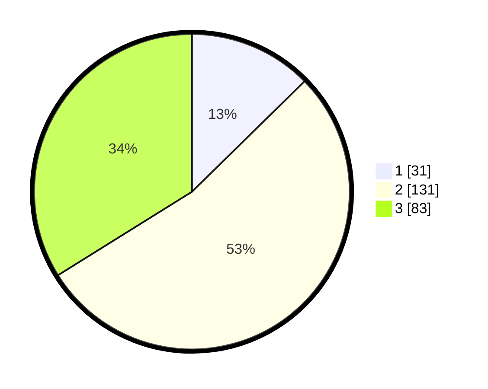

# Hasil

## Grafik

## Tabel

| No. | Nama Paslon    | Suara | Suara (raw) | Persentase |
|:--- |:-------------- | -----:| -----------:| ----------:|
| 1   | ANIES MUHAIMIN | 31    | [31][p-1]   | 12,65      |
| 2   | PRABOWO GIBRAN | 131   | [131][p-2]  | 53,47      |
| 3   | GANJAR MAHFUD  | 83    | [83][p-3]   | 33,88      |

[p-1]: https://github.com/gigit-pemilu/pemilu-2024/blob/main/pilpres/hitung-suara/sub/34-di-yogyakarta/sub/04-sleman/sub/07-depok/sub/2001-caturtunggal/sub/060-tps/sub/paslon-1.txt
[p-2]: https://github.com/gigit-pemilu/pemilu-2024/blob/main/pilpres/hitung-suara/sub/34-di-yogyakarta/sub/04-sleman/sub/07-depok/sub/2001-caturtunggal/sub/060-tps/sub/paslon-2.txt
[p-3]: https://github.com/gigit-pemilu/pemilu-2024/blob/main/pilpres/hitung-suara/sub/34-di-yogyakarta/sub/04-sleman/sub/07-depok/sub/2001-caturtunggal/sub/060-tps/sub/paslon-3.txt

## Foto C Plano

https://sirekap-obj-formc.kpu.go.id/d7b0/pemilu/ppwp/34/04/07/20/01/3404072001060-20240214-155738--642762dc-e238-477a-b95a-6f680581a5b1.jpg

https://sirekap-obj-formc.kpu.go.id/d7b0/pemilu/ppwp/34/04/07/20/01/3404072001060-20240214-160116--48070171-6655-44b2-964a-48313de226ab.jpg

https://sirekap-obj-formc.kpu.go.id/d7b0/pemilu/ppwp/34/04/07/20/01/3404072001060-20240214-160131--17e27594-6796-4c19-ae1e-5274c79ca78d.jpg

## Metadata

| Key        | Value               |
| ---------- | ------------------- |
| Time Stamp | 2024-02-15 22:00:27 |

