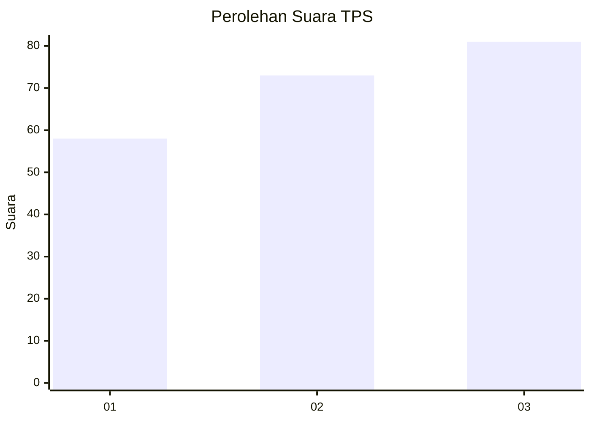
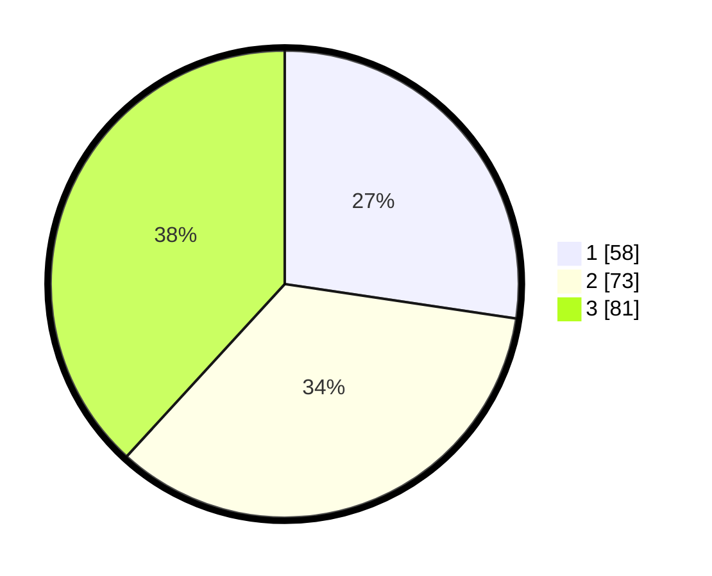

# Hasil

## Grafik

## Tabel

| No. | Nama Paslon    | Suara | Suara (raw) | Persentase |
|:--- |:-------------- | -----:| -----------:| ----------:|
| 1   | ANIES MUHAIMIN | 58    | [58][p-1]   | 27,36      |
| 2   | PRABOWO GIBRAN | 73    | [73][p-2]   | 34,43      |
| 3   | GANJAR MAHFUD  | 81    | [81][p-3]   | 38,21      |

[p-1]: https://github.com/gigit-pemilu/pemilu-2024-34-di-yogyakarta/blob/main/pilpres/hitung-suara/sub/34-di-yogyakarta/sub/04-sleman/sub/07-depok/sub/2001-caturtunggal/sub/062-tps/sub/paslon-1.txt
[p-2]: https://github.com/gigit-pemilu/pemilu-2024-34-di-yogyakarta/blob/main/pilpres/hitung-suara/sub/34-di-yogyakarta/sub/04-sleman/sub/07-depok/sub/2001-caturtunggal/sub/062-tps/sub/paslon-2.txt
[p-3]: https://github.com/gigit-pemilu/pemilu-2024-34-di-yogyakarta/blob/main/pilpres/hitung-suara/sub/34-di-yogyakarta/sub/04-sleman/sub/07-depok/sub/2001-caturtunggal/sub/062-tps/sub/paslon-3.txt

## Foto C Plano

https://sirekap-obj-formc.kpu.go.id/4fbe/pemilu/ppwp/34/04/07/20/01/3404072001062-20240214-184804--987f78e7-7c7d-4052-b6f6-5daae08250f1.jpg

https://sirekap-obj-formc.kpu.go.id/4fbe/pemilu/ppwp/34/04/07/20/01/3404072001062-20240214-184813--cddfa1ea-cd62-448e-b130-d6dfbfe6231f.jpg

https://sirekap-obj-formc.kpu.go.id/4fbe/pemilu/ppwp/34/04/07/20/01/3404072001062-20240214-184818--e9c837e4-bc6c-4f1f-8960-6816ad1be4b4.jpg

## Metadata

| Key        | Value               |
| ---------- | ------------------- |
| Time Stamp | 2024-02-15 15:00:29 |

