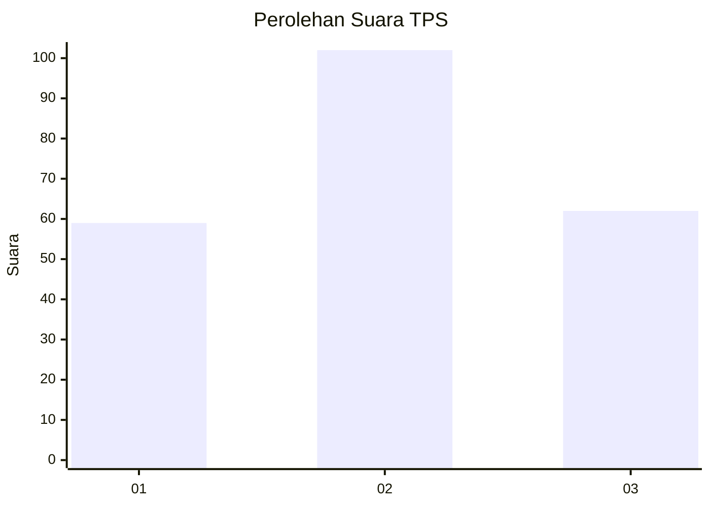
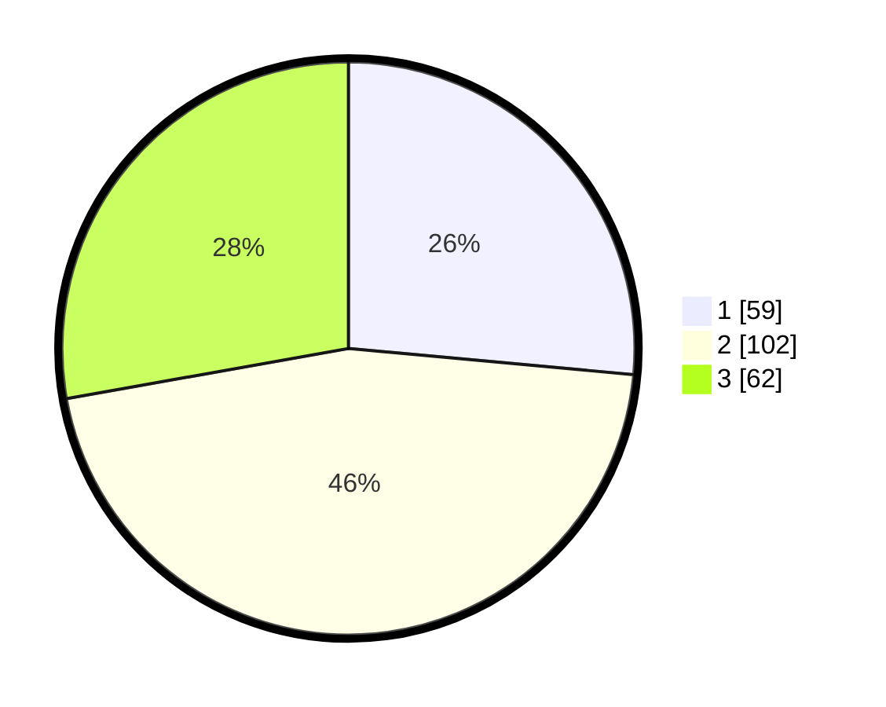

# Hasil

## Grafik

## Tabel

| No. | Nama Paslon    | Suara | Suara (raw) | Persentase |
|:--- |:-------------- | -----:| -----------:| ----------:|
| 1   | ANIES MUHAIMIN | 59    | [59][p-1]   | 26,46      |
| 2   | PRABOWO GIBRAN | 102   | [102][p-2]  | 45,74      |
| 3   | GANJAR MAHFUD  | 62    | [62][p-3]   | 27,80      |

[p-1]: https://github.com/gigit-pemilu/pemilu-2024-34-di-yogyakarta/blob/main/pilpres/hitung-suara/sub/34-di-yogyakarta/sub/04-sleman/sub/07-depok/sub/2001-caturtunggal/sub/064-tps/sub/paslon-1.txt
[p-2]: https://github.com/gigit-pemilu/pemilu-2024-34-di-yogyakarta/blob/main/pilpres/hitung-suara/sub/34-di-yogyakarta/sub/04-sleman/sub/07-depok/sub/2001-caturtunggal/sub/064-tps/sub/paslon-2.txt
[p-3]: https://github.com/gigit-pemilu/pemilu-2024-34-di-yogyakarta/blob/main/pilpres/hitung-suara/sub/34-di-yogyakarta/sub/04-sleman/sub/07-depok/sub/2001-caturtunggal/sub/064-tps/sub/paslon-3.txt

## Foto C Plano

https://sirekap-obj-formc.kpu.go.id/6fa6/pemilu/ppwp/34/04/07/20/01/3404072001064-20240214-213611--67eacf98-484d-4ec7-83d6-e72c1058ba2a.jpg

https://sirekap-obj-formc.kpu.go.id/6fa6/pemilu/ppwp/34/04/07/20/01/3404072001064-20240214-213726--e5a286b1-fa94-4b0f-8645-d427792998b9.jpg

https://sirekap-obj-formc.kpu.go.id/6fa6/pemilu/ppwp/34/04/07/20/01/3404072001064-20240214-213748--fc464150-c386-4578-a4ec-50c688d4eabf.jpg

## Metadata

| Key        | Value               |
| ---------- | ------------------- |
| Time Stamp | 2024-02-24 22:31:28 |

