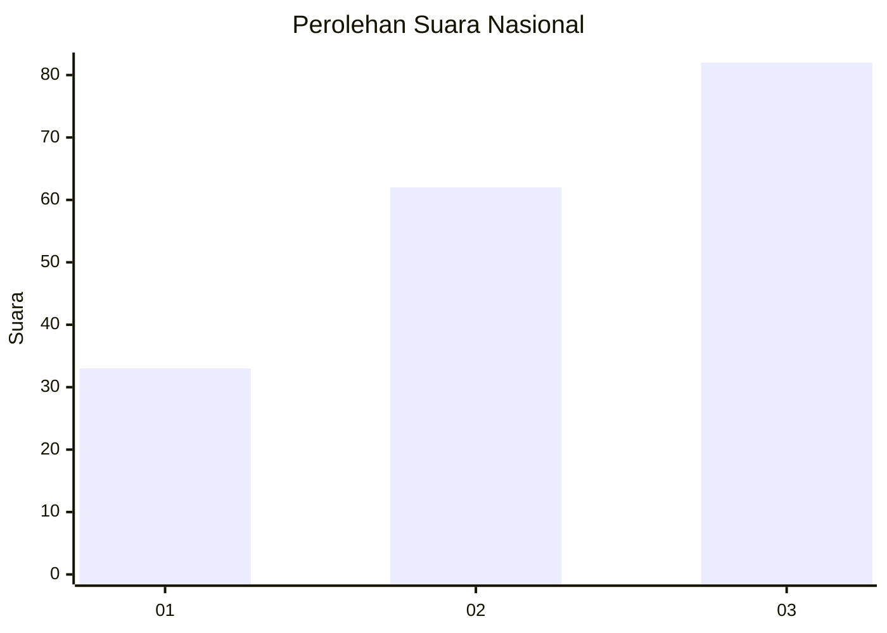
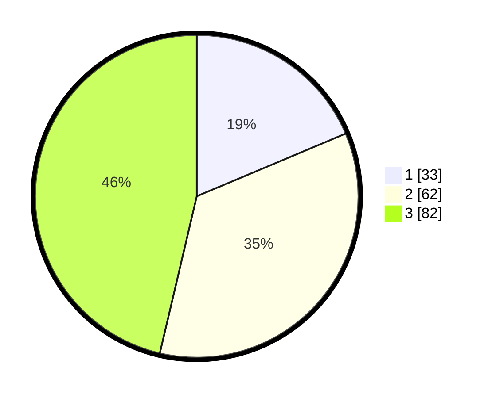

# Hasil

## Grafik

## Tabel

| No. | Nama Paslon    | Suara | Suara (raw) | Persentase |
|:--- |:-------------- | -----:| -----------:| ----------:|
| 1   | ANIES MUHAIMIN | 33    | [33][p-1]   | 18,64      |
| 2   | PRABOWO GIBRAN | 62    | [62][p-2]   | 35,03      |
| 3   | GANJAR MAHFUD  | 82    | [82][p-3]   | 46,33      |

[p-1]: https://github.com/gigit-pemilu/pemilu-2024/blob/main/pilpres/hitung-suara/sub/34-di-yogyakarta/sub/04-sleman/sub/07-depok/sub/2001-caturtunggal/sub/065-tps/sub/paslon-1.txt
[p-2]: https://github.com/gigit-pemilu/pemilu-2024/blob/main/pilpres/hitung-suara/sub/34-di-yogyakarta/sub/04-sleman/sub/07-depok/sub/2001-caturtunggal/sub/065-tps/sub/paslon-2.txt
[p-3]: https://github.com/gigit-pemilu/pemilu-2024/blob/main/pilpres/hitung-suara/sub/34-di-yogyakarta/sub/04-sleman/sub/07-depok/sub/2001-caturtunggal/sub/065-tps/sub/paslon-3.txt

## Foto C Plano

https://sirekap-obj-formc.kpu.go.id/457b/pemilu/ppwp/34/04/07/20/01/3404072001065-20240214-234618--9a23e4b7-30b0-481d-8cd8-c9b1956c9045.jpg

https://sirekap-obj-formc.kpu.go.id/457b/pemilu/ppwp/34/04/07/20/01/3404072001065-20240214-234721--310a3ffb-172d-47db-8fc4-2b419855cc4e.jpg

https://sirekap-obj-formc.kpu.go.id/457b/pemilu/ppwp/34/04/07/20/01/3404072001065-20240214-234826--b7dd8e68-5d43-46fb-b783-10f973951200.jpg

## Metadata

| Key        | Value               |
| ---------- | ------------------- |
| Time Stamp | 2024-02-15 22:00:27 |

