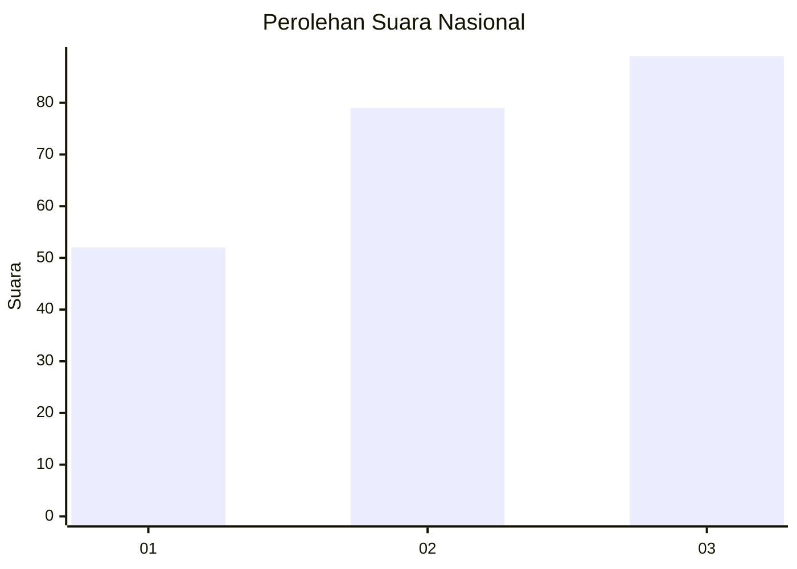
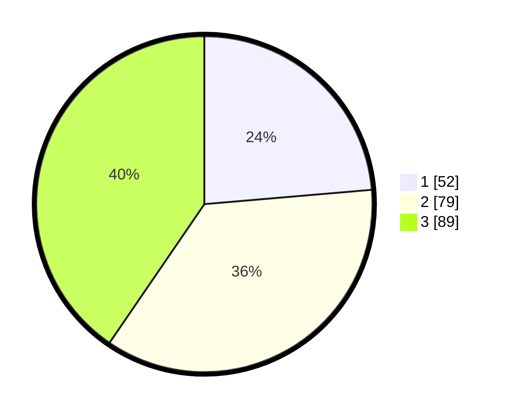

# Hasil

## Grafik

## Tabel

| No. | Nama Paslon    | Suara | Suara (raw) | Persentase |
|:--- |:-------------- | -----:| -----------:| ----------:|
| 1   | ANIES MUHAIMIN | 52    | [52][p-1]   | 23,64      |
| 2   | PRABOWO GIBRAN | 79    | [79][p-2]   | 35,91      |
| 3   | GANJAR MAHFUD  | 89    | [89][p-3]   | 40,45      |

[p-1]: https://github.com/gigit-pemilu/pemilu-2024/blob/main/pilpres/hitung-suara/sub/34-di-yogyakarta/sub/04-sleman/sub/07-depok/sub/2001-caturtunggal/sub/071-tps/sub/paslon-1.txt
[p-2]: https://github.com/gigit-pemilu/pemilu-2024/blob/main/pilpres/hitung-suara/sub/34-di-yogyakarta/sub/04-sleman/sub/07-depok/sub/2001-caturtunggal/sub/071-tps/sub/paslon-2.txt
[p-3]: https://github.com/gigit-pemilu/pemilu-2024/blob/main/pilpres/hitung-suara/sub/34-di-yogyakarta/sub/04-sleman/sub/07-depok/sub/2001-caturtunggal/sub/071-tps/sub/paslon-3.txt

## Foto C Plano

https://sirekap-obj-formc.kpu.go.id/6c5b/pemilu/ppwp/34/04/07/20/01/3404072001071-20240214-204220--9a247c23-749e-4541-9106-d4d4f924e869.jpg

https://sirekap-obj-formc.kpu.go.id/6c5b/pemilu/ppwp/34/04/07/20/01/3404072001071-20240214-204306--e6ad7feb-46e5-457e-9070-7430fe9da261.jpg

https://sirekap-obj-formc.kpu.go.id/6c5b/pemilu/ppwp/34/04/07/20/01/3404072001071-20240214-204352--7fb5f5f7-03b8-474a-b5a2-4c8d73a6bceb.jpg

## Metadata

| Key        | Value               |
| ---------- | ------------------- |
| Time Stamp | 2024-02-15 00:41:44 |

## DATA PEMILIH TETAP

Jumlah pemilih dalam DPT: **230**.
 * L: **117**.
 * P: **113**.

## DATA PENGGUNA HAK PILIH

Jumlah pengguna hak pilih dalam DPT: **204**.
 * L: **102**.
 * P: **102**.

Jumlah pengguna hak pilih dalam DPTb: **15**.
 * L: **8**.
 * P: **7**.

Jumlah pengguna hak pilih dalam DPK: **3**.
 * L: **2**.
 * P: **1**.

Jumlah pengguna hak pilih: **222**.
 * L: **112**.
 * P: **110**.

## JUMLAH SUARA SAH DAN TIDAK SAH

JUMLAH SELURUH SUARA SAH: **220**.

JUMLAH SUARA TIDAK SAH: **2**.

JUMLAH SELURUH SUARA SAH DAN SUARA TIDAK SAH: **222**.

