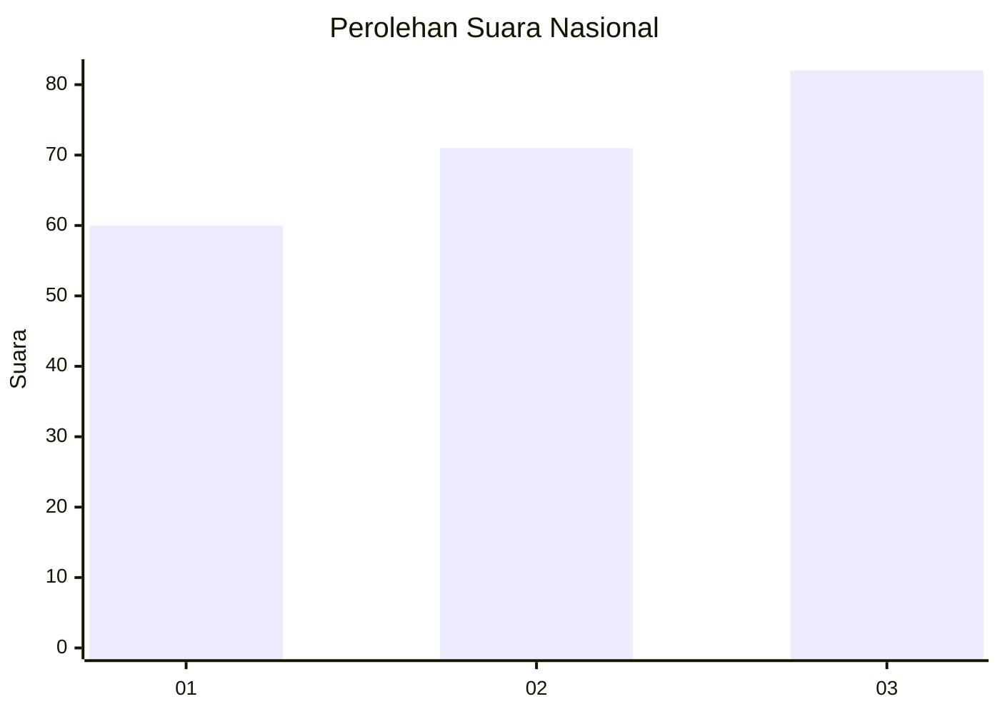
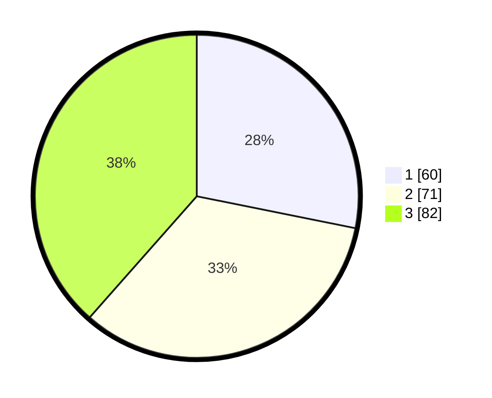

# Hasil

## Grafik

## Tabel

| No. | Nama Paslon    | Suara | Suara (raw) | Persentase |
|:--- |:-------------- | -----:| -----------:| ----------:|
| 1   | ANIES MUHAIMIN | 60    | [60][p-1]   | 28,17      |
| 2   | PRABOWO GIBRAN | 71    | [71][p-2]   | 33,33      |
| 3   | GANJAR MAHFUD  | 82    | [82][p-3]   | 38,50      |

[p-1]: https://github.com/gigit-pemilu/pemilu-2024/blob/main/pilpres/hitung-suara/sub/34-di-yogyakarta/sub/04-sleman/sub/07-depok/sub/2001-caturtunggal/sub/073-tps/sub/paslon-1.txt
[p-2]: https://github.com/gigit-pemilu/pemilu-2024/blob/main/pilpres/hitung-suara/sub/34-di-yogyakarta/sub/04-sleman/sub/07-depok/sub/2001-caturtunggal/sub/073-tps/sub/paslon-2.txt
[p-3]: https://github.com/gigit-pemilu/pemilu-2024/blob/main/pilpres/hitung-suara/sub/34-di-yogyakarta/sub/04-sleman/sub/07-depok/sub/2001-caturtunggal/sub/073-tps/sub/paslon-3.txt

## Foto C Plano

https://sirekap-obj-formc.kpu.go.id/2ca3/pemilu/ppwp/34/04/07/20/01/3404072001073-20240214-220523--296e04a1-95ef-449a-b001-536f2543f69c.jpg

https://sirekap-obj-formc.kpu.go.id/2ca3/pemilu/ppwp/34/04/07/20/01/3404072001073-20240214-220716--8cdd2bfe-ecec-44f1-a179-2c1a70dc2e63.jpg

https://sirekap-obj-formc.kpu.go.id/2ca3/pemilu/ppwp/34/04/07/20/01/3404072001073-20240214-220751--069db4a3-ce3e-481e-9570-391c9be5683c.jpg

## Metadata

| Key        | Value               |
| ---------- | ------------------- |
| Time Stamp | 2024-02-16 21:01:00 |

