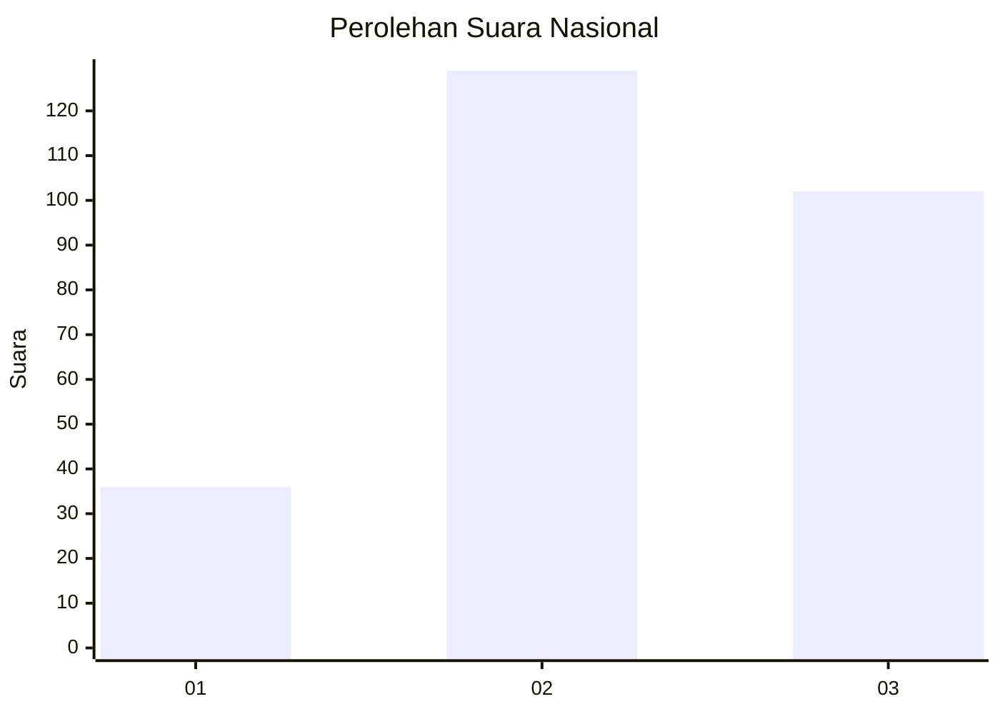
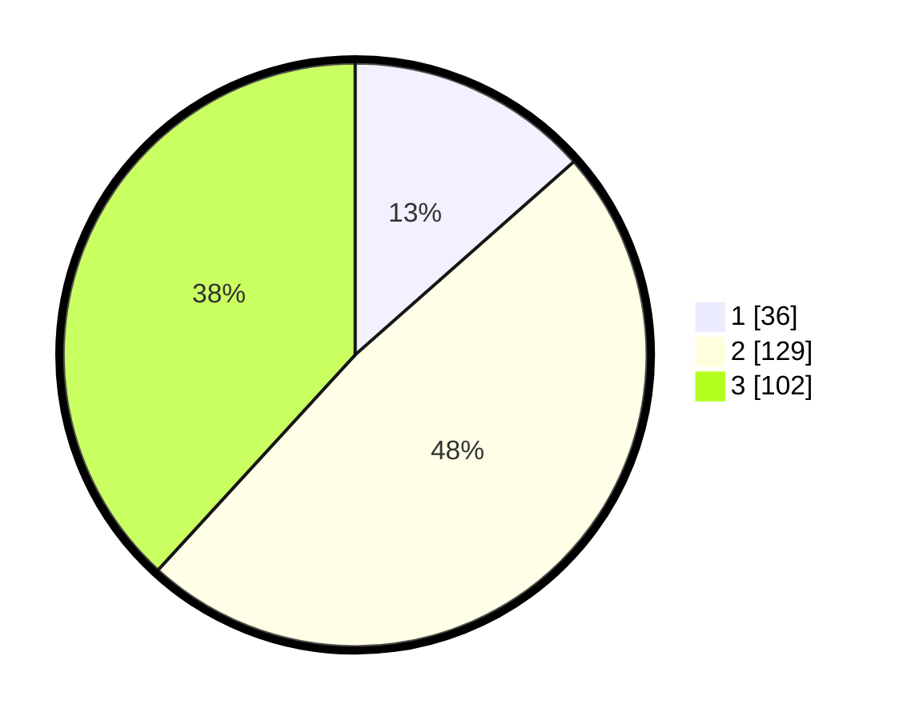

# Hasil

## Grafik

## Tabel

| No. | Nama Paslon    | Suara | Suara (raw) | Persentase |
|:--- |:-------------- | -----:| -----------:| ----------:|
| 1   | ANIES MUHAIMIN | 36    | [36][p-1]   | 13,48      |
| 2   | PRABOWO GIBRAN | 129   | [129][p-2]  | 48,31      |
| 3   | GANJAR MAHFUD  | 102   | [102][p-3]  | 38,20      |

[p-1]: https://github.com/gigit-pemilu/pemilu-2024/blob/main/pilpres/hitung-suara/sub/34-di-yogyakarta/sub/04-sleman/sub/07-depok/sub/2001-caturtunggal/sub/074-tps/sub/paslon-1.txt
[p-2]: https://github.com/gigit-pemilu/pemilu-2024/blob/main/pilpres/hitung-suara/sub/34-di-yogyakarta/sub/04-sleman/sub/07-depok/sub/2001-caturtunggal/sub/074-tps/sub/paslon-2.txt
[p-3]: https://github.com/gigit-pemilu/pemilu-2024/blob/main/pilpres/hitung-suara/sub/34-di-yogyakarta/sub/04-sleman/sub/07-depok/sub/2001-caturtunggal/sub/074-tps/sub/paslon-3.txt

## Foto C Plano

https://sirekap-obj-formc.kpu.go.id/81a9/pemilu/ppwp/34/04/07/20/01/3404072001074-20240214-232839--c679c00f-678d-4468-b198-21c18a51fa17.jpg

https://sirekap-obj-formc.kpu.go.id/81a9/pemilu/ppwp/34/04/07/20/01/3404072001074-20240214-232927--db6c748b-775d-4cf9-b385-a6273e37273a.jpg

https://sirekap-obj-formc.kpu.go.id/81a9/pemilu/ppwp/34/04/07/20/01/3404072001074-20240214-233046--ae5a906e-b658-4c07-8d56-36d66feccda1.jpg

## Metadata

| Key        | Value               |
| ---------- | ------------------- |
| Time Stamp | 2024-02-15 15:00:29 |

