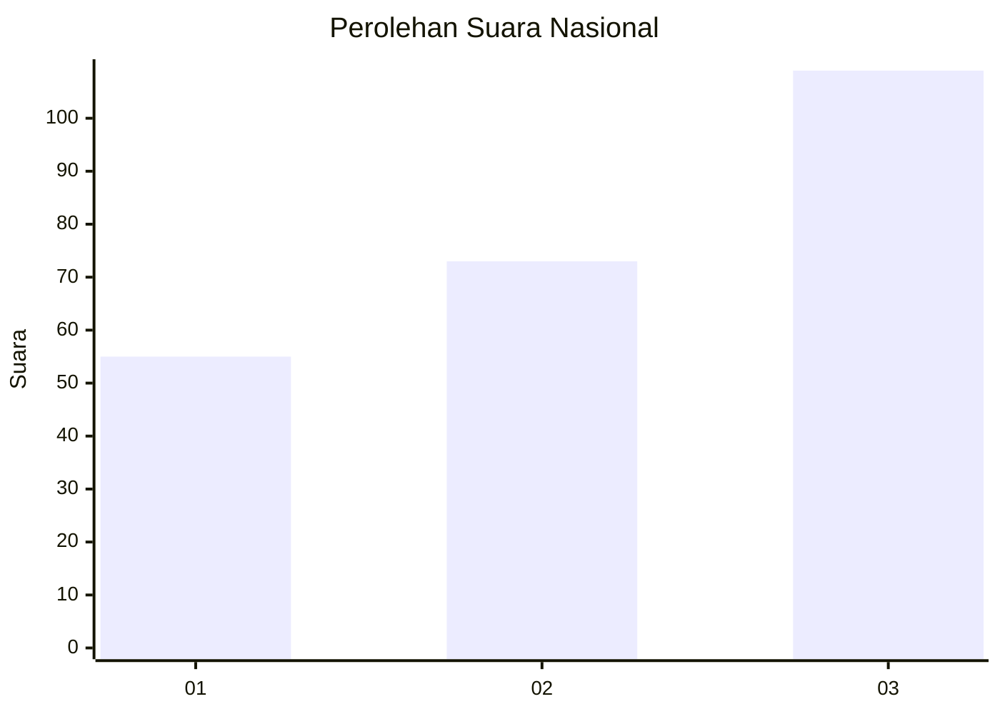
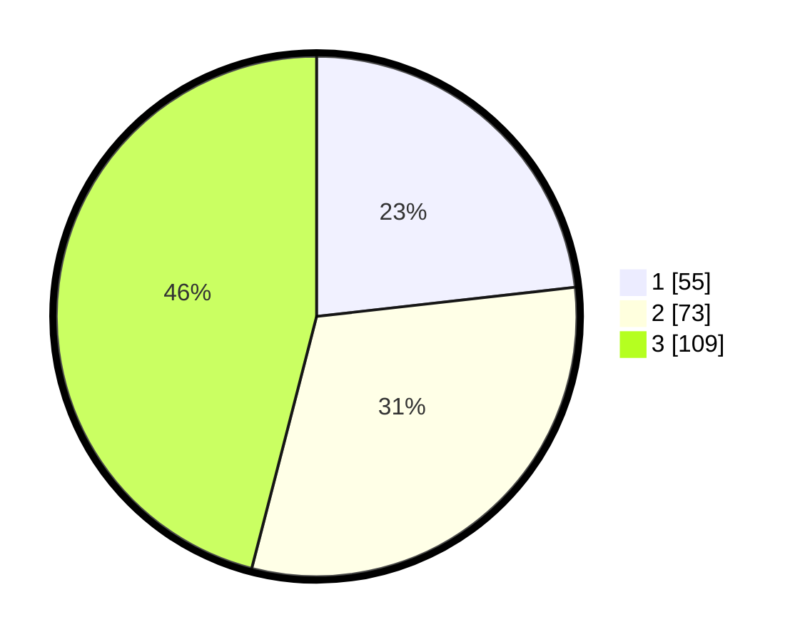

# Hasil

## Grafik

## Tabel

| No. | Nama Paslon    | Suara | Suara (raw) | Persentase |
|:--- |:-------------- | -----:| -----------:| ----------:|
| 1   | ANIES MUHAIMIN | 55    | [55][p-1]   | 23,21      |
| 2   | PRABOWO GIBRAN | 73    | [73][p-2]   | 30,80      |
| 3   | GANJAR MAHFUD  | 109   | [109][p-3]  | 45,99      |

[p-1]: https://github.com/gigit-pemilu/pemilu-2024/blob/main/pilpres/hitung-suara/sub/34-di-yogyakarta/sub/04-sleman/sub/07-depok/sub/2001-caturtunggal/sub/077-tps/sub/paslon-1.txt
[p-2]: https://github.com/gigit-pemilu/pemilu-2024/blob/main/pilpres/hitung-suara/sub/34-di-yogyakarta/sub/04-sleman/sub/07-depok/sub/2001-caturtunggal/sub/077-tps/sub/paslon-2.txt
[p-3]: https://github.com/gigit-pemilu/pemilu-2024/blob/main/pilpres/hitung-suara/sub/34-di-yogyakarta/sub/04-sleman/sub/07-depok/sub/2001-caturtunggal/sub/077-tps/sub/paslon-3.txt

## Foto C Plano

https://sirekap-obj-formc.kpu.go.id/e0db/pemilu/ppwp/34/04/07/20/01/3404072001077-20240214-190910--8df1aeeb-440c-4874-a398-169cca9d3c88.jpg

https://sirekap-obj-formc.kpu.go.id/e0db/pemilu/ppwp/34/04/07/20/01/3404072001077-20240214-191347--87854662-07c5-4f1f-b4b8-d3fde2fdadba.jpg

https://sirekap-obj-formc.kpu.go.id/e0db/pemilu/ppwp/34/04/07/20/01/3404072001077-20240214-191539--98c73f6c-7482-4d2b-ba88-843bdb133439.jpg

## Metadata

| Key        | Value               |
| ---------- | ------------------- |
| Time Stamp | 2024-02-15 15:00:29 |

