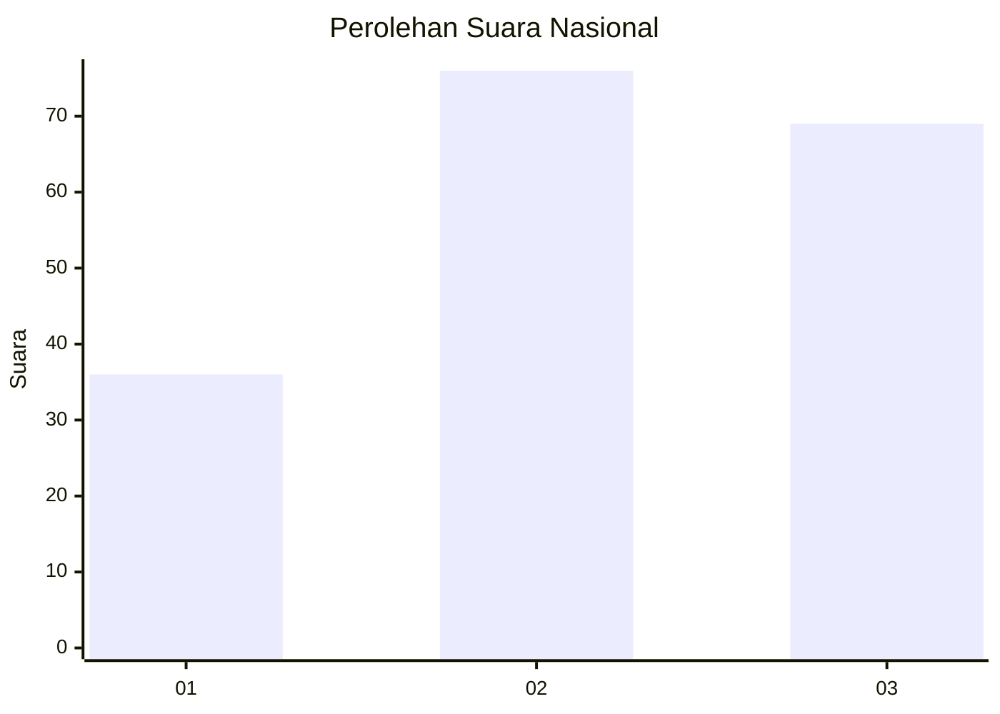
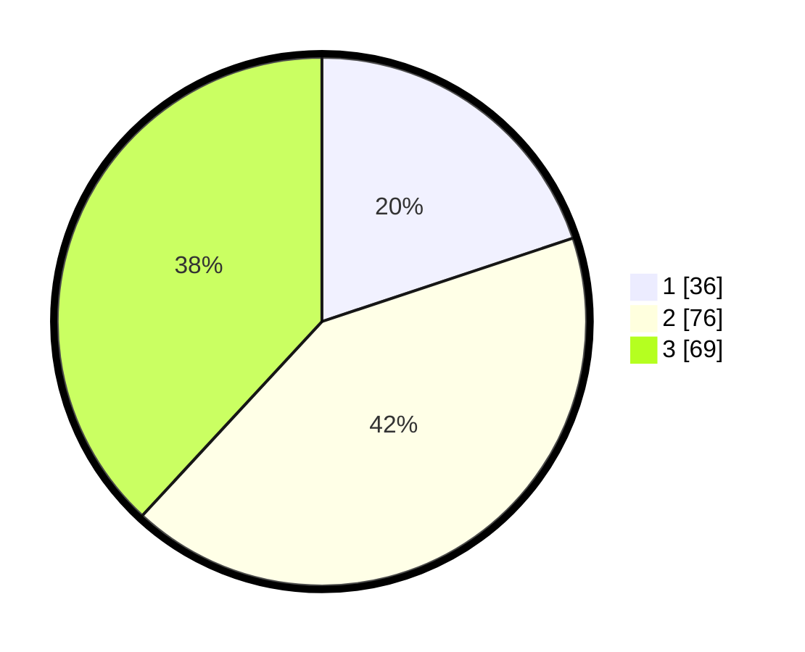

# Hasil

## Grafik

## Tabel

| No. | Nama Paslon    | Suara | Suara (raw) | Persentase |
|:--- |:-------------- | -----:| -----------:| ----------:|
| 1   | ANIES MUHAIMIN | 36    | [36][p-1]   | 19,89      |
| 2   | PRABOWO GIBRAN | 76    | [76][p-2]   | 41,99      |
| 3   | GANJAR MAHFUD  | 69    | [69][p-3]   | 38,12      |

[p-1]: https://github.com/gigit-pemilu/pemilu-2024/blob/main/pilpres/hitung-suara/sub/34-di-yogyakarta/sub/04-sleman/sub/07-depok/sub/2001-caturtunggal/sub/079-tps/sub/paslon-1.txt
[p-2]: https://github.com/gigit-pemilu/pemilu-2024/blob/main/pilpres/hitung-suara/sub/34-di-yogyakarta/sub/04-sleman/sub/07-depok/sub/2001-caturtunggal/sub/079-tps/sub/paslon-2.txt
[p-3]: https://github.com/gigit-pemilu/pemilu-2024/blob/main/pilpres/hitung-suara/sub/34-di-yogyakarta/sub/04-sleman/sub/07-depok/sub/2001-caturtunggal/sub/079-tps/sub/paslon-3.txt

## Foto C Plano

https://sirekap-obj-formc.kpu.go.id/edf4/pemilu/ppwp/34/04/07/20/01/3404072001079-20240214-233827--918bd44e-ad1e-4bdc-8e74-255db213b190.jpg

https://sirekap-obj-formc.kpu.go.id/edf4/pemilu/ppwp/34/04/07/20/01/3404072001079-20240214-234719--433847b1-de02-43b8-a6c7-c34f2773597b.jpg

https://sirekap-obj-formc.kpu.go.id/edf4/pemilu/ppwp/34/04/07/20/01/3404072001079-20240214-234825--73c96bcc-5ed8-4ee6-83bb-f5753de10b36.jpg

## Metadata

| Key        | Value               |
| ---------- | ------------------- |
| Time Stamp | 2024-02-15 15:00:29 |

