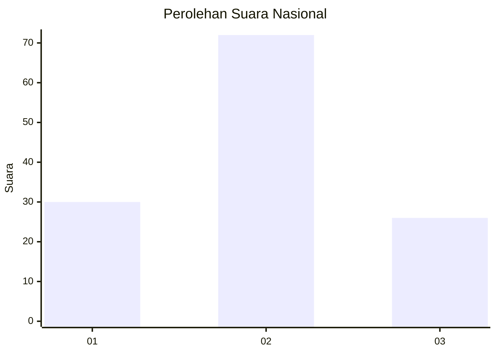
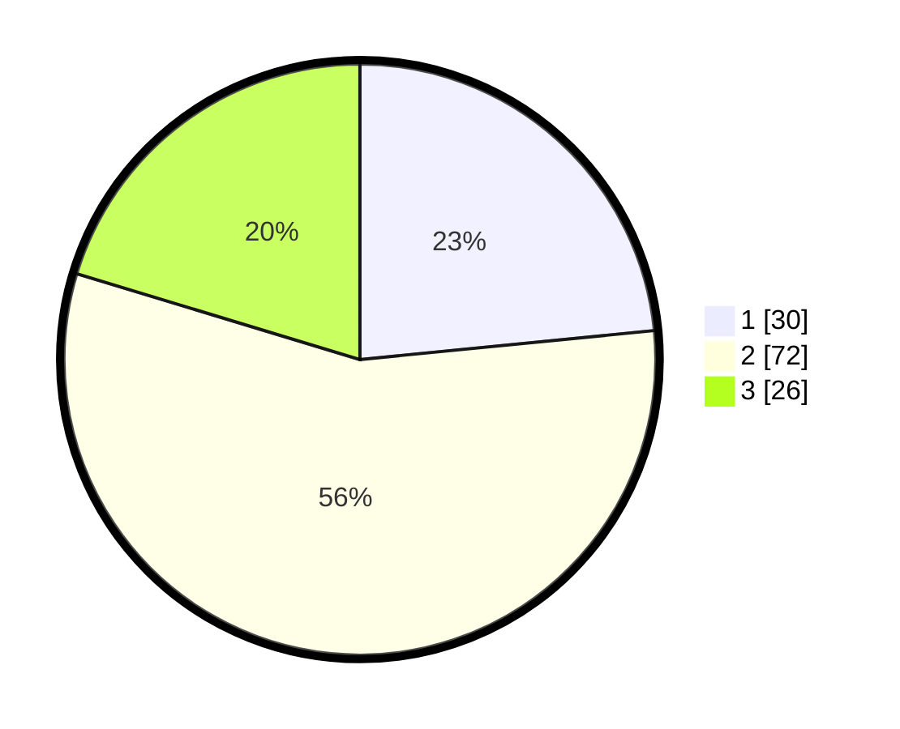

# Hasil

## Grafik

## Tabel

| No. | Nama Paslon    | Suara | Suara (raw) | Persentase |
|:--- |:-------------- | -----:| -----------:| ----------:|
| 1   | ANIES MUHAIMIN | 30    | [30][p-1]   | 23,44      |
| 2   | PRABOWO GIBRAN | 72    | [72][p-2]   | 56,25      |
| 3   | GANJAR MAHFUD  | 26    | [26][p-3]   | 20,31      |

[p-1]: https://github.com/gigit-pemilu/pemilu-2024/blob/main/pilpres/hitung-suara/sub/34-di-yogyakarta/sub/04-sleman/sub/07-depok/sub/2001-caturtunggal/sub/082-tps/sub/paslon-1.txt
[p-2]: https://github.com/gigit-pemilu/pemilu-2024/blob/main/pilpres/hitung-suara/sub/34-di-yogyakarta/sub/04-sleman/sub/07-depok/sub/2001-caturtunggal/sub/082-tps/sub/paslon-2.txt
[p-3]: https://github.com/gigit-pemilu/pemilu-2024/blob/main/pilpres/hitung-suara/sub/34-di-yogyakarta/sub/04-sleman/sub/07-depok/sub/2001-caturtunggal/sub/082-tps/sub/paslon-3.txt

## Foto C Plano

https://sirekap-obj-formc.kpu.go.id/b725/pemilu/ppwp/34/04/07/20/01/3404072001082-20240214-232118--b1ccef92-3b5f-43c7-814f-a41aa37da1dd.jpg

https://sirekap-obj-formc.kpu.go.id/b725/pemilu/ppwp/34/04/07/20/01/3404072001082-20240214-232204--c4ad59c4-374e-46e5-84fb-b45a018af93b.jpg

https://sirekap-obj-formc.kpu.go.id/b725/pemilu/ppwp/34/04/07/20/01/3404072001082-20240214-232314--2ce3eabc-56f3-4227-905d-6e4a9a1d70ac.jpg

## Metadata

| Key        | Value               |
| ---------- | ------------------- |
| Time Stamp | 2024-02-15 22:00:27 |

