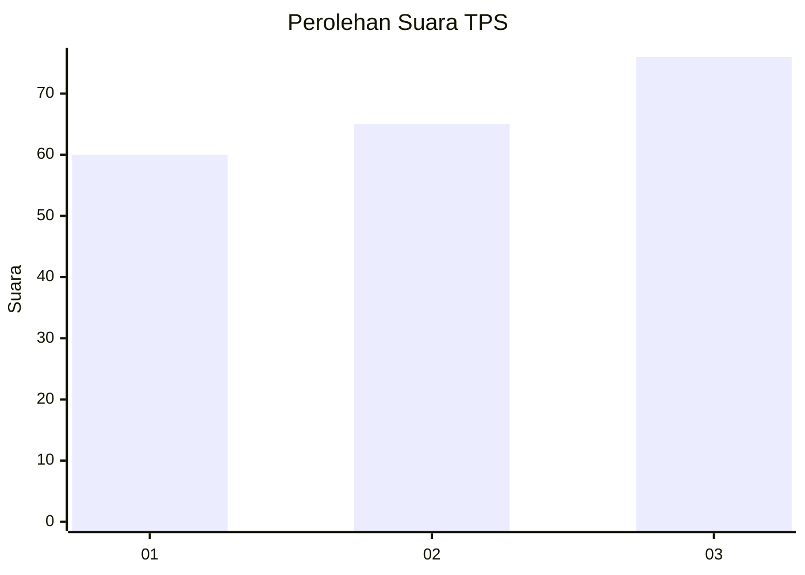
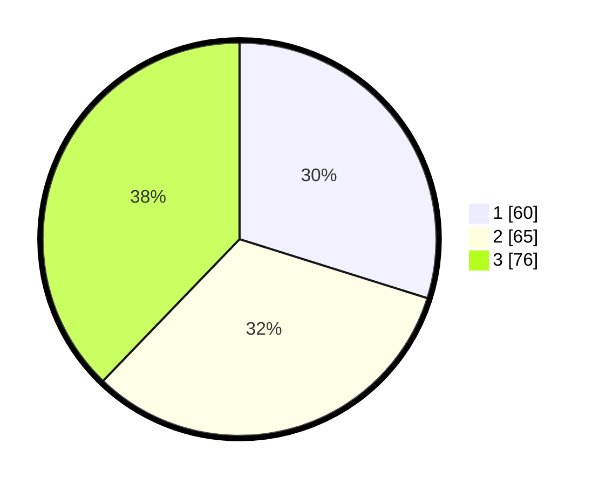

# Hasil

## Grafik

## Tabel

| No. | Nama Paslon    | Suara | Suara (raw) | Persentase |
|:--- |:-------------- | -----:| -----------:| ----------:|
| 1   | ANIES MUHAIMIN | 60    | [60][p-1]   | 29,85      |
| 2   | PRABOWO GIBRAN | 65    | [65][p-2]   | 32,34      |
| 3   | GANJAR MAHFUD  | 76    | [76][p-3]   | 37,81      |

[p-1]: https://github.com/gigit-pemilu/pemilu-2024-34-di-yogyakarta/blob/main/pilpres/hitung-suara/sub/34-di-yogyakarta/sub/04-sleman/sub/07-depok/sub/2001-caturtunggal/sub/083-tps/sub/paslon-1.txt
[p-2]: https://github.com/gigit-pemilu/pemilu-2024-34-di-yogyakarta/blob/main/pilpres/hitung-suara/sub/34-di-yogyakarta/sub/04-sleman/sub/07-depok/sub/2001-caturtunggal/sub/083-tps/sub/paslon-2.txt
[p-3]: https://github.com/gigit-pemilu/pemilu-2024-34-di-yogyakarta/blob/main/pilpres/hitung-suara/sub/34-di-yogyakarta/sub/04-sleman/sub/07-depok/sub/2001-caturtunggal/sub/083-tps/sub/paslon-3.txt

## Foto C Plano

https://sirekap-obj-formc.kpu.go.id/58cd/pemilu/ppwp/34/04/07/20/01/3404072001083-20240214-235436--4a59f67c-1235-4363-9de8-040a775c33c0.jpg

https://sirekap-obj-formc.kpu.go.id/58cd/pemilu/ppwp/34/04/07/20/01/3404072001083-20240215-000014--3bbc2411-531e-410b-8f6c-1b1b9abf445c.jpg

https://sirekap-obj-formc.kpu.go.id/58cd/pemilu/ppwp/34/04/07/20/01/3404072001083-20240215-000223--57b7c7c0-18ec-4d38-aba6-1331d982c736.jpg

## Metadata

| Key        | Value               |
| ---------- | ------------------- |
| Time Stamp | 2024-02-17 12:00:00 |

