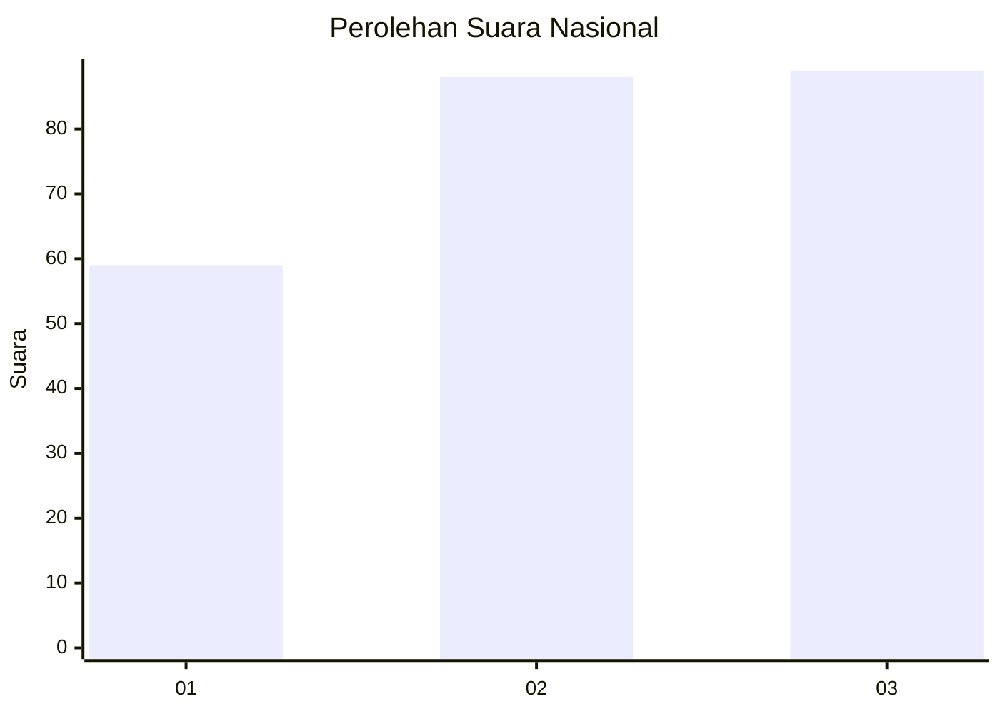
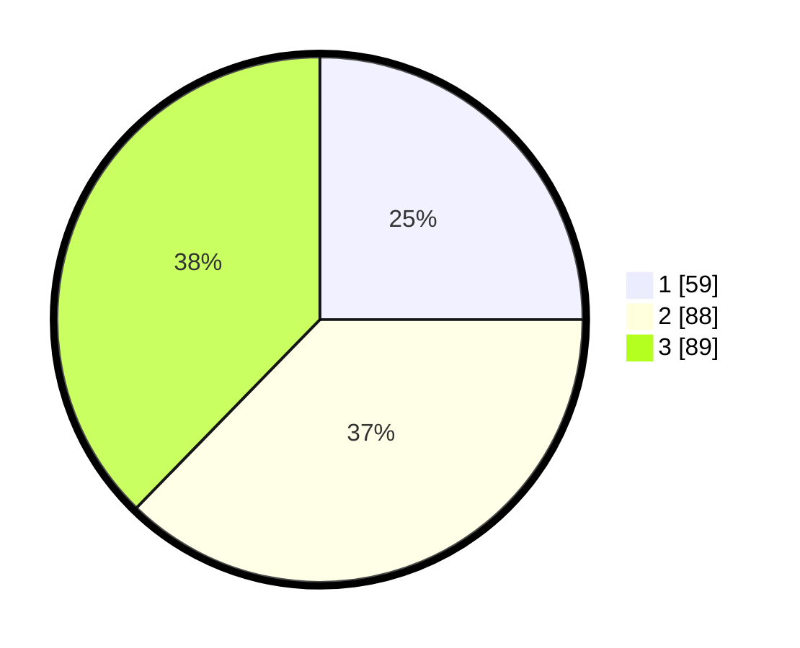

# Hasil

## Grafik

## Tabel

| No. | Nama Paslon    | Suara | Suara (raw) | Persentase |
|:--- |:-------------- | -----:| -----------:| ----------:|
| 1   | ANIES MUHAIMIN | 59    | [59][p-1]   | 25,00      |
| 2   | PRABOWO GIBRAN | 88    | [88][p-2]   | 37,29      |
| 3   | GANJAR MAHFUD  | 89    | [89][p-3]   | 37,71      |

[p-1]: https://github.com/gigit-pemilu/pemilu-2024/blob/main/pilpres/hitung-suara/sub/34-di-yogyakarta/sub/04-sleman/sub/07-depok/sub/2001-caturtunggal/sub/097-tps/sub/paslon-1.txt
[p-2]: https://github.com/gigit-pemilu/pemilu-2024/blob/main/pilpres/hitung-suara/sub/34-di-yogyakarta/sub/04-sleman/sub/07-depok/sub/2001-caturtunggal/sub/097-tps/sub/paslon-2.txt
[p-3]: https://github.com/gigit-pemilu/pemilu-2024/blob/main/pilpres/hitung-suara/sub/34-di-yogyakarta/sub/04-sleman/sub/07-depok/sub/2001-caturtunggal/sub/097-tps/sub/paslon-3.txt

## Foto C Plano

https://sirekap-obj-formc.kpu.go.id/c639/pemilu/ppwp/34/04/07/20/01/3404072001097-20240215-000546--784c14cd-2e30-4153-b0a8-6bd9581e382f.jpg

https://sirekap-obj-formc.kpu.go.id/c639/pemilu/ppwp/34/04/07/20/01/3404072001097-20240215-000619--a68a3d7f-5068-410e-86dc-dde7730c3fcd.jpg

https://sirekap-obj-formc.kpu.go.id/c639/pemilu/ppwp/34/04/07/20/01/3404072001097-20240215-000710--c06e993a-f32c-4a04-9b69-38928b5a6ff5.jpg

## Metadata

| Key        | Value               |
| ---------- | ------------------- |
| Time Stamp | 2024-02-15 21:01:18 |

