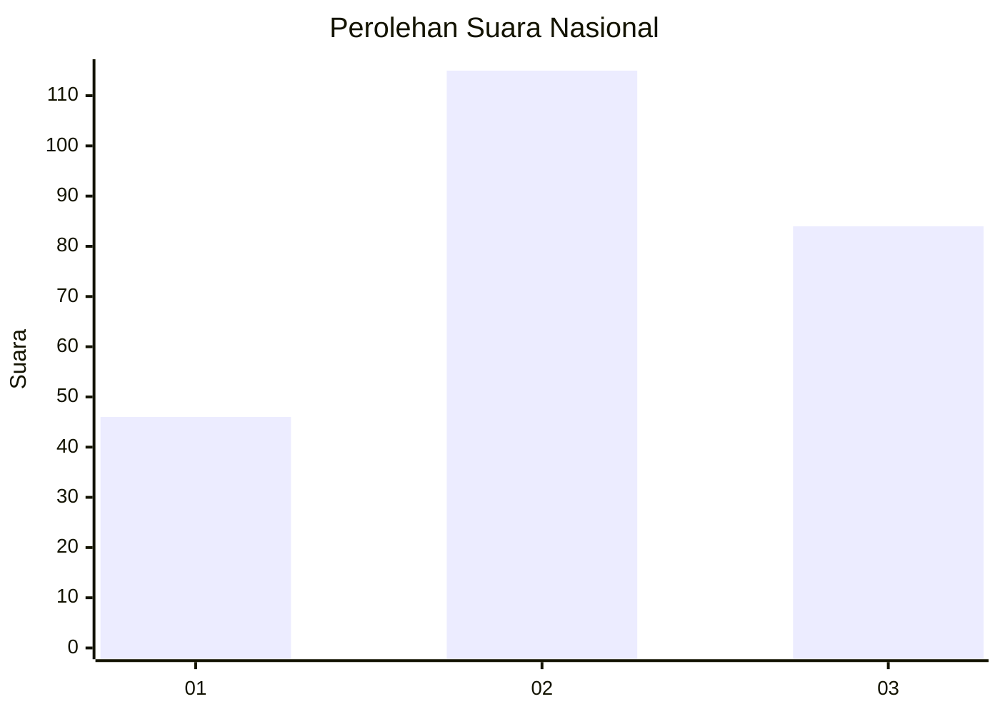
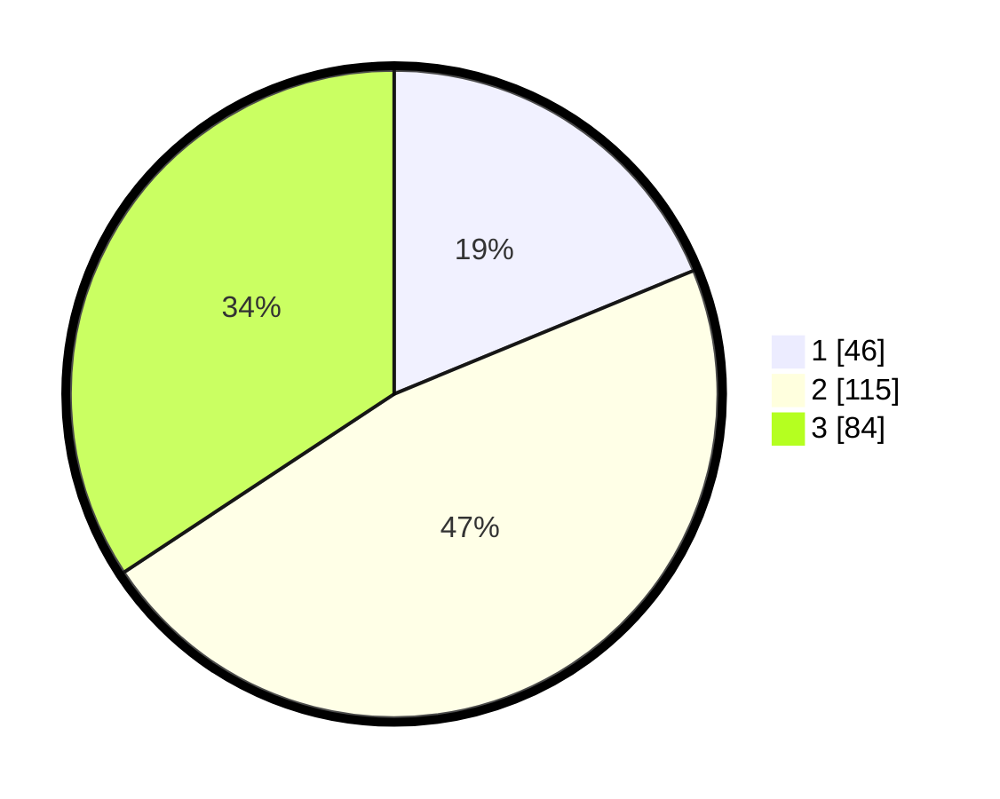

# Hasil

## Grafik

## Tabel

| No. | Nama Paslon    | Suara | Suara (raw) | Persentase |
|:--- |:-------------- | -----:| -----------:| ----------:|
| 1   | ANIES MUHAIMIN | 46    | [46][p-1]   | 18,78      |
| 2   | PRABOWO GIBRAN | 115   | [115][p-2]  | 46,94      |
| 3   | GANJAR MAHFUD  | 84    | [84][p-3]   | 34,29      |

[p-1]: https://github.com/gigit-pemilu/pemilu-2024/blob/main/pilpres/hitung-suara/sub/34-di-yogyakarta/sub/04-sleman/sub/07-depok/sub/2001-caturtunggal/sub/098-tps/sub/paslon-1.txt
[p-2]: https://github.com/gigit-pemilu/pemilu-2024/blob/main/pilpres/hitung-suara/sub/34-di-yogyakarta/sub/04-sleman/sub/07-depok/sub/2001-caturtunggal/sub/098-tps/sub/paslon-2.txt
[p-3]: https://github.com/gigit-pemilu/pemilu-2024/blob/main/pilpres/hitung-suara/sub/34-di-yogyakarta/sub/04-sleman/sub/07-depok/sub/2001-caturtunggal/sub/098-tps/sub/paslon-3.txt

## Foto C Plano

https://sirekap-obj-formc.kpu.go.id/558c/pemilu/ppwp/34/04/07/20/01/3404072001098-20240214-155704--383c1938-38a7-4193-96d5-faf19bb20664.jpg

https://sirekap-obj-formc.kpu.go.id/558c/pemilu/ppwp/34/04/07/20/01/3404072001098-20240214-155731--11d833a2-7902-4367-a5e6-f0a0a6ae74d2.jpg

https://sirekap-obj-formc.kpu.go.id/558c/pemilu/ppwp/34/04/07/20/01/3404072001098-20240214-155849--d431fde8-04dc-43fc-8ec7-1a91ce878590.jpg

## Metadata

| Key        | Value               |
| ---------- | ------------------- |
| Time Stamp | 2024-02-15 18:30:25 |

