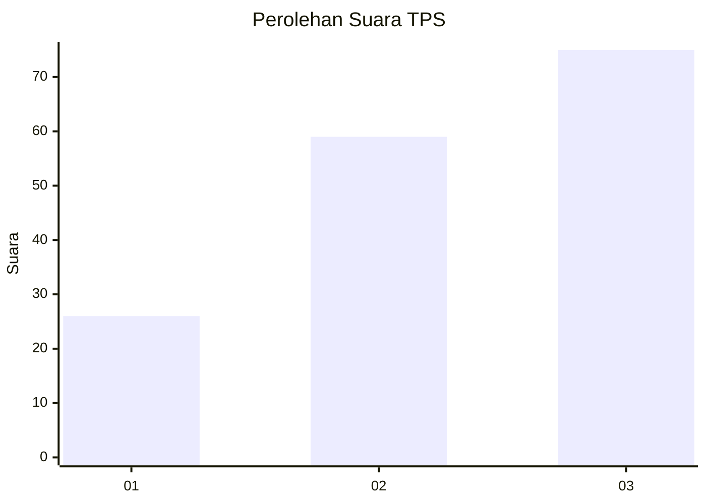
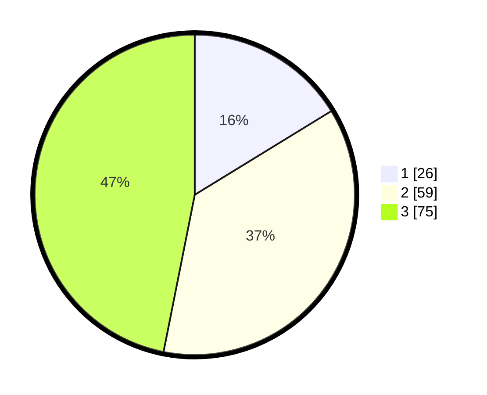

# Hasil

## Grafik

## Tabel

| No. | Nama Paslon    | Suara | Suara (raw) | Persentase |
|:--- |:-------------- | -----:| -----------:| ----------:|
| 1   | ANIES MUHAIMIN | 26    | [26][p-1]   | 16,25      |
| 2   | PRABOWO GIBRAN | 59    | [59][p-2]   | 36,88      |
| 3   | GANJAR MAHFUD  | 75    | [75][p-3]   | 46,88      |

[p-1]: https://github.com/gigit-pemilu/pemilu-2024-34-di-yogyakarta/blob/main/pilpres/hitung-suara/sub/34-di-yogyakarta/sub/04-sleman/sub/07-depok/sub/2001-caturtunggal/sub/100-tps/sub/paslon-1.txt
[p-2]: https://github.com/gigit-pemilu/pemilu-2024-34-di-yogyakarta/blob/main/pilpres/hitung-suara/sub/34-di-yogyakarta/sub/04-sleman/sub/07-depok/sub/2001-caturtunggal/sub/100-tps/sub/paslon-2.txt
[p-3]: https://github.com/gigit-pemilu/pemilu-2024-34-di-yogyakarta/blob/main/pilpres/hitung-suara/sub/34-di-yogyakarta/sub/04-sleman/sub/07-depok/sub/2001-caturtunggal/sub/100-tps/sub/paslon-3.txt

## Foto C Plano

https://sirekap-obj-formc.kpu.go.id/739a/pemilu/ppwp/34/04/07/20/01/3404072001100-20240214-213857--b5c4ac91-7aa5-49a9-9176-ec6f37aa1728.jpg

https://sirekap-obj-formc.kpu.go.id/739a/pemilu/ppwp/34/04/07/20/01/3404072001100-20240214-213930--2342b040-c159-41ee-be27-dff8dd908b2c.jpg

https://sirekap-obj-formc.kpu.go.id/739a/pemilu/ppwp/34/04/07/20/01/3404072001100-20240214-213940--aa30daa2-2861-4f65-8c76-cb21d59d90c3.jpg

## Metadata

| Key        | Value               |
| ---------- | ------------------- |
| Time Stamp | 2024-02-15 15:30:25 |

