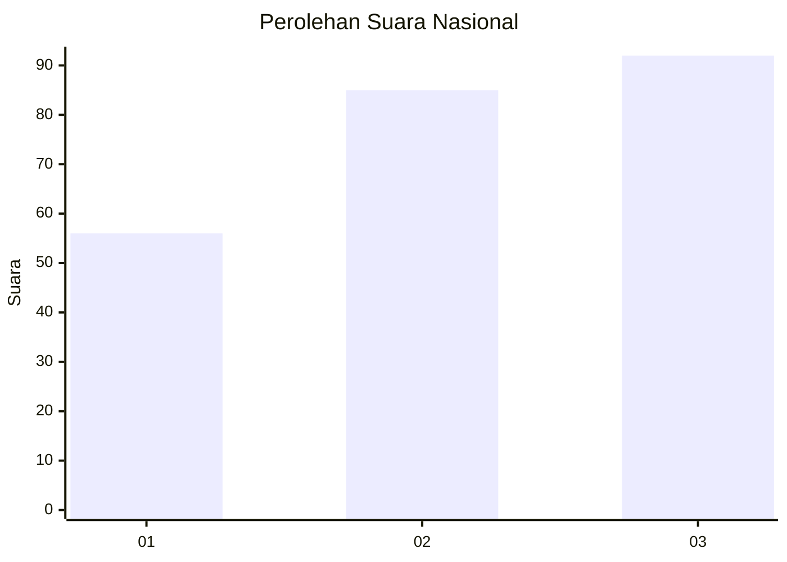
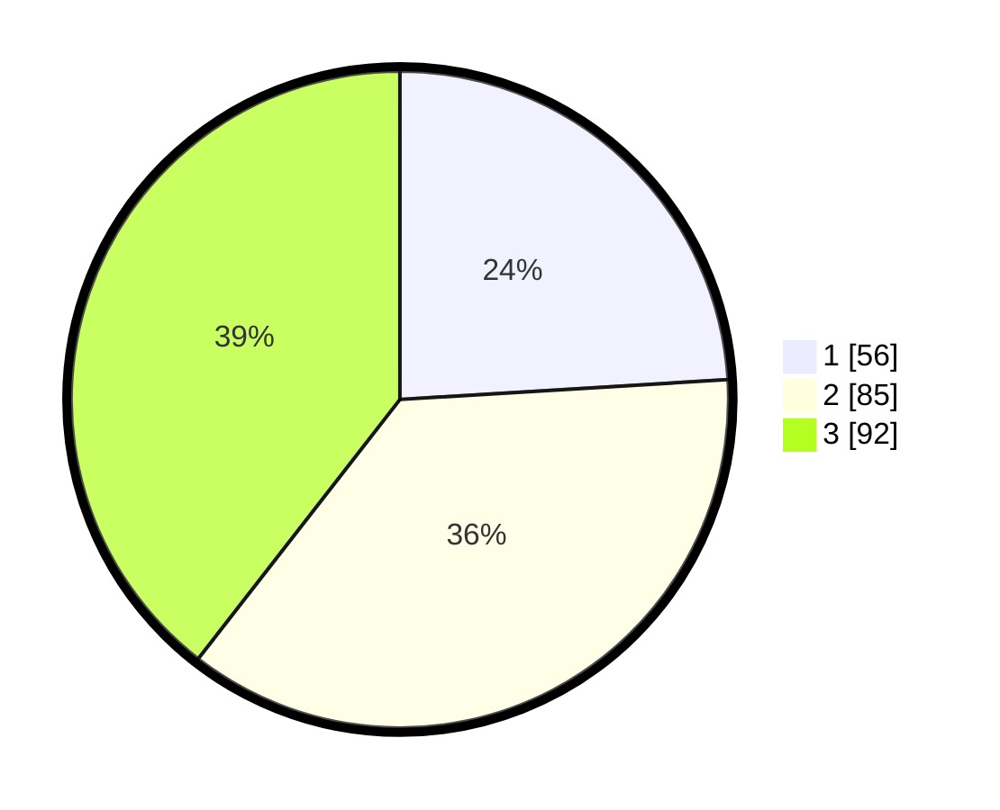

# Hasil

## Grafik

## Tabel

| No. | Nama Paslon    | Suara | Suara (raw) | Persentase |
|:--- |:-------------- | -----:| -----------:| ----------:|
| 1   | ANIES MUHAIMIN | 56    | [56][p-1]   | 24,03      |
| 2   | PRABOWO GIBRAN | 85    | [85][p-2]   | 36,48      |
| 3   | GANJAR MAHFUD  | 92    | [92][p-3]   | 39,48      |

[p-1]: https://github.com/gigit-pemilu/pemilu-2024/blob/main/pilpres/hitung-suara/sub/34-di-yogyakarta/sub/04-sleman/sub/07-depok/sub/2001-caturtunggal/sub/101-tps/sub/paslon-1.txt
[p-2]: https://github.com/gigit-pemilu/pemilu-2024/blob/main/pilpres/hitung-suara/sub/34-di-yogyakarta/sub/04-sleman/sub/07-depok/sub/2001-caturtunggal/sub/101-tps/sub/paslon-2.txt
[p-3]: https://github.com/gigit-pemilu/pemilu-2024/blob/main/pilpres/hitung-suara/sub/34-di-yogyakarta/sub/04-sleman/sub/07-depok/sub/2001-caturtunggal/sub/101-tps/sub/paslon-3.txt

## Foto C Plano

https://sirekap-obj-formc.kpu.go.id/575c/pemilu/ppwp/34/04/07/20/01/3404072001101-20240214-230731--e97cbc23-9eb1-462b-9208-28a81cb94ab8.jpg

https://sirekap-obj-formc.kpu.go.id/575c/pemilu/ppwp/34/04/07/20/01/3404072001101-20240214-230835--039a4860-38e9-484e-b49c-f4ba49e01dee.jpg

https://sirekap-obj-formc.kpu.go.id/575c/pemilu/ppwp/34/04/07/20/01/3404072001101-20240214-230952--8c6be2a6-d81c-4331-acb4-2555e155d576.jpg

## Metadata

| Key        | Value               |
| ---------- | ------------------- |
| Time Stamp | 2024-02-15 23:29:50 |

