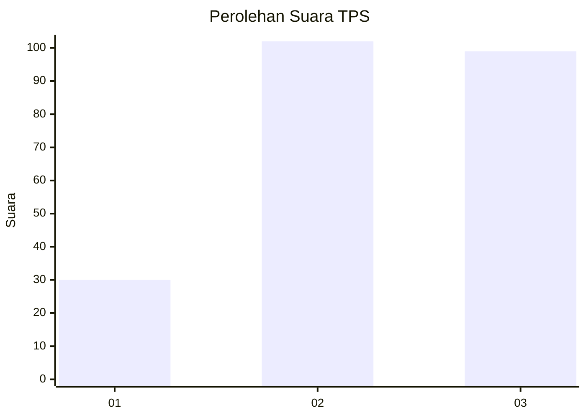
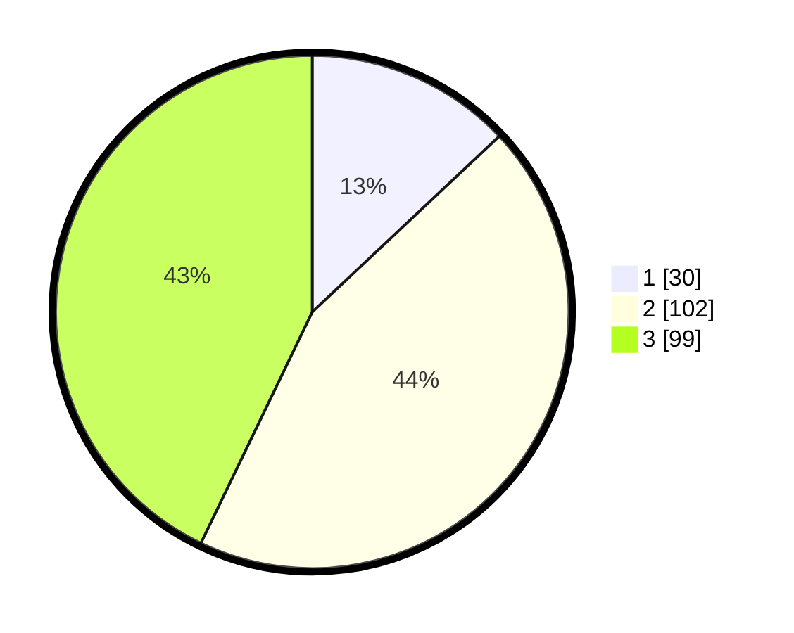

# Hasil

## Grafik

## Tabel

| No. | Nama Paslon    | Suara | Suara (raw) | Persentase |
|:--- |:-------------- | -----:| -----------:| ----------:|
| 1   | ANIES MUHAIMIN | 30    | [30][p-1]   | 12,99      |
| 2   | PRABOWO GIBRAN | 102   | [102][p-2]  | 44,16      |
| 3   | GANJAR MAHFUD  | 99    | [99][p-3]   | 42,86      |

[p-1]: https://github.com/gigit-pemilu/pemilu-2024-34-di-yogyakarta/blob/main/pilpres/hitung-suara/sub/34-di-yogyakarta/sub/04-sleman/sub/07-depok/sub/2001-caturtunggal/sub/103-tps/sub/paslon-1.txt
[p-2]: https://github.com/gigit-pemilu/pemilu-2024-34-di-yogyakarta/blob/main/pilpres/hitung-suara/sub/34-di-yogyakarta/sub/04-sleman/sub/07-depok/sub/2001-caturtunggal/sub/103-tps/sub/paslon-2.txt
[p-3]: https://github.com/gigit-pemilu/pemilu-2024-34-di-yogyakarta/blob/main/pilpres/hitung-suara/sub/34-di-yogyakarta/sub/04-sleman/sub/07-depok/sub/2001-caturtunggal/sub/103-tps/sub/paslon-3.txt

## Foto C Plano

https://sirekap-obj-formc.kpu.go.id/d700/pemilu/ppwp/34/04/07/20/01/3404072001103-20240214-233048--bbce5cc6-3c76-4543-a459-e9e57f2df011.jpg

https://sirekap-obj-formc.kpu.go.id/d700/pemilu/ppwp/34/04/07/20/01/3404072001103-20240214-233026--7c9d2496-8297-4303-9d04-661dbbd30cff.jpg

https://sirekap-obj-formc.kpu.go.id/d700/pemilu/ppwp/34/04/07/20/01/3404072001103-20240214-232933--ed1d44cc-7fb6-4b46-b50a-9b90a33a0d81.jpg

## Metadata

| Key        | Value               |
| ---------- | ------------------- |
| Time Stamp | 2024-02-15 15:00:29 |

