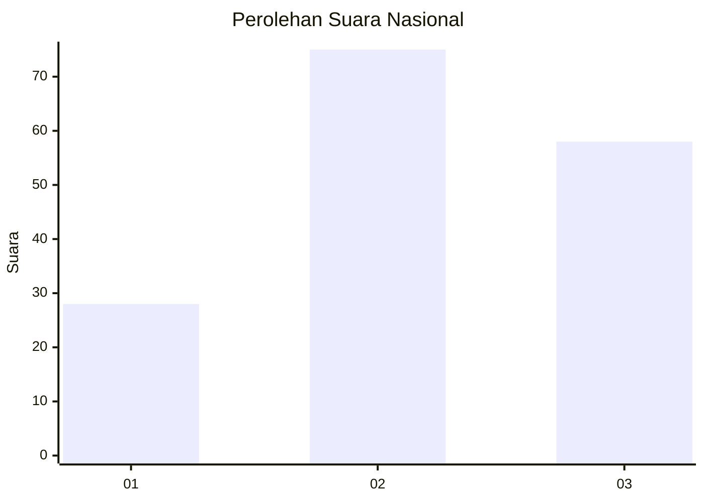
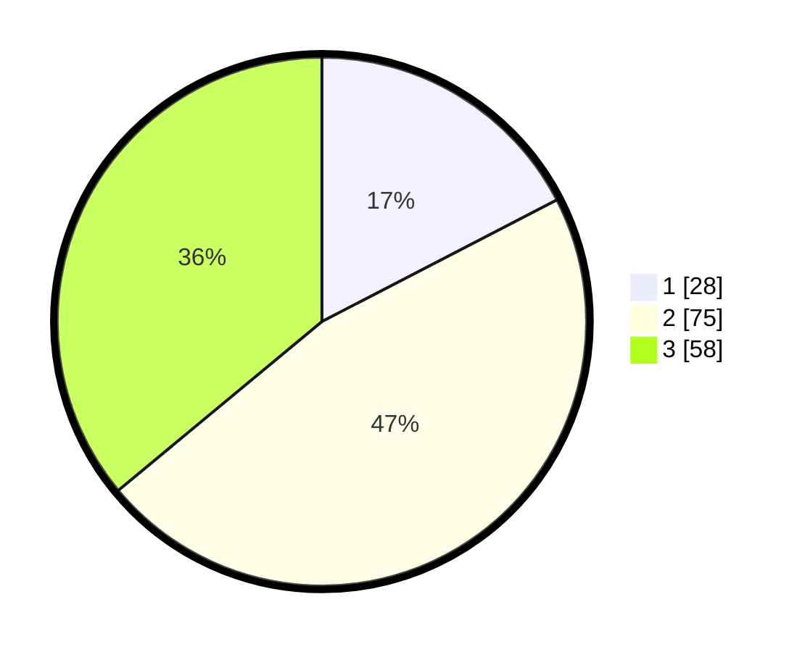

# Hasil

## Grafik

## Tabel

| No. | Nama Paslon    | Suara | Suara (raw) | Persentase |
|:--- |:-------------- | -----:| -----------:| ----------:|
| 1   | ANIES MUHAIMIN | 28    | [28][p-1]   | 17,39      |
| 2   | PRABOWO GIBRAN | 75    | [75][p-2]   | 46,58      |
| 3   | GANJAR MAHFUD  | 58    | [58][p-3]   | 36,02      |

[p-1]: https://github.com/gigit-pemilu/pemilu-2024/blob/main/pilpres/hitung-suara/sub/34-di-yogyakarta/sub/04-sleman/sub/07-depok/sub/2001-caturtunggal/sub/114-tps/sub/paslon-1.txt
[p-2]: https://github.com/gigit-pemilu/pemilu-2024/blob/main/pilpres/hitung-suara/sub/34-di-yogyakarta/sub/04-sleman/sub/07-depok/sub/2001-caturtunggal/sub/114-tps/sub/paslon-2.txt
[p-3]: https://github.com/gigit-pemilu/pemilu-2024/blob/main/pilpres/hitung-suara/sub/34-di-yogyakarta/sub/04-sleman/sub/07-depok/sub/2001-caturtunggal/sub/114-tps/sub/paslon-3.txt

## Foto C Plano

https://sirekap-obj-formc.kpu.go.id/067b/pemilu/ppwp/34/04/07/20/01/3404072001114-20240214-231628--54817338-8292-40af-a9e9-996922655558.jpg

https://sirekap-obj-formc.kpu.go.id/067b/pemilu/ppwp/34/04/07/20/01/3404072001114-20240214-231739--deb0d7e7-16e2-451e-b845-b19fcea60e60.jpg

https://sirekap-obj-formc.kpu.go.id/067b/pemilu/ppwp/34/04/07/20/01/3404072001114-20240214-231845--5fe5b889-af54-4c02-984f-cfdf36186d21.jpg

## Metadata

| Key        | Value               |
| ---------- | ------------------- |
| Time Stamp | 2024-02-15 21:01:18 |

