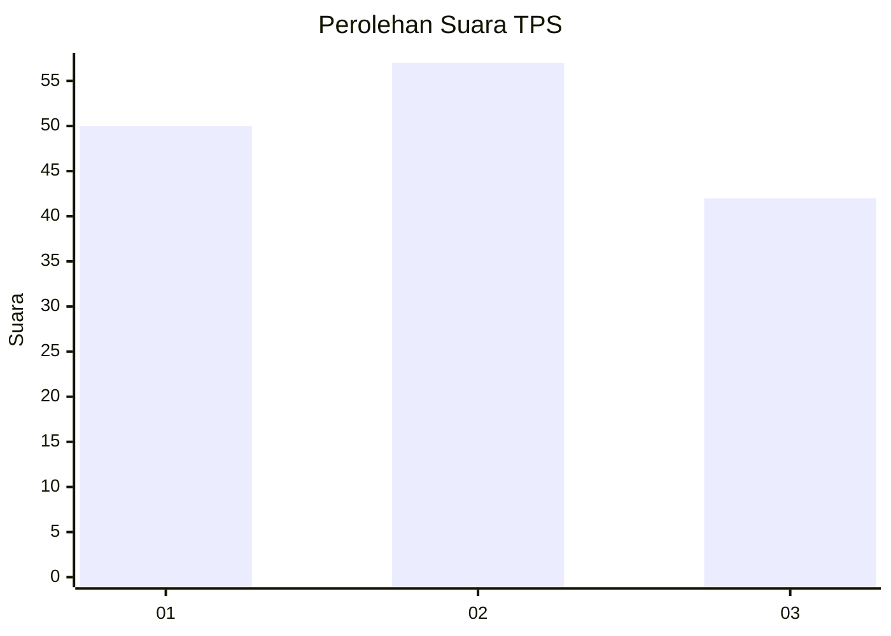
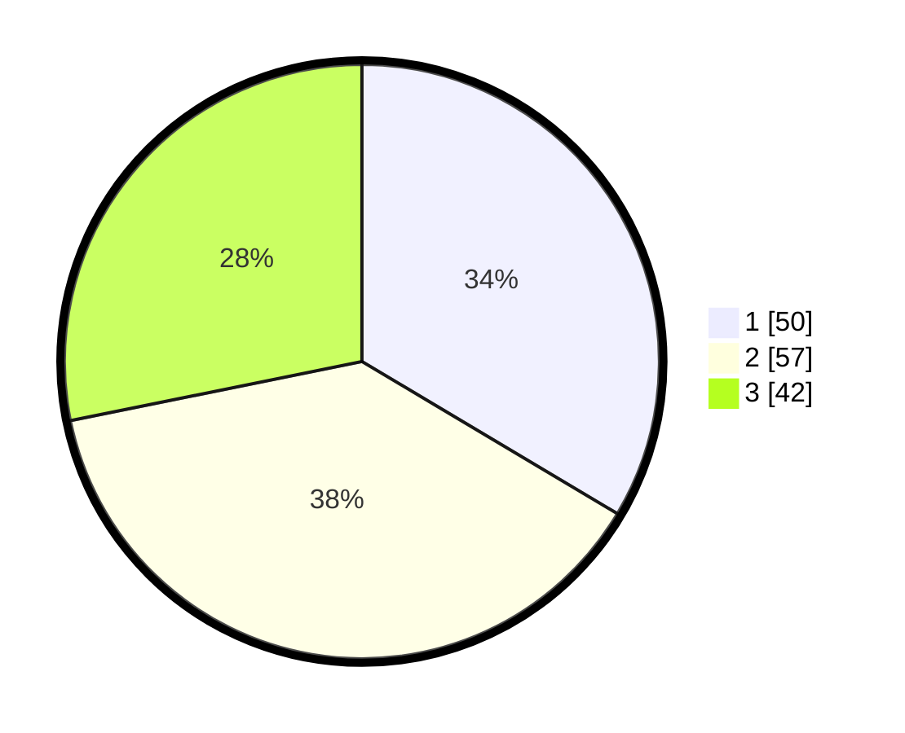

# Hasil

## Grafik

## Tabel

| No. | Nama Paslon    | Suara | Suara (raw) | Persentase |
|:--- |:-------------- | -----:| -----------:| ----------:|
| 1   | ANIES MUHAIMIN | 50    | [50][p-1]   | 33,56      |
| 2   | PRABOWO GIBRAN | 57    | [57][p-2]   | 38,26      |
| 3   | GANJAR MAHFUD  | 42    | [42][p-3]   | 28,19      |

[p-1]: https://github.com/gigit-pemilu/pemilu-2024-34-di-yogyakarta/blob/main/pilpres/hitung-suara/sub/34-di-yogyakarta/sub/04-sleman/sub/07-depok/sub/2001-caturtunggal/sub/115-tps/sub/paslon-1.txt
[p-2]: https://github.com/gigit-pemilu/pemilu-2024-34-di-yogyakarta/blob/main/pilpres/hitung-suara/sub/34-di-yogyakarta/sub/04-sleman/sub/07-depok/sub/2001-caturtunggal/sub/115-tps/sub/paslon-2.txt
[p-3]: https://github.com/gigit-pemilu/pemilu-2024-34-di-yogyakarta/blob/main/pilpres/hitung-suara/sub/34-di-yogyakarta/sub/04-sleman/sub/07-depok/sub/2001-caturtunggal/sub/115-tps/sub/paslon-3.txt

## Foto C Plano

https://sirekap-obj-formc.kpu.go.id/0942/pemilu/ppwp/34/04/07/20/01/3404072001115-20240215-015753--d93f88ff-3d40-40a4-b7d7-a1553b6083ba.jpg

https://sirekap-obj-formc.kpu.go.id/0942/pemilu/ppwp/34/04/07/20/01/3404072001115-20240215-015814--eeaa13fb-24d4-44b4-9b66-b090eb1e0fbf.jpg

https://sirekap-obj-formc.kpu.go.id/0942/pemilu/ppwp/34/04/07/20/01/3404072001115-20240215-012051--0124f183-0d2e-4671-a00b-17a540e69bf5.jpg

## Metadata

| Key        | Value               |
| ---------- | ------------------- |
| Time Stamp | 2024-02-17 12:00:00 |

