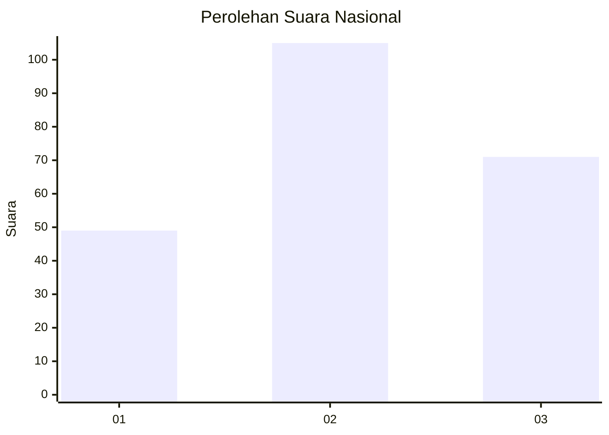
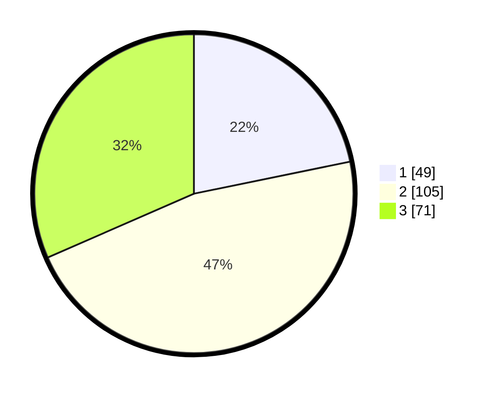

# Hasil

## Grafik

## Tabel

| No. | Nama Paslon    | Suara | Suara (raw) | Persentase |
|:--- |:-------------- | -----:| -----------:| ----------:|
| 1   | ANIES MUHAIMIN | 49    | [49][p-1]   | 21,78      |
| 2   | PRABOWO GIBRAN | 105   | [105][p-2]  | 46,67      |
| 3   | GANJAR MAHFUD  | 71    | [71][p-3]   | 31,56      |

[p-1]: https://github.com/gigit-pemilu/pemilu-2024/blob/main/pilpres/hitung-suara/sub/34-di-yogyakarta/sub/04-sleman/sub/07-depok/sub/2001-caturtunggal/sub/117-tps/sub/paslon-1.txt
[p-2]: https://github.com/gigit-pemilu/pemilu-2024/blob/main/pilpres/hitung-suara/sub/34-di-yogyakarta/sub/04-sleman/sub/07-depok/sub/2001-caturtunggal/sub/117-tps/sub/paslon-2.txt
[p-3]: https://github.com/gigit-pemilu/pemilu-2024/blob/main/pilpres/hitung-suara/sub/34-di-yogyakarta/sub/04-sleman/sub/07-depok/sub/2001-caturtunggal/sub/117-tps/sub/paslon-3.txt

## Foto C Plano

https://sirekap-obj-formc.kpu.go.id/8d0b/pemilu/ppwp/34/04/07/20/01/3404072001117-20240214-232832--987959c2-acb9-4972-a77d-7b1e21fde16d.jpg

https://sirekap-obj-formc.kpu.go.id/8d0b/pemilu/ppwp/34/04/07/20/01/3404072001117-20240214-233128--89d3ab5a-2907-41f3-a5f4-05c7c65b2933.jpg

https://sirekap-obj-formc.kpu.go.id/8d0b/pemilu/ppwp/34/04/07/20/01/3404072001117-20240214-233328--cb7e286e-0a14-4d49-b5ea-4b2d0e61d53e.jpg

## Metadata

| Key        | Value               |
| ---------- | ------------------- |
| Time Stamp | 2024-02-15 15:00:29 |

