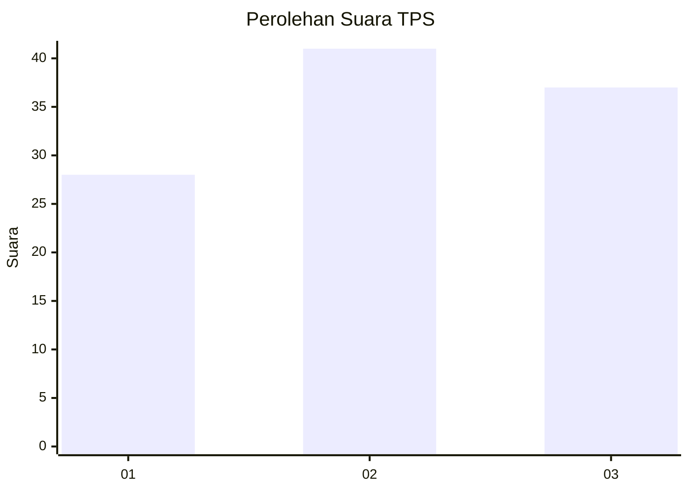
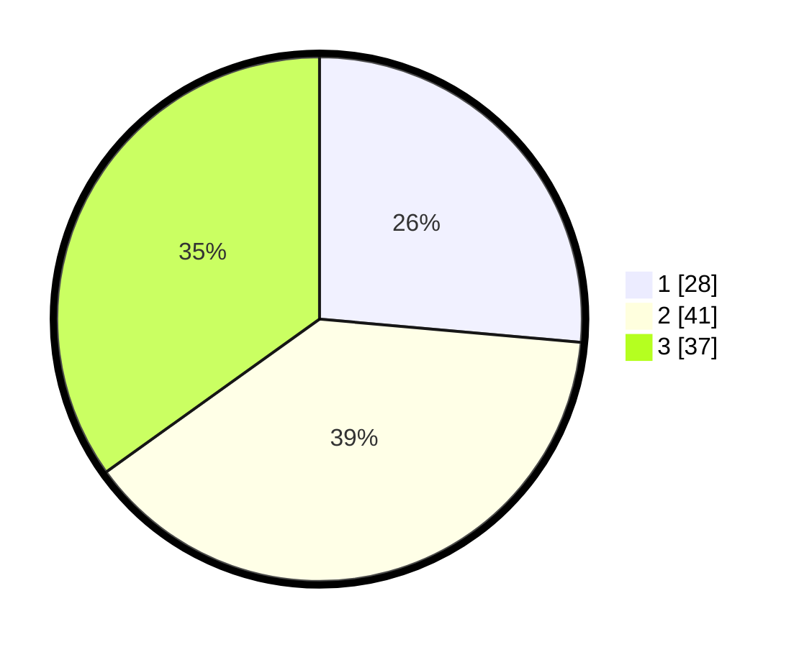

# Hasil

## Grafik

## Tabel

| No. | Nama Paslon    | Suara | Suara (raw) | Persentase |
|:--- |:-------------- | -----:| -----------:| ----------:|
| 1   | ANIES MUHAIMIN | 28    | [28][p-1]   | 26,42      |
| 2   | PRABOWO GIBRAN | 41    | [41][p-2]   | 38,68      |
| 3   | GANJAR MAHFUD  | 37    | [37][p-3]   | 34,91      |

[p-1]: https://github.com/gigit-pemilu/pemilu-2024-34-di-yogyakarta/blob/main/pilpres/hitung-suara/sub/34-di-yogyakarta/sub/04-sleman/sub/07-depok/sub/2001-caturtunggal/sub/125-tps/sub/paslon-1.txt
[p-2]: https://github.com/gigit-pemilu/pemilu-2024-34-di-yogyakarta/blob/main/pilpres/hitung-suara/sub/34-di-yogyakarta/sub/04-sleman/sub/07-depok/sub/2001-caturtunggal/sub/125-tps/sub/paslon-2.txt
[p-3]: https://github.com/gigit-pemilu/pemilu-2024-34-di-yogyakarta/blob/main/pilpres/hitung-suara/sub/34-di-yogyakarta/sub/04-sleman/sub/07-depok/sub/2001-caturtunggal/sub/125-tps/sub/paslon-3.txt

## Foto C Plano

https://sirekap-obj-formc.kpu.go.id/9a74/pemilu/ppwp/34/04/07/20/01/3404072001125-20240215-002206--b57cff81-ea7c-454e-8dd1-922bc41e00be.jpg

https://sirekap-obj-formc.kpu.go.id/9a74/pemilu/ppwp/34/04/07/20/01/3404072001125-20240215-002342--7576c9a1-2929-49c9-b964-01fb3ad718a9.jpg

https://sirekap-obj-formc.kpu.go.id/9a74/pemilu/ppwp/34/04/07/20/01/3404072001125-20240215-002353--54ca4866-ce85-4b7d-b1d3-99fd11d36062.jpg

## Metadata

| Key        | Value               |
| ---------- | ------------------- |
| Time Stamp | 2024-02-15 21:01:18 |

