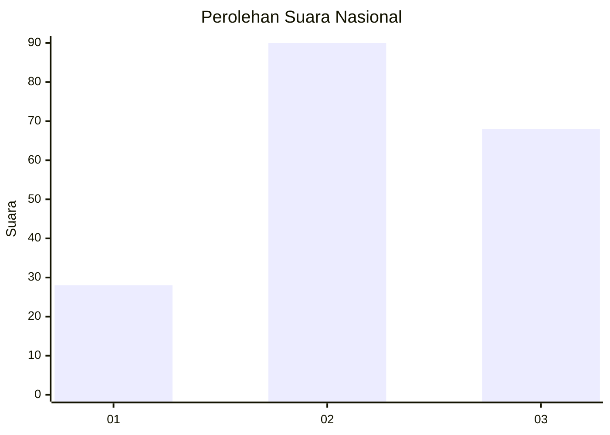
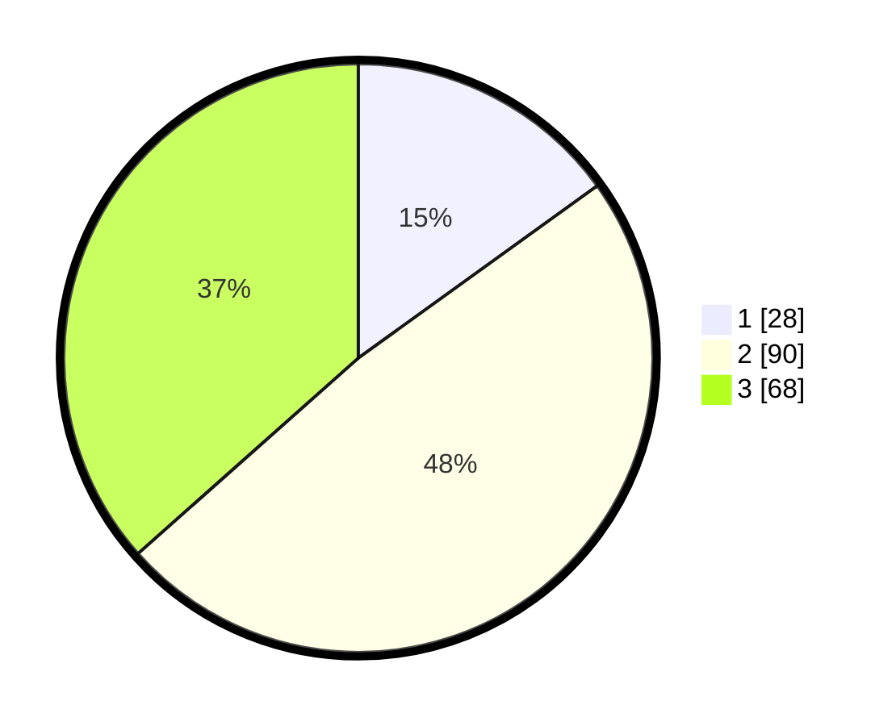

# Hasil

## Grafik

## Tabel

| No. | Nama Paslon    | Suara | Suara (raw) | Persentase |
|:--- |:-------------- | -----:| -----------:| ----------:|
| 1   | ANIES MUHAIMIN | 28    | [28][p-1]   | 15,05      |
| 2   | PRABOWO GIBRAN | 90    | [90][p-2]   | 48,39      |
| 3   | GANJAR MAHFUD  | 68    | [68][p-3]   | 36,56      |

[p-1]: https://github.com/gigit-pemilu/pemilu-2024/blob/main/pilpres/hitung-suara/sub/34-di-yogyakarta/sub/04-sleman/sub/07-depok/sub/2001-caturtunggal/sub/130-tps/sub/paslon-1.txt
[p-2]: https://github.com/gigit-pemilu/pemilu-2024/blob/main/pilpres/hitung-suara/sub/34-di-yogyakarta/sub/04-sleman/sub/07-depok/sub/2001-caturtunggal/sub/130-tps/sub/paslon-2.txt
[p-3]: https://github.com/gigit-pemilu/pemilu-2024/blob/main/pilpres/hitung-suara/sub/34-di-yogyakarta/sub/04-sleman/sub/07-depok/sub/2001-caturtunggal/sub/130-tps/sub/paslon-3.txt

## Foto C Plano

https://sirekap-obj-formc.kpu.go.id/6345/pemilu/ppwp/34/04/07/20/01/3404072001130-20240214-201837--545e124d-e301-4657-a31b-ee9831e56928.jpg

https://sirekap-obj-formc.kpu.go.id/6345/pemilu/ppwp/34/04/07/20/01/3404072001130-20240214-201910--7431bd11-43e0-433e-be76-e206b2028f4c.jpg

https://sirekap-obj-formc.kpu.go.id/6345/pemilu/ppwp/34/04/07/20/01/3404072001130-20240214-201914--88670317-2860-4d17-9aec-b93a8420782e.jpg

## Metadata

| Key        | Value               |
| ---------- | ------------------- |
| Time Stamp | 2024-02-15 15:00:29 |

