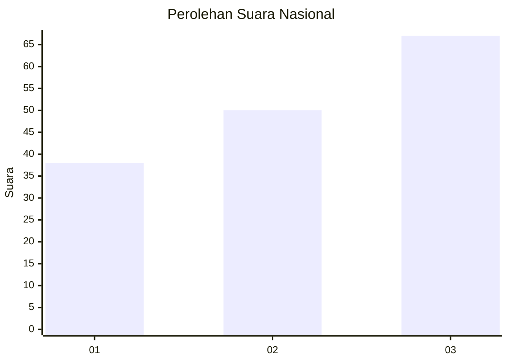
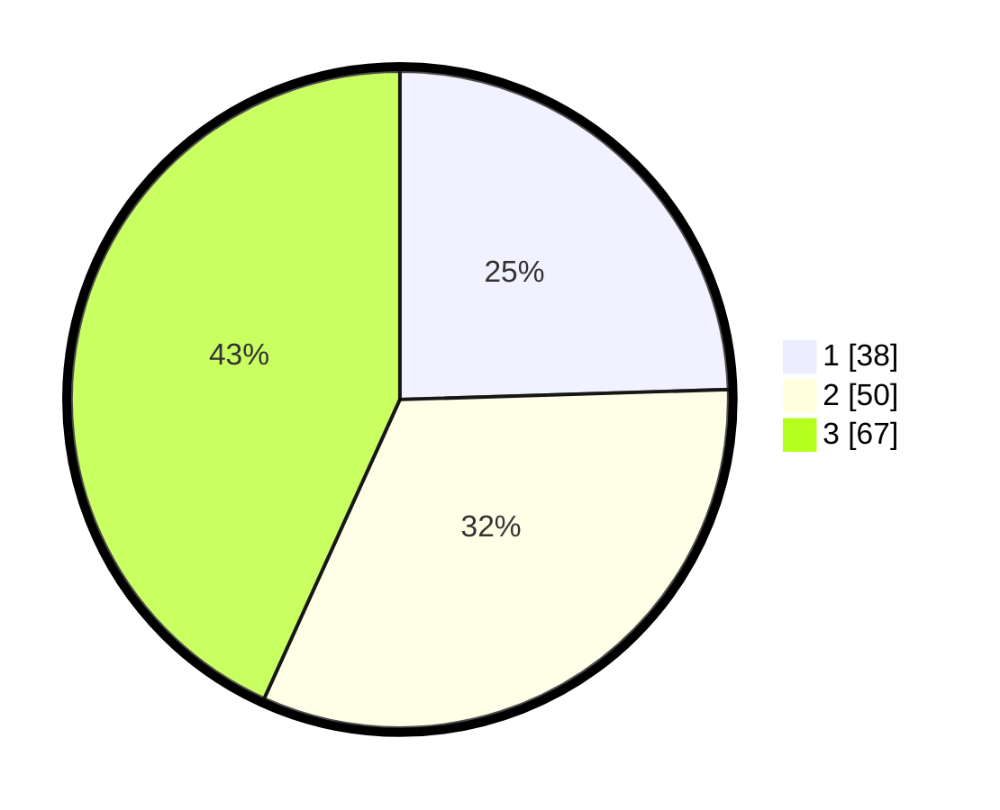

# Hasil

## Grafik

## Tabel

| No. | Nama Paslon    | Suara | Suara (raw) | Persentase |
|:--- |:-------------- | -----:| -----------:| ----------:|
| 1   | ANIES MUHAIMIN | 38    | [38][p-1]   | 24,52      |
| 2   | PRABOWO GIBRAN | 50    | [50][p-2]   | 32,26      |
| 3   | GANJAR MAHFUD  | 67    | [67][p-3]   | 43,23      |

[p-1]: https://github.com/gigit-pemilu/pemilu-2024/blob/main/pilpres/hitung-suara/sub/34-di-yogyakarta/sub/04-sleman/sub/07-depok/sub/2001-caturtunggal/sub/133-tps/sub/paslon-1.txt
[p-2]: https://github.com/gigit-pemilu/pemilu-2024/blob/main/pilpres/hitung-suara/sub/34-di-yogyakarta/sub/04-sleman/sub/07-depok/sub/2001-caturtunggal/sub/133-tps/sub/paslon-2.txt
[p-3]: https://github.com/gigit-pemilu/pemilu-2024/blob/main/pilpres/hitung-suara/sub/34-di-yogyakarta/sub/04-sleman/sub/07-depok/sub/2001-caturtunggal/sub/133-tps/sub/paslon-3.txt

## Foto C Plano

https://sirekap-obj-formc.kpu.go.id/8499/pemilu/ppwp/34/04/07/20/01/3404072001133-20240214-155525--3e134c7a-0a7b-4543-9ea3-d4a9bac3dd30.jpg

https://sirekap-obj-formc.kpu.go.id/8499/pemilu/ppwp/34/04/07/20/01/3404072001133-20240214-160116--f4f7e25e-9288-45a1-a254-49868eacbf8e.jpg

https://sirekap-obj-formc.kpu.go.id/8499/pemilu/ppwp/34/04/07/20/01/3404072001133-20240214-160142--6bc1accd-ec66-46dd-bfd0-f7e4701419f3.jpg

## Metadata

| Key        | Value               |
| ---------- | ------------------- |
| Time Stamp | 2024-02-17 12:00:00 |

