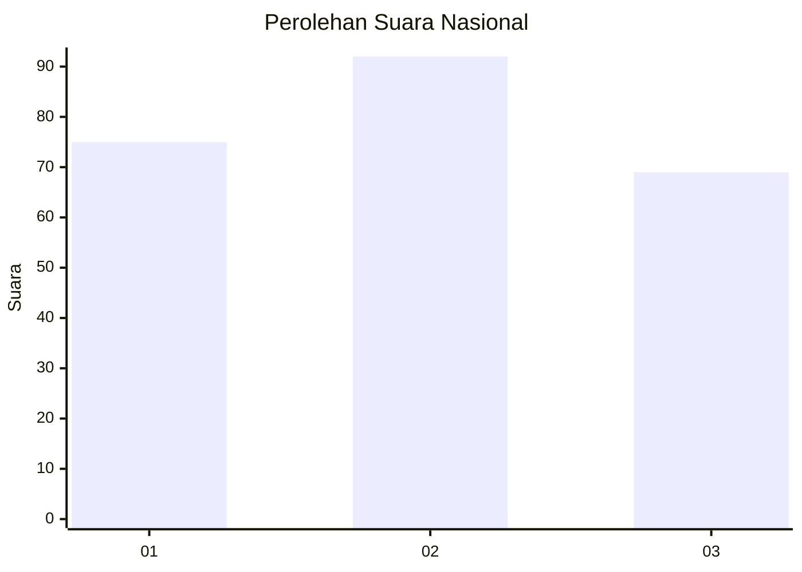
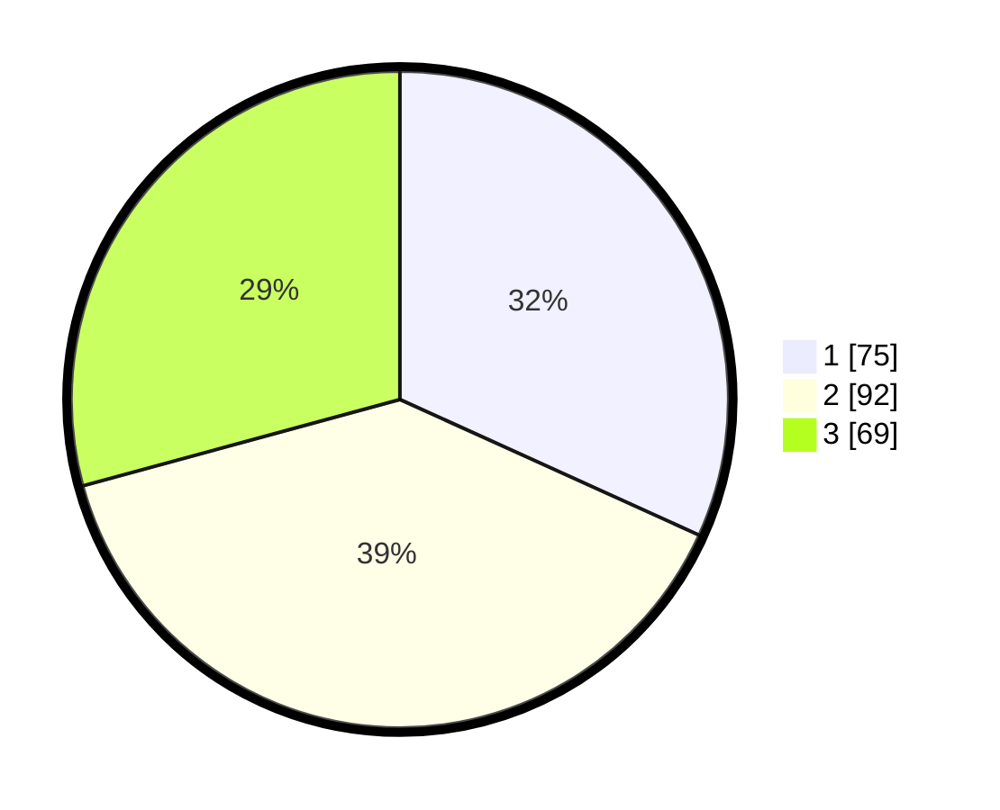

# Hasil

## Grafik

## Tabel

| No. | Nama Paslon    | Suara | Suara (raw) | Persentase |
|:--- |:-------------- | -----:| -----------:| ----------:|
| 1   | ANIES MUHAIMIN | 75    | [75][p-1]   | 31,78      |
| 2   | PRABOWO GIBRAN | 92    | [92][p-2]   | 38,98      |
| 3   | GANJAR MAHFUD  | 69    | [69][p-3]   | 29,24      |

[p-1]: https://github.com/gigit-pemilu/pemilu-2024/blob/main/pilpres/hitung-suara/sub/34-di-yogyakarta/sub/04-sleman/sub/07-depok/sub/2001-caturtunggal/sub/140-tps/sub/paslon-1.txt
[p-2]: https://github.com/gigit-pemilu/pemilu-2024/blob/main/pilpres/hitung-suara/sub/34-di-yogyakarta/sub/04-sleman/sub/07-depok/sub/2001-caturtunggal/sub/140-tps/sub/paslon-2.txt
[p-3]: https://github.com/gigit-pemilu/pemilu-2024/blob/main/pilpres/hitung-suara/sub/34-di-yogyakarta/sub/04-sleman/sub/07-depok/sub/2001-caturtunggal/sub/140-tps/sub/paslon-3.txt

## Foto C Plano

https://sirekap-obj-formc.kpu.go.id/968d/pemilu/ppwp/34/04/07/20/01/3404072001140-20240215-001206--58120716-9b97-43fe-8ded-54a301b637fe.jpg

https://sirekap-obj-formc.kpu.go.id/968d/pemilu/ppwp/34/04/07/20/01/3404072001140-20240216-163147--780f116a-2894-48c0-9e67-cd8b279e68d7.jpg

https://sirekap-obj-formc.kpu.go.id/968d/pemilu/ppwp/34/04/07/20/01/3404072001140-20240215-002908--26a520be-ad73-4d2e-bf33-7b2441490fd5.jpg

## Metadata

| Key        | Value               |
| ---------- | ------------------- |
| Time Stamp | 2024-02-16 17:00:00 |

