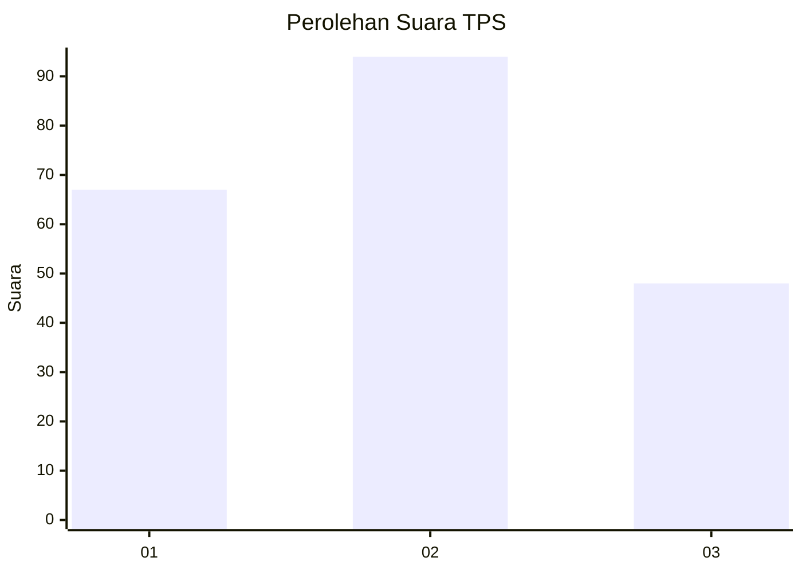
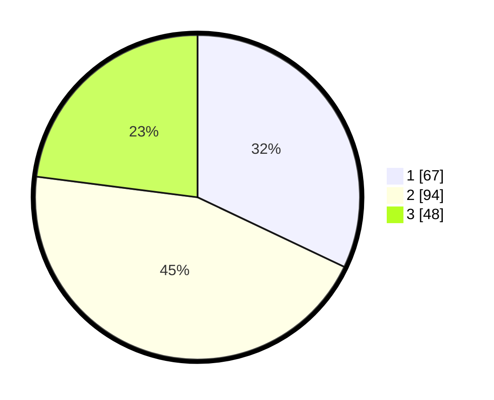

# Hasil

## Grafik

## Tabel

| No. | Nama Paslon    | Suara | Suara (raw) | Persentase |
|:--- |:-------------- | -----:| -----------:| ----------:|
| 1   | ANIES MUHAIMIN | 67    | [67][p-1]   | 32,06      |
| 2   | PRABOWO GIBRAN | 94    | [94][p-2]   | 44,98      |
| 3   | GANJAR MAHFUD  | 48    | [48][p-3]   | 22,97      |

[p-1]: https://github.com/gigit-pemilu/pemilu-2024-34-di-yogyakarta/blob/main/pilpres/hitung-suara/sub/34-di-yogyakarta/sub/04-sleman/sub/07-depok/sub/2001-caturtunggal/sub/141-tps/sub/paslon-1.txt
[p-2]: https://github.com/gigit-pemilu/pemilu-2024-34-di-yogyakarta/blob/main/pilpres/hitung-suara/sub/34-di-yogyakarta/sub/04-sleman/sub/07-depok/sub/2001-caturtunggal/sub/141-tps/sub/paslon-2.txt
[p-3]: https://github.com/gigit-pemilu/pemilu-2024-34-di-yogyakarta/blob/main/pilpres/hitung-suara/sub/34-di-yogyakarta/sub/04-sleman/sub/07-depok/sub/2001-caturtunggal/sub/141-tps/sub/paslon-3.txt

## Foto C Plano

https://sirekap-obj-formc.kpu.go.id/53ca/pemilu/ppwp/34/04/07/20/01/3404072001141-20240216-141803--3cbd83b0-391c-48b3-9453-ef7cd0adeb34.jpg

https://sirekap-obj-formc.kpu.go.id/53ca/pemilu/ppwp/34/04/07/20/01/3404072001141-20240216-141804--1c9a0a87-3b12-4b7a-9aed-39492eee7d1a.jpg

https://sirekap-obj-formc.kpu.go.id/53ca/pemilu/ppwp/34/04/07/20/01/3404072001141-20240216-141804--6d601770-765c-4a08-abc1-84c119be9829.jpg

## Metadata

| Key        | Value               |
| ---------- | ------------------- |
| Time Stamp | 2024-02-16 22:01:00 |

## DATA PEMILIH TETAP

Jumlah pemilih dalam DPT: **259**.
 * L: **125**.
 * P: **134**.

## DATA PENGGUNA HAK PILIH

Jumlah pengguna hak pilih dalam DPT: **185**.
 * L: **88**.
 * P: **97**.

Jumlah pengguna hak pilih dalam DPTb: **14**.
 * L: **2**.
 * P: **12**.

Jumlah pengguna hak pilih dalam DPK: **14**.
 * L: **8**.
 * P: **6**.

Jumlah pengguna hak pilih: **213**.
 * L: **98**.
 * P: **115**.

## JUMLAH SUARA SAH DAN TIDAK SAH

JUMLAH SELURUH SUARA SAH: **209**.

JUMLAH SUARA TIDAK SAH: **4**.

JUMLAH SELURUH SUARA SAH DAN SUARA TIDAK SAH: **213**.

