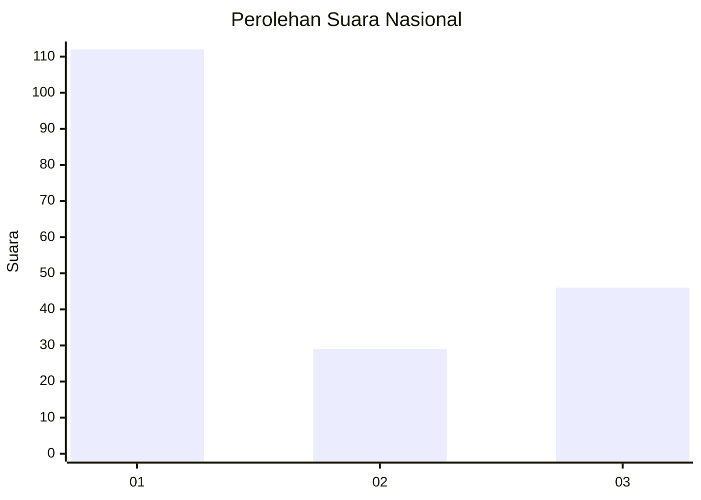
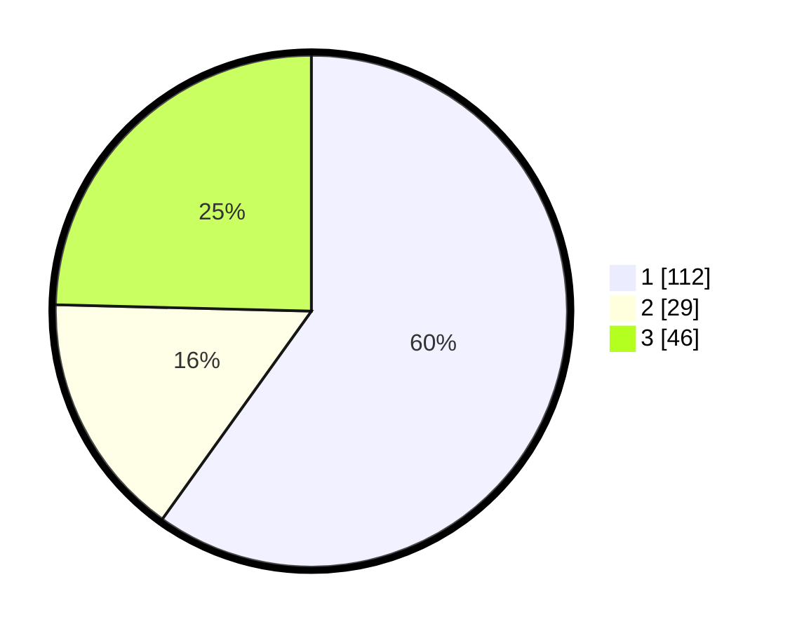

# Hasil

## Grafik

## Tabel

| No. | Nama Paslon    | Suara | Suara (raw) | Persentase |
|:--- |:-------------- | -----:| -----------:| ----------:|
| 1   | ANIES MUHAIMIN | 112   | [112][p-1]  | 59,89      |
| 2   | PRABOWO GIBRAN | 29    | [29][p-2]   | 15,51      |
| 3   | GANJAR MAHFUD  | 46    | [46][p-3]   | 24,60      |

[p-1]: https://github.com/gigit-pemilu/pemilu-2024/blob/main/pilpres/hitung-suara/sub/34-di-yogyakarta/sub/04-sleman/sub/07-depok/sub/2001-caturtunggal/sub/905-tps/sub/paslon-1.txt
[p-2]: https://github.com/gigit-pemilu/pemilu-2024/blob/main/pilpres/hitung-suara/sub/34-di-yogyakarta/sub/04-sleman/sub/07-depok/sub/2001-caturtunggal/sub/905-tps/sub/paslon-2.txt
[p-3]: https://github.com/gigit-pemilu/pemilu-2024/blob/main/pilpres/hitung-suara/sub/34-di-yogyakarta/sub/04-sleman/sub/07-depok/sub/2001-caturtunggal/sub/905-tps/sub/paslon-3.txt

## Foto C Plano

https://sirekap-obj-formc.kpu.go.id/03b7/pemilu/ppwp/34/04/07/20/01/3404072001905-20240216-041204--b2b1cead-0b29-4462-8ec7-f8a22a219aee.jpg

https://sirekap-obj-formc.kpu.go.id/03b7/pemilu/ppwp/34/04/07/20/01/3404072001905-20240216-041206--8334dab4-2ac4-40dd-9134-fb349b019438.jpg

https://sirekap-obj-formc.kpu.go.id/03b7/pemilu/ppwp/34/04/07/20/01/3404072001905-20240216-041205--7322f185-f2f9-428a-8b9b-b1fe57429aa7.jpg

## Metadata

| Key        | Value               |
| ---------- | ------------------- |
| Time Stamp | 2024-02-16 21:01:00 |

## DATA PEMILIH TETAP

Jumlah pemilih dalam DPT: **291**.
 * L: **87**.
 * P: **204**.

## DATA PENGGUNA HAK PILIH

Jumlah pengguna hak pilih dalam DPT: **177**.
 * L: **63**.
 * P: **114**.

Jumlah pengguna hak pilih dalam DPTb: **11**.
 * L: **2**.
 * P: **9**.

Jumlah pengguna hak pilih dalam DPK: **0**.
 * L: **0**.
 * P: **0**.

Jumlah pengguna hak pilih: **188**.
 * L: **65**.
 * P: **123**.

## JUMLAH SUARA SAH DAN TIDAK SAH

JUMLAH SELURUH SUARA SAH: **187**.

JUMLAH SUARA TIDAK SAH: **1**.

JUMLAH SELURUH SUARA SAH DAN SUARA TIDAK SAH: **188**.

