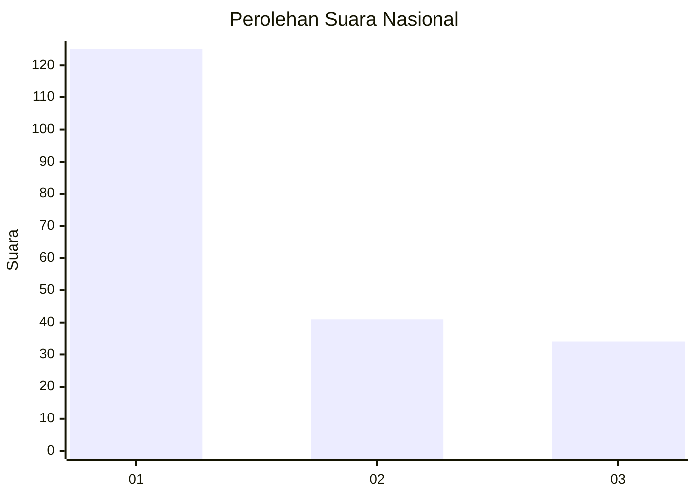
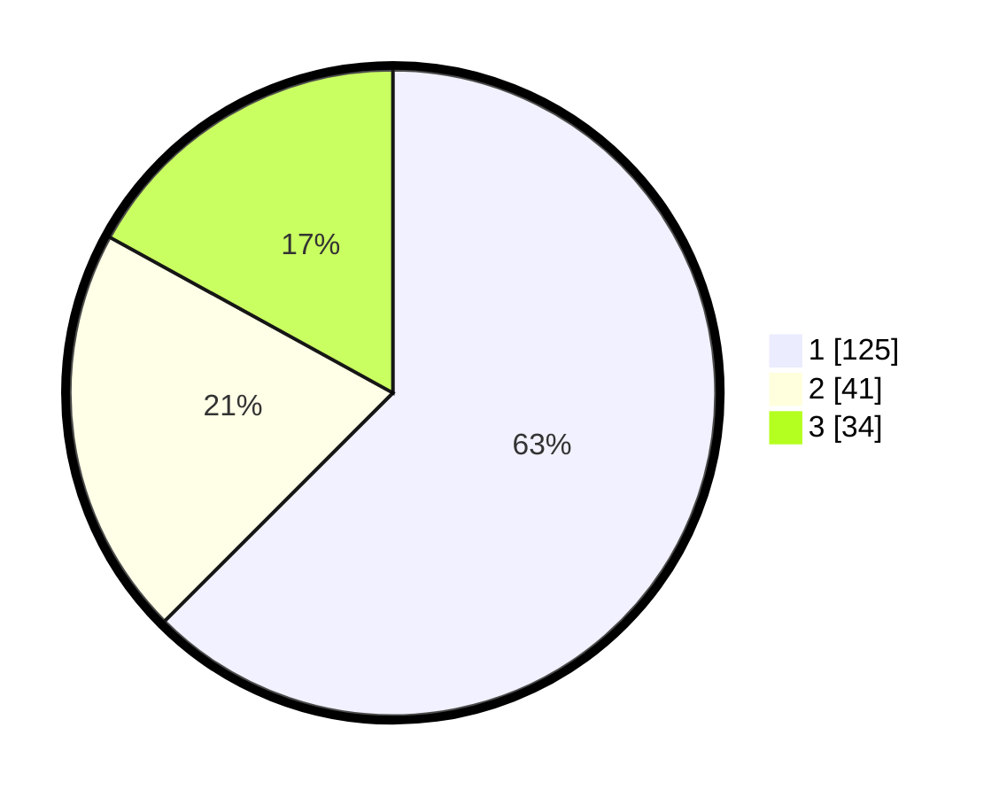

# Hasil

## Grafik

## Tabel

| No. | Nama Paslon    | Suara | Suara (raw) | Persentase |
|:--- |:-------------- | -----:| -----------:| ----------:|
| 1   | ANIES MUHAIMIN | 125   | [125][p-1]  | 62,50      |
| 2   | PRABOWO GIBRAN | 41    | [41][p-2]   | 20,50      |
| 3   | GANJAR MAHFUD  | 34    | [34][p-3]   | 17,00      |

[p-1]: https://github.com/gigit-pemilu/pemilu-2024/blob/main/pilpres/hitung-suara/sub/34-di-yogyakarta/sub/04-sleman/sub/07-depok/sub/2001-caturtunggal/sub/906-tps/sub/paslon-1.txt
[p-2]: https://github.com/gigit-pemilu/pemilu-2024/blob/main/pilpres/hitung-suara/sub/34-di-yogyakarta/sub/04-sleman/sub/07-depok/sub/2001-caturtunggal/sub/906-tps/sub/paslon-2.txt
[p-3]: https://github.com/gigit-pemilu/pemilu-2024/blob/main/pilpres/hitung-suara/sub/34-di-yogyakarta/sub/04-sleman/sub/07-depok/sub/2001-caturtunggal/sub/906-tps/sub/paslon-3.txt

## Foto C Plano

https://sirekap-obj-formc.kpu.go.id/9a12/pemilu/ppwp/34/04/07/20/01/3404072001906-20240214-175446--a68b9879-548d-48ca-8005-455fd81814df.jpg

https://sirekap-obj-formc.kpu.go.id/9a12/pemilu/ppwp/34/04/07/20/01/3404072001906-20240214-184555--3d51e6a7-9201-411a-843b-1ad697fb5cd2.jpg

https://sirekap-obj-formc.kpu.go.id/9a12/pemilu/ppwp/34/04/07/20/01/3404072001906-20240214-184621--d3d84e32-4998-40cb-99fe-a07b59e0f8f0.jpg

## Metadata

| Key        | Value               |
| ---------- | ------------------- |
| Time Stamp | 2024-02-14 21:46:01 |

## DATA PEMILIH TETAP

Jumlah pemilih dalam DPT: **202**.
 * L: **83**.
 * P: **119**.

## DATA PENGGUNA HAK PILIH

Jumlah pengguna hak pilih dalam DPT: **189**.
 * L: **78**.
 * P: **111**.

Jumlah pengguna hak pilih dalam DPTb: **13**.
 * L: **5**.
 * P: **8**.

Jumlah pengguna hak pilih dalam DPK: **0**.
 * L: **0**.
 * P: **0**.

Jumlah pengguna hak pilih: **202**.
 * L: **83**.
 * P: **119**.

## JUMLAH SUARA SAH DAN TIDAK SAH

JUMLAH SELURUH SUARA SAH: **200**.

JUMLAH SUARA TIDAK SAH: **2**.

JUMLAH SELURUH SUARA SAH DAN SUARA TIDAK SAH: **202**.

