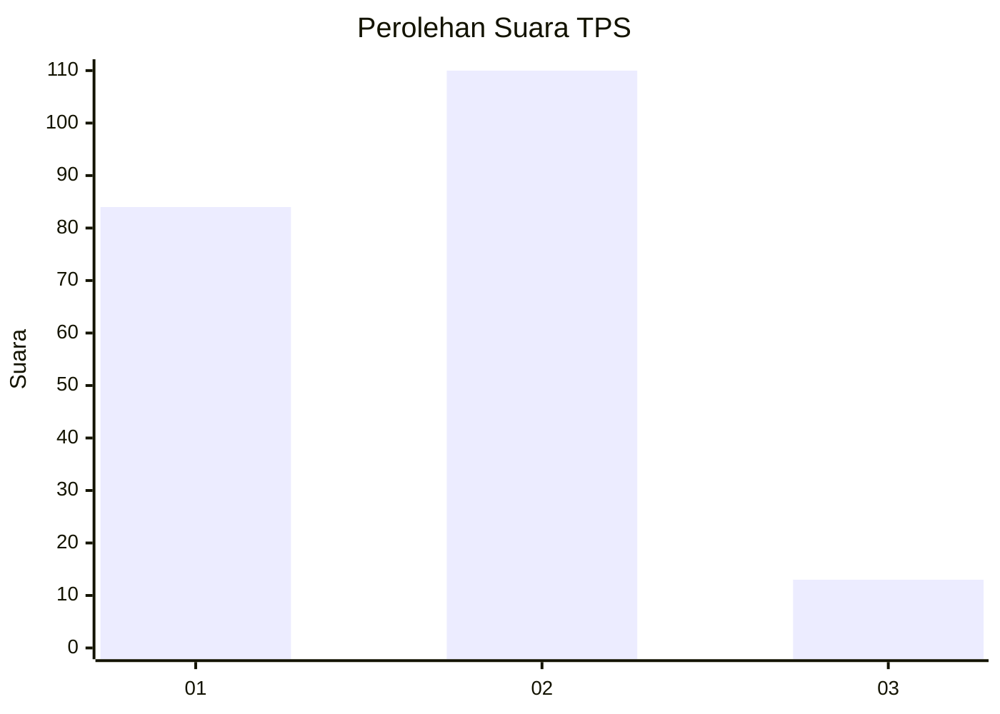

# Hasil

## Grafik

## Tabel

| No. | Nama Paslon    | Suara | Suara (raw) | Persentase |
|:--- |:-------------- | -----:| -----------:| ----------:|
| 1   | ANIES MUHAIMIN | 84    | [84][p-1]   | 40,58      |
| 2   | PRABOWO GIBRAN | 110   | [110][p-2]  | 53,14      |
| 3   | GANJAR MAHFUD  | 13    | [13][p-3]   | 6,28       |

[p-1]: https://github.com/gigit-pemilu/pemilu-2024-34-di-yogyakarta/blob/main/pilpres/hitung-suara/sub/34-di-yogyakarta/sub/04-sleman/sub/07-depok/sub/2001-caturtunggal/sub/916-tps/sub/paslon-1.txt
[p-2]: https://github.com/gigit-pemilu/pemilu-2024-34-di-yogyakarta/blob/main/pilpres/hitung-suara/sub/34-di-yogyakarta/sub/04-sleman/sub/07-depok/sub/2001-caturtunggal/sub/916-tps/sub/paslon-2.txt
[p-3]: https://github.com/gigit-pemilu/pemilu-2024-34-di-yogyakarta/blob/main/pilpres/hitung-suara/sub/34-di-yogyakarta/sub/04-sleman/sub/07-depok/sub/2001-caturtunggal/sub/916-tps/sub/paslon-3.txt

## Foto C Plano

https://sirekap-obj-formc.kpu.go.id/6b6c/pemilu/ppwp/34/04/07/20/01/3404072001916-20240214-143835--84ceef70-b2b0-42b2-bf41-dd282703a955.jpg

https://sirekap-obj-formc.kpu.go.id/6b6c/pemilu/ppwp/34/04/07/20/01/3404072001916-20240214-143640--32f90bad-9034-4727-a60d-42b3ecd58952.jpg

https://sirekap-obj-formc.kpu.go.id/6b6c/pemilu/ppwp/34/04/07/20/01/3404072001916-20240214-151402--88d9554c-f646-4e6e-b27e-2ecbee645022.jpg

## Metadata

| Key        | Value               |
| ---------- | ------------------- |
| Time Stamp | 2024-02-14 21:46:01 |

## DATA PEMILIH TETAP

Jumlah pemilih dalam DPT: **293**.
 * L: **82**.
 * P: **211**.

## DATA PENGGUNA HAK PILIH

Jumlah pengguna hak pilih dalam DPT: **199**.
 * L: **54**.
 * P: **145**.

Jumlah pengguna hak pilih dalam DPTb: **10**.
 * L: **8**.
 * P: **2**.

Jumlah pengguna hak pilih dalam DPK: **0**.
 * L: **0**.
 * P: **0**.

Jumlah pengguna hak pilih: **209**.
 * L: **62**.
 * P: **147**.

## JUMLAH SUARA SAH DAN TIDAK SAH

JUMLAH SELURUH SUARA SAH: **207**.

JUMLAH SUARA TIDAK SAH: **2**.

JUMLAH SELURUH SUARA SAH DAN SUARA TIDAK SAH: **209**.

