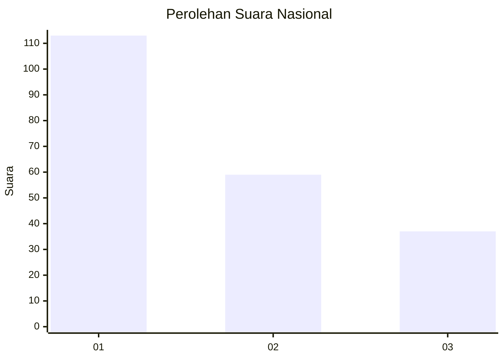
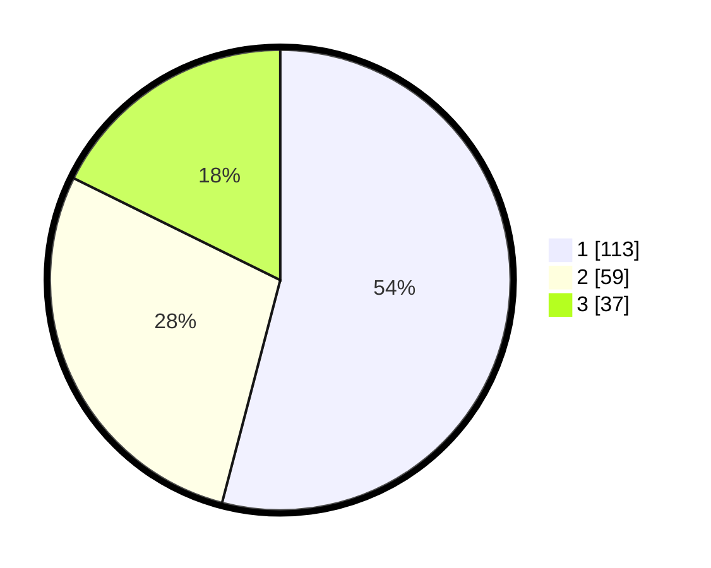

# Hasil

## Grafik

## Tabel

| No. | Nama Paslon    | Suara | Suara (raw) | Persentase |
|:--- |:-------------- | -----:| -----------:| ----------:|
| 1   | ANIES MUHAIMIN | 113   | [113][p-1]  | 54,07      |
| 2   | PRABOWO GIBRAN | 59    | [59][p-2]   | 28,23      |
| 3   | GANJAR MAHFUD  | 37    | [37][p-3]   | 17,70      |

[p-1]: https://github.com/gigit-pemilu/pemilu-2024/blob/main/pilpres/hitung-suara/sub/34-di-yogyakarta/sub/04-sleman/sub/07-depok/sub/2001-caturtunggal/sub/922-tps/sub/paslon-1.txt
[p-2]: https://github.com/gigit-pemilu/pemilu-2024/blob/main/pilpres/hitung-suara/sub/34-di-yogyakarta/sub/04-sleman/sub/07-depok/sub/2001-caturtunggal/sub/922-tps/sub/paslon-2.txt
[p-3]: https://github.com/gigit-pemilu/pemilu-2024/blob/main/pilpres/hitung-suara/sub/34-di-yogyakarta/sub/04-sleman/sub/07-depok/sub/2001-caturtunggal/sub/922-tps/sub/paslon-3.txt

## Foto C Plano

https://sirekap-obj-formc.kpu.go.id/cc72/pemilu/ppwp/34/04/07/20/01/3404072001922-20240214-192002--75d621ba-132d-471f-a2c3-9d56085c9de0.jpg

https://sirekap-obj-formc.kpu.go.id/cc72/pemilu/ppwp/34/04/07/20/01/3404072001922-20240214-192156--f439b64c-1971-4eb2-aa6c-2bcc247d08ff.jpg

## Metadata

| Key        | Value               |
| ---------- | ------------------- |
| Time Stamp | 2024-02-21 22:00:00 |

