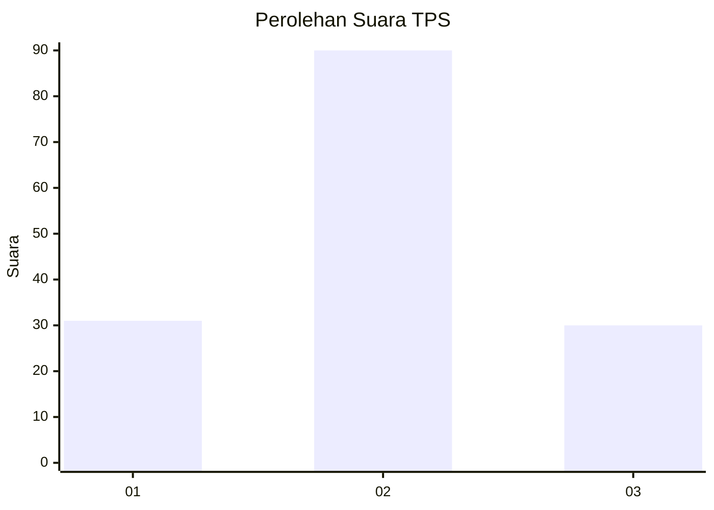
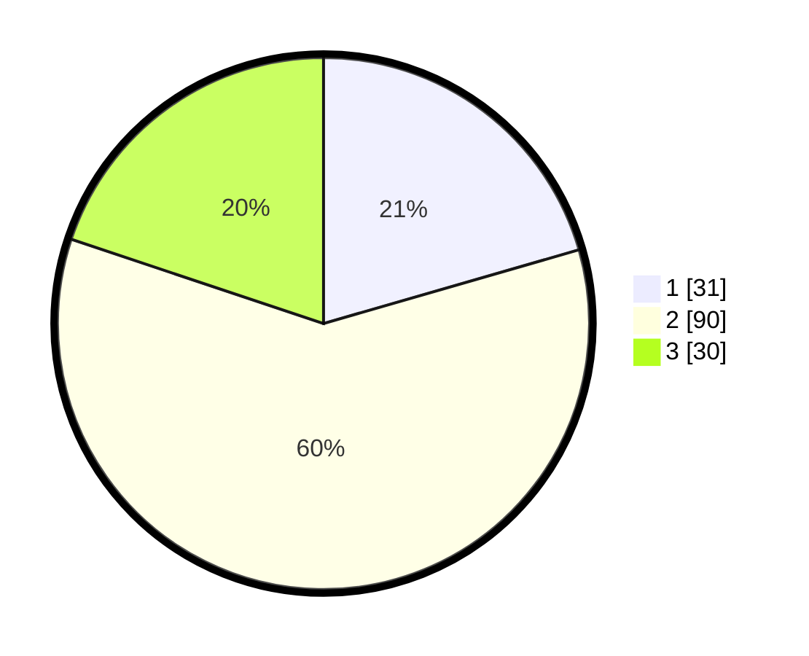

# Hasil

## Grafik

## Tabel

| No. | Nama Paslon    | Suara | Suara (raw) | Persentase |
|:--- |:-------------- | -----:| -----------:| ----------:|
| 1   | ANIES MUHAIMIN | 31    | [31][p-1]   | 20,53      |
| 2   | PRABOWO GIBRAN | 90    | [90][p-2]   | 59,60      |
| 3   | GANJAR MAHFUD  | 30    | [30][p-3]   | 19,87      |

[p-1]: https://github.com/gigit-pemilu/pemilu-2024-34-di-yogyakarta/blob/main/pilpres/hitung-suara/sub/34-di-yogyakarta/sub/04-sleman/sub/07-depok/sub/2002-maguwoharjo/sub/009-tps/sub/paslon-1.txt
[p-2]: https://github.com/gigit-pemilu/pemilu-2024-34-di-yogyakarta/blob/main/pilpres/hitung-suara/sub/34-di-yogyakarta/sub/04-sleman/sub/07-depok/sub/2002-maguwoharjo/sub/009-tps/sub/paslon-2.txt
[p-3]: https://github.com/gigit-pemilu/pemilu-2024-34-di-yogyakarta/blob/main/pilpres/hitung-suara/sub/34-di-yogyakarta/sub/04-sleman/sub/07-depok/sub/2002-maguwoharjo/sub/009-tps/sub/paslon-3.txt

## Foto C Plano

https://sirekap-obj-formc.kpu.go.id/54f1/pemilu/ppwp/34/04/07/20/02/3404072002009-20240214-141122--6b075bf5-3155-47ca-86f7-88852cc69441.jpg

https://sirekap-obj-formc.kpu.go.id/54f1/pemilu/ppwp/34/04/07/20/02/3404072002009-20240215-000313--28731623-8acb-4e34-8f54-990339360707.jpg

https://sirekap-obj-formc.kpu.go.id/54f1/pemilu/ppwp/34/04/07/20/02/3404072002009-20240215-000342--932e421d-36c7-466b-aac7-20909e54f81a.jpg

## Metadata

| Key        | Value               |
| ---------- | ------------------- |
| Time Stamp | 2024-02-15 15:00:29 |

