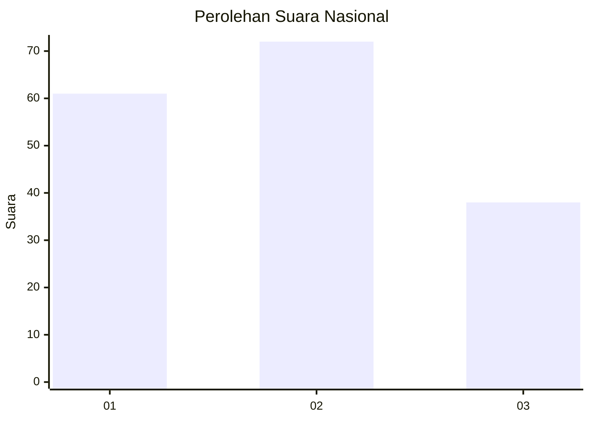
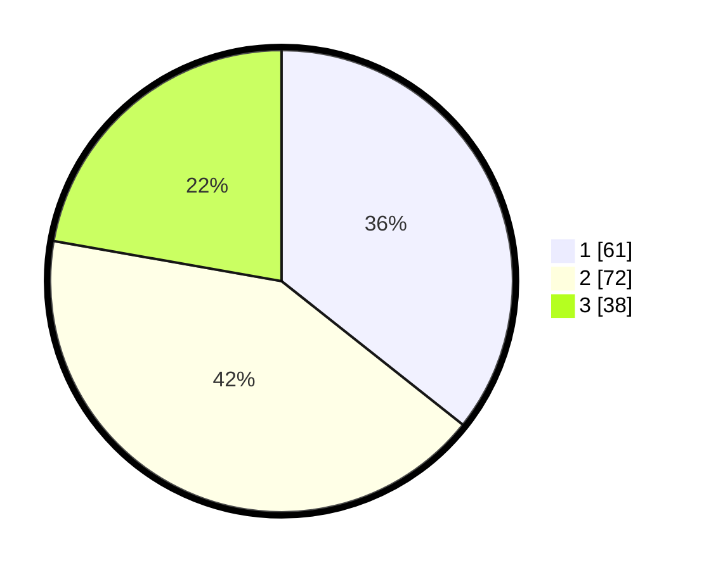

# Hasil

## Grafik

## Tabel

| No. | Nama Paslon    | Suara | Suara (raw) | Persentase |
|:--- |:-------------- | -----:| -----------:| ----------:|
| 1   | ANIES MUHAIMIN | 61    | [61][p-1]   | 35,67      |
| 2   | PRABOWO GIBRAN | 72    | [72][p-2]   | 42,11      |
| 3   | GANJAR MAHFUD  | 38    | [38][p-3]   | 22,22      |

[p-1]: https://github.com/gigit-pemilu/pemilu-2024/blob/main/pilpres/hitung-suara/sub/34-di-yogyakarta/sub/04-sleman/sub/07-depok/sub/2002-maguwoharjo/sub/017-tps/sub/paslon-1.txt
[p-2]: https://github.com/gigit-pemilu/pemilu-2024/blob/main/pilpres/hitung-suara/sub/34-di-yogyakarta/sub/04-sleman/sub/07-depok/sub/2002-maguwoharjo/sub/017-tps/sub/paslon-2.txt
[p-3]: https://github.com/gigit-pemilu/pemilu-2024/blob/main/pilpres/hitung-suara/sub/34-di-yogyakarta/sub/04-sleman/sub/07-depok/sub/2002-maguwoharjo/sub/017-tps/sub/paslon-3.txt

## Foto C Plano

https://sirekap-obj-formc.kpu.go.id/6c74/pemilu/ppwp/34/04/07/20/02/3404072002017-20240215-000416--de33f459-9ac0-4043-9cb7-b85f60bbf642.jpg

https://sirekap-obj-formc.kpu.go.id/6c74/pemilu/ppwp/34/04/07/20/02/3404072002017-20240215-075442--00fbbedf-afae-4daf-8b39-f964649bac61.jpg

https://sirekap-obj-formc.kpu.go.id/6c74/pemilu/ppwp/34/04/07/20/02/3404072002017-20240215-075625--c962ee05-44d2-4a17-9813-8828664dafd3.jpg

## Metadata

| Key        | Value               |
| ---------- | ------------------- |
| Time Stamp | 2024-02-17 13:37:34 |

