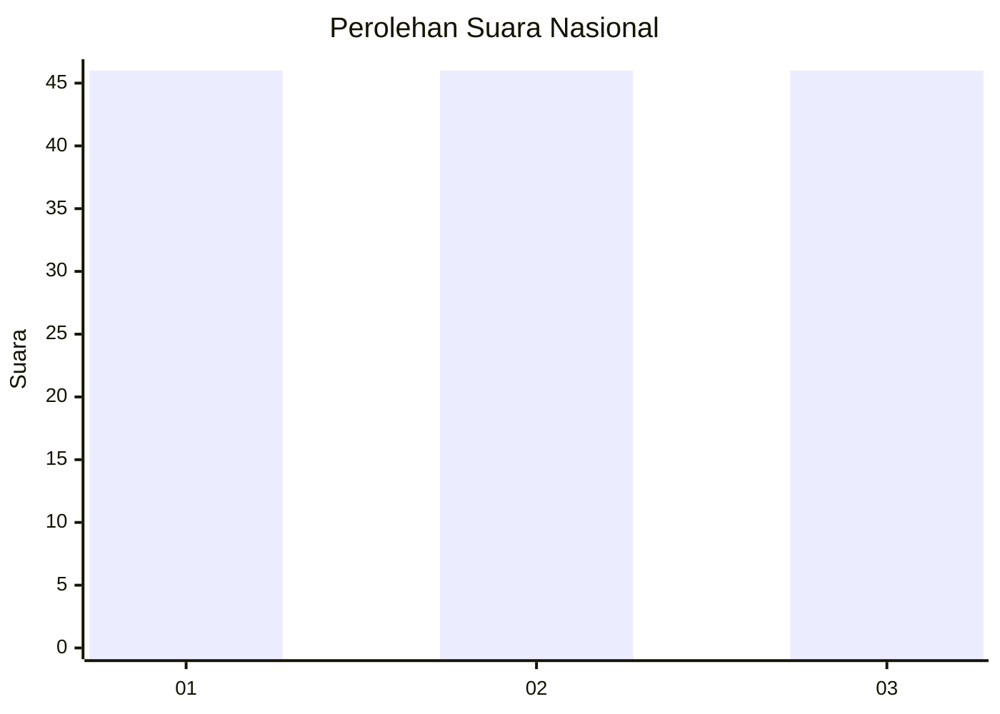
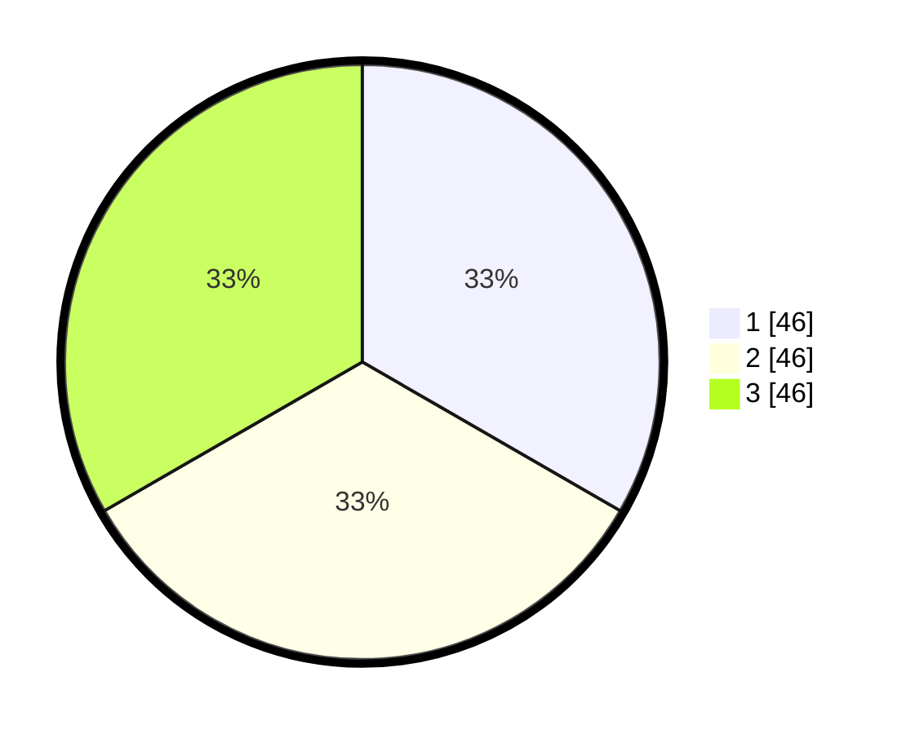

# Hasil

## Grafik

## Tabel

| No. | Nama Paslon    | Suara | Suara (raw) | Persentase |
|:--- |:-------------- | -----:| -----------:| ----------:|
| 1   | ANIES MUHAIMIN | 46    | [46][p-1]   | 33,33      |
| 2   | PRABOWO GIBRAN | 46    | [46][p-2]   | 33,33      |
| 3   | GANJAR MAHFUD  | 46    | [46][p-3]   | 33,33      |

[p-1]: https://github.com/gigit-pemilu/pemilu-2024/blob/main/pilpres/hitung-suara/sub/34-di-yogyakarta/sub/04-sleman/sub/07-depok/sub/2002-maguwoharjo/sub/019-tps/sub/paslon-1.txt
[p-2]: https://github.com/gigit-pemilu/pemilu-2024/blob/main/pilpres/hitung-suara/sub/34-di-yogyakarta/sub/04-sleman/sub/07-depok/sub/2002-maguwoharjo/sub/019-tps/sub/paslon-2.txt
[p-3]: https://github.com/gigit-pemilu/pemilu-2024/blob/main/pilpres/hitung-suara/sub/34-di-yogyakarta/sub/04-sleman/sub/07-depok/sub/2002-maguwoharjo/sub/019-tps/sub/paslon-3.txt

## Foto C Plano

https://sirekap-obj-formc.kpu.go.id/7041/pemilu/ppwp/34/04/07/20/02/3404072002019-20240214-194005--a70fd883-cfc5-4c81-89ac-2f6d08855079.jpg

https://sirekap-obj-formc.kpu.go.id/7041/pemilu/ppwp/34/04/07/20/02/3404072002019-20240214-194117--2611dac0-e22b-4ddc-bc0a-819faf83ad10.jpg

https://sirekap-obj-formc.kpu.go.id/7041/pemilu/ppwp/34/04/07/20/02/3404072002019-20240214-224758--09964b73-3fe6-4eaa-8d2c-9bc017c49ce7.jpg

## Metadata

| Key        | Value               |
| ---------- | ------------------- |
| Time Stamp | 2024-02-15 09:00:24 |

