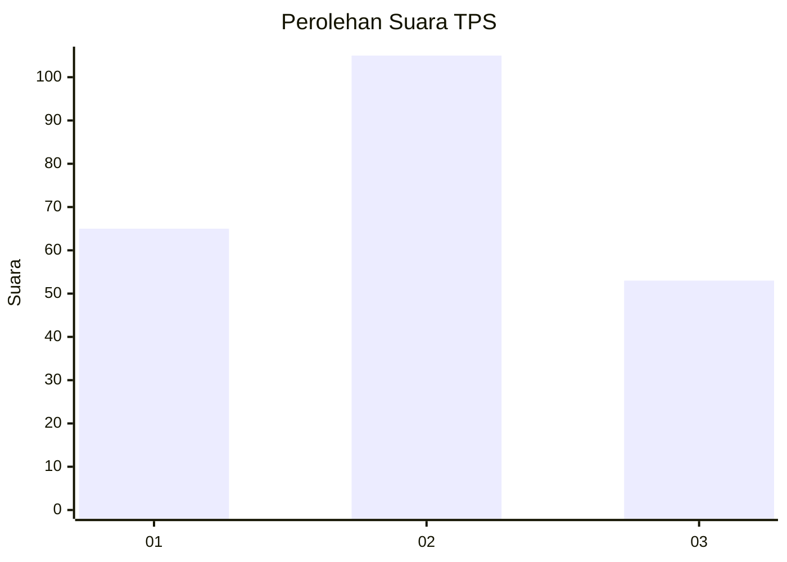
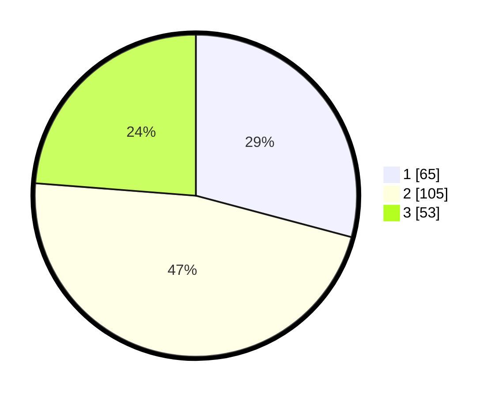

# Hasil

## Grafik

## Tabel

| No. | Nama Paslon    | Suara | Suara (raw) | Persentase |
|:--- |:-------------- | -----:| -----------:| ----------:|
| 1   | ANIES MUHAIMIN | 65    | [65][p-1]   | 29,15      |
| 2   | PRABOWO GIBRAN | 105   | [105][p-2]  | 47,09      |
| 3   | GANJAR MAHFUD  | 53    | [53][p-3]   | 23,77      |

[p-1]: https://github.com/gigit-pemilu/pemilu-2024-34-di-yogyakarta/blob/main/pilpres/hitung-suara/sub/34-di-yogyakarta/sub/04-sleman/sub/07-depok/sub/2002-maguwoharjo/sub/021-tps/sub/paslon-1.txt
[p-2]: https://github.com/gigit-pemilu/pemilu-2024-34-di-yogyakarta/blob/main/pilpres/hitung-suara/sub/34-di-yogyakarta/sub/04-sleman/sub/07-depok/sub/2002-maguwoharjo/sub/021-tps/sub/paslon-2.txt
[p-3]: https://github.com/gigit-pemilu/pemilu-2024-34-di-yogyakarta/blob/main/pilpres/hitung-suara/sub/34-di-yogyakarta/sub/04-sleman/sub/07-depok/sub/2002-maguwoharjo/sub/021-tps/sub/paslon-3.txt

## Foto C Plano

https://sirekap-obj-formc.kpu.go.id/53e5/pemilu/ppwp/34/04/07/20/02/3404072002021-20240214-141934--8055b167-cd53-45a6-be3c-14493f0e41e5.jpg

https://sirekap-obj-formc.kpu.go.id/53e5/pemilu/ppwp/34/04/07/20/02/3404072002021-20240214-204846--95dd2c2a-d901-45a7-b4ff-ac6ef08cdea6.jpg

https://sirekap-obj-formc.kpu.go.id/53e5/pemilu/ppwp/34/04/07/20/02/3404072002021-20240214-204856--eefbf7c1-85d6-4795-9a12-a416ac3d11d2.jpg

## Metadata

| Key        | Value               |
| ---------- | ------------------- |
| Time Stamp | 2024-02-15 15:00:29 |

