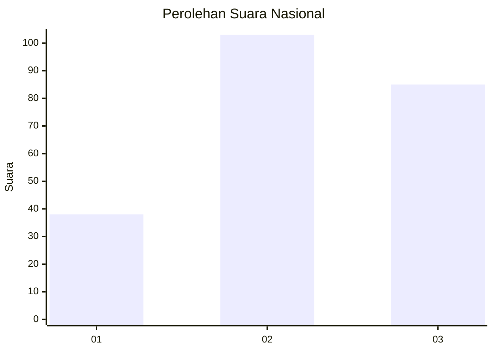
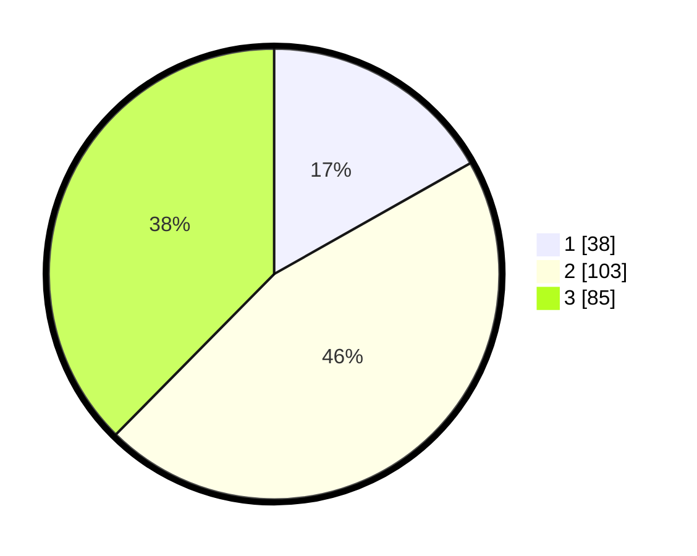

# Hasil

## Grafik

## Tabel

| No. | Nama Paslon    | Suara | Suara (raw) | Persentase |
|:--- |:-------------- | -----:| -----------:| ----------:|
| 1   | ANIES MUHAIMIN | 38    | [38][p-1]   | 16,81      |
| 2   | PRABOWO GIBRAN | 103   | [103][p-2]  | 45,58      |
| 3   | GANJAR MAHFUD  | 85    | [85][p-3]   | 37,61      |

[p-1]: https://github.com/gigit-pemilu/pemilu-2024/blob/main/pilpres/hitung-suara/sub/34-di-yogyakarta/sub/04-sleman/sub/07-depok/sub/2002-maguwoharjo/sub/024-tps/sub/paslon-1.txt
[p-2]: https://github.com/gigit-pemilu/pemilu-2024/blob/main/pilpres/hitung-suara/sub/34-di-yogyakarta/sub/04-sleman/sub/07-depok/sub/2002-maguwoharjo/sub/024-tps/sub/paslon-2.txt
[p-3]: https://github.com/gigit-pemilu/pemilu-2024/blob/main/pilpres/hitung-suara/sub/34-di-yogyakarta/sub/04-sleman/sub/07-depok/sub/2002-maguwoharjo/sub/024-tps/sub/paslon-3.txt

## Foto C Plano

https://sirekap-obj-formc.kpu.go.id/f607/pemilu/ppwp/34/04/07/20/02/3404072002024-20240216-121949--3c7c8fa6-e02f-4a86-87fd-0871f9de9680.jpg

https://sirekap-obj-formc.kpu.go.id/f607/pemilu/ppwp/34/04/07/20/02/3404072002024-20240216-122332--e16febf9-0c58-4fb9-95a7-79ea754e4279.jpg

https://sirekap-obj-formc.kpu.go.id/f607/pemilu/ppwp/34/04/07/20/02/3404072002024-20240215-025854--ab7fd763-95ba-49ea-9531-0dba1c1881d2.jpg

## Metadata

| Key        | Value               |
| ---------- | ------------------- |
| Time Stamp | 2024-02-17 13:37:34 |

