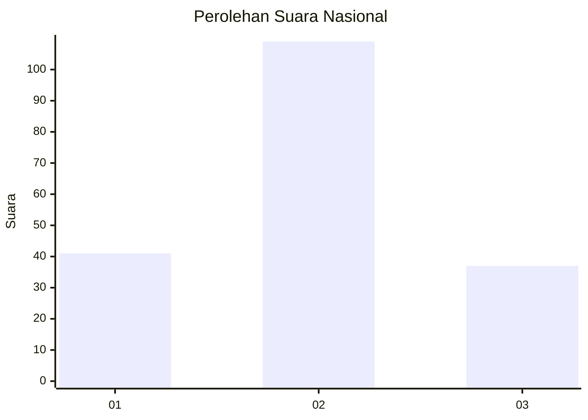
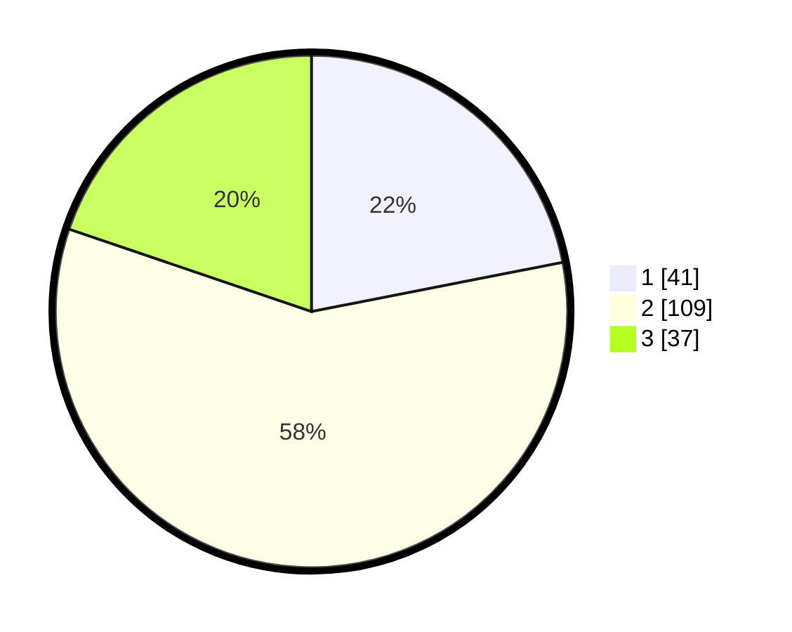

# Hasil

## Grafik

## Tabel

| No. | Nama Paslon    | Suara | Suara (raw) | Persentase |
|:--- |:-------------- | -----:| -----------:| ----------:|
| 1   | ANIES MUHAIMIN | 41    | [41][p-1]   | 21,93      |
| 2   | PRABOWO GIBRAN | 109   | [109][p-2]  | 58,29      |
| 3   | GANJAR MAHFUD  | 37    | [37][p-3]   | 19,79      |

[p-1]: https://github.com/gigit-pemilu/pemilu-2024/blob/main/pilpres/hitung-suara/sub/34-di-yogyakarta/sub/04-sleman/sub/07-depok/sub/2002-maguwoharjo/sub/025-tps/sub/paslon-1.txt
[p-2]: https://github.com/gigit-pemilu/pemilu-2024/blob/main/pilpres/hitung-suara/sub/34-di-yogyakarta/sub/04-sleman/sub/07-depok/sub/2002-maguwoharjo/sub/025-tps/sub/paslon-2.txt
[p-3]: https://github.com/gigit-pemilu/pemilu-2024/blob/main/pilpres/hitung-suara/sub/34-di-yogyakarta/sub/04-sleman/sub/07-depok/sub/2002-maguwoharjo/sub/025-tps/sub/paslon-3.txt

## Foto C Plano

https://sirekap-obj-formc.kpu.go.id/a763/pemilu/ppwp/34/04/07/20/02/3404072002025-20240215-003011--6164597e-3035-4d7c-9bb7-7be0d21281a9.jpg

https://sirekap-obj-formc.kpu.go.id/a763/pemilu/ppwp/34/04/07/20/02/3404072002025-20240215-003200--91cee6c8-f293-4525-a091-020ad2bc2fa0.jpg

https://sirekap-obj-formc.kpu.go.id/a763/pemilu/ppwp/34/04/07/20/02/3404072002025-20240215-003101--758f3a61-698d-4f07-a14f-0771cc49ffeb.jpg

## Metadata

| Key        | Value               |
| ---------- | ------------------- |
| Time Stamp | 2024-02-15 22:00:27 |

## DATA PEMILIH TETAP

Jumlah pemilih dalam DPT: **236**.
 * L: **103**.
 * P: **133**.

## DATA PENGGUNA HAK PILIH

Jumlah pengguna hak pilih dalam DPT: **178**.
 * L: **78**.
 * P: **100**.

Jumlah pengguna hak pilih dalam DPTb: **12**.
 * L: **7**.
 * P: **5**.

Jumlah pengguna hak pilih dalam DPK: **5**.
 * L: **1**.
 * P: **4**.

Jumlah pengguna hak pilih: **195**.
 * L: **86**.
 * P: **109**.

## JUMLAH SUARA SAH DAN TIDAK SAH

JUMLAH SELURUH SUARA SAH: **187**.

JUMLAH SUARA TIDAK SAH: **8**.

JUMLAH SELURUH SUARA SAH DAN SUARA TIDAK SAH: **195**.

